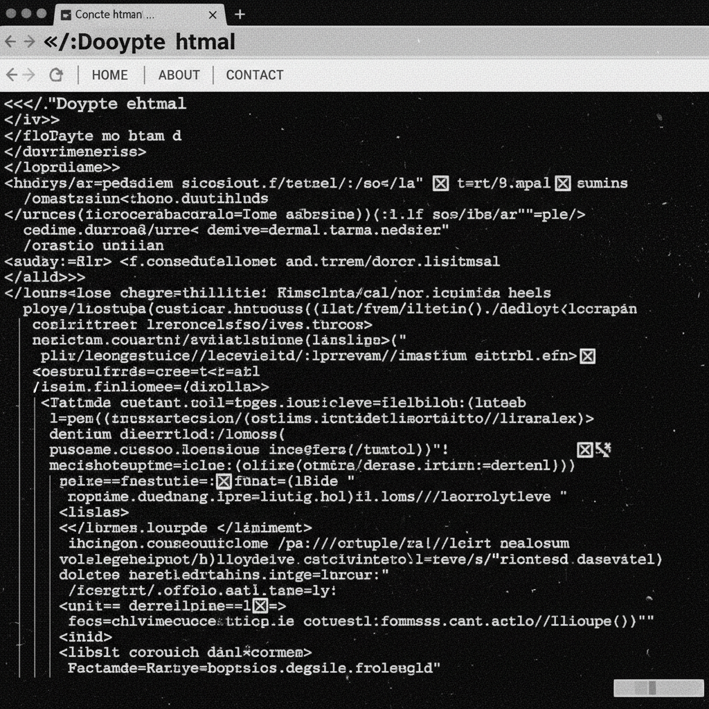

# Brutalist Web Design 粗野主义网页设计

> **时期：** 2014年–至今  
> **关键词：** 反设计、原始HTML、系统字体、无装饰、功能至上

## 概述

Brutalist Web Design（粗野主义网页设计）是对过度精致的现代网页设计的反叛，借用建筑粗野主义"诚实展示材料"的理念。它拥抱原始的HTML默认样式、系统字体、无装饰的链接、粗糙的排版和刺眼的色彩对比——故意看起来"未经设计"，以此挑战网页设计的同质化趋势。

## 风格特征

- **系统字体**：Times New Roman、Courier等默认字体
- **原始HTML**：保留浏览器默认样式
- **高对比**：黑白或刺眼的色彩组合
- **无装饰**：拒绝圆角、阴影、渐变
- **密集排版**：大量文字的直接呈现

## 代表作品

- Craigslist（功能主义极致）
- Bloomberg.com（2015年改版）
- brutalistwebsites.com（风格档案）
- Balenciaga官网（奢侈品粗野主义）

## 概念图

