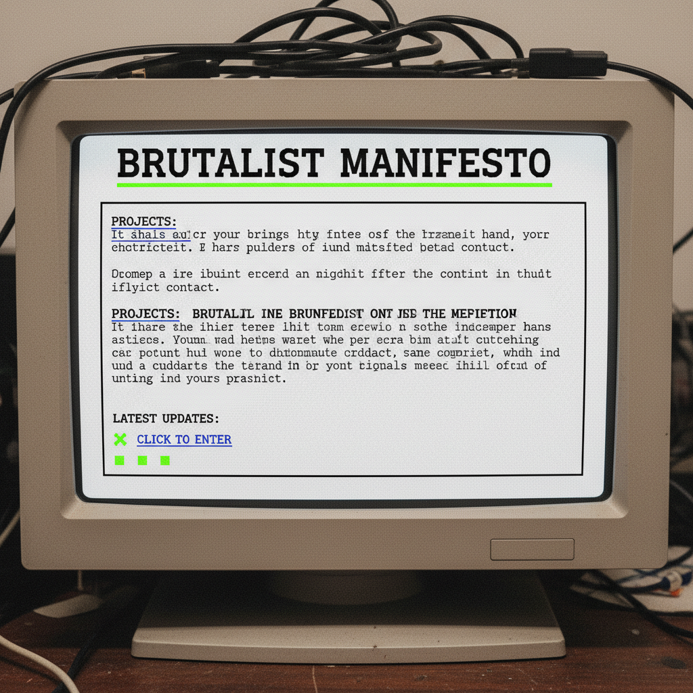

# Brutalist Web 野兽派网页



> **"Times New Roman、黑色超链接、没有CSS——当网页设计故意拒绝'好看'。"**

## 概述

| 维度 | 描述 |
|------|------|
| 时期 | 2014–至今 |
| 别名 | Brutalist Web Design, Anti-Design, Raw Web |
| 核心色彩 | 黑色、白色、系统蓝（超链接色）、偶尔的荧光色 |
| 关键元素 | 系统字体、无装饰、裸HTML感、故意的"丑" |
| 代表人物 | brutalistwebsites.com、Bloomberg、Balenciaga |
| 关联风格 | Webcore, Anti-Design, Acid Graphics, Normcore |

---

## 历史脉络

### 2014：对"漂亮"的反叛

Brutalist Web Design 是对**过度设计的互联网**的反叛：

| 它反对什么 | 它拥抱什么 |
|-----------|-----------|
| 精心设计的UI | 裸HTML |
| 圆角和阴影 | 方角和边框 |
| 优雅的字体 | 系统字体/等宽字体 |
| 精美的图片 | 未裁剪的原始图片 |
| 用户体验 | 用户困惑（故意的） |
| "好看" | "有意思" |

### 建筑野兽派的遗产

| 建筑野兽派 | 网页野兽派 |
|-----------|-----------|
| 裸露混凝土 | 裸露HTML |
| 拒绝装饰 | 拒绝CSS美化 |
| 展示结构 | 展示代码结构 |
| 功能至上 | 内容至上 |
| 1950s–1970s | 2014–至今 |

### 谁在用？

| 用户 | 原因 |
|------|------|
| 时尚品牌 (Balenciaga) | 反主流 = 酷 |
| 艺术机构 | 拒绝商业美学 |
| 独立开发者 | 回归网页本质 |
| 学术/文化网站 | 内容 > 形式 |
| 讽刺/实验项目 | 挑战设计规范 |

---

## 视觉语法

### 色彩系统

```
主色：
  黑色 (#000000) — 文字
  白色 (#FFFFFF) — 背景
  系统蓝 (#0000FF) — 超链接
  
可选冲击色：
  荧光绿 (#00FF00) — 终端感
  荧光粉 (#FF00FF) — 冲击力
  红色 (#FF0000) — 警告/强调

规则：
  - 尽量少的颜色
  - 高对比度
  - 没有渐变
  - 颜色用于功能，不是装饰
```

### 标志性元素

| 类别 | 元素 |
|------|------|
| 字体 | Times New Roman、Courier、Arial、系统默认 |
| 布局 | 单列、无网格、或故意破碎的网格 |
| 链接 | 蓝色下划线（默认样式） |
| 图片 | 未裁剪、未优化、或完全没有 |
| 边框 | 1px solid black |
| 交互 | 最少的JavaScript、无动效 |

---

## 与千禧怀旧的关系

### 对 Web 1.0 的怀念
- Brutalist Web 的视觉语言让人想起 1990s 的互联网
- 那时候网页就是"丑"的，但充满个性
- 这是一种有意识的"回归"

### 与 Webcore 的区别
- Webcore = 怀念早期互联网的混乱美学
- Brutalist Web = 用当代设计意识重新选择"丑"
- Webcore 是怀旧，Brutalist Web 是态度

---

## 中国语境

- 国内较少见（商业环境不允许"丑"）
- 部分独立艺术家/设计师的个人网站
- 与"反设计"/"去设计"思潮的交叉
- 豆瓣早期的简洁美学有类似精神

---

## 设计应用

| 场景 | 应用方式 |
|------|----------|
| 个人网站 | 系统字体+单列+无装饰 |
| 艺术项目 | 故意的视觉冲突+裸HTML |
| 时尚品牌 | 极简到极致+反常规排版 |
| 实验设计 | 打破所有"好设计"规则 |

---

## 相关风格

← [Webcore / Old Web](webcore.md) | [Acid Graphics 酸性设计](acid-graphics.md) →

↑ [返回千禧怀旧目录](README.md) | [返回总目录](../README.md)
