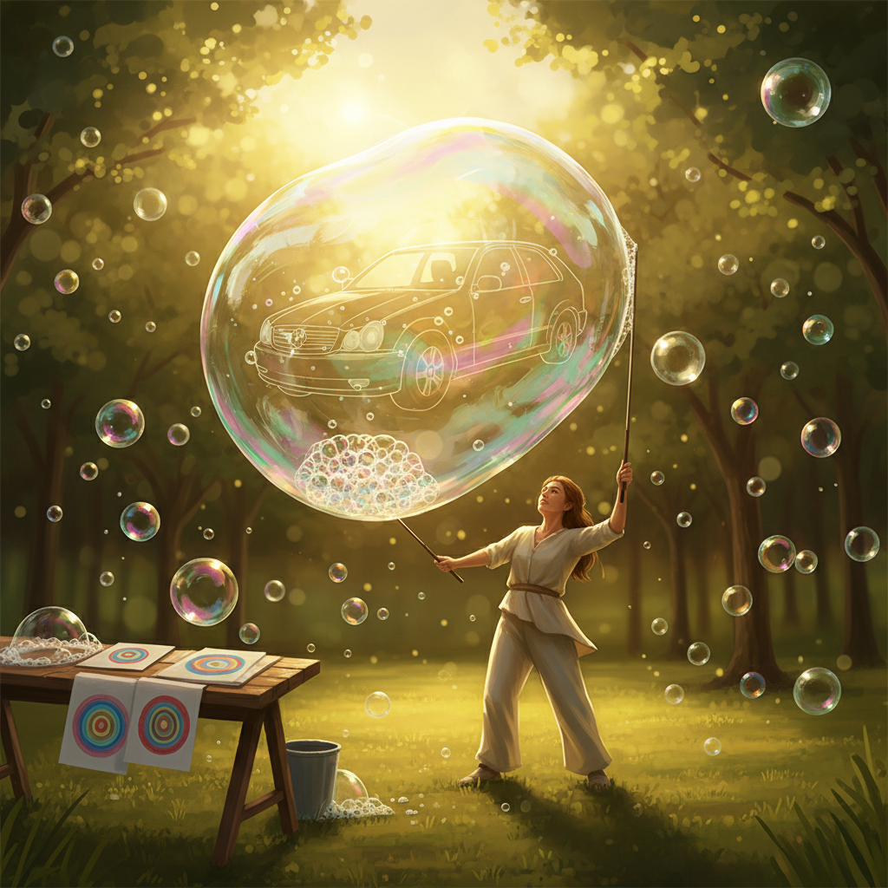

# Bubble Art 泡泡艺术

> "A soap bubble is the most perfect and most ephemeral of all natural forms — a sphere of water one molecule thick, stretched to impossible thinness, displaying every color of the rainbow in swirling patterns that change faster than the eye can follow. It exists for seconds, maybe minutes, before vanishing with a silent pop. Bubble art celebrates this impossible beauty, finding ways to extend, capture, or multiply the magic of soap film." — Unknown

## 概述

泡泡艺术（Bubble Art）是以肥皂泡为主要媒介或创作元素的艺术形式——利用泡泡的球形完美性、虹彩薄膜、透明性和极致短暂性创造视觉奇观。泡泡艺术涵盖从街头泡泡表演到科学可视化的广泛实践。

泡泡艺术的实践包括：1）巨型泡泡——创造超大尺寸的肥皂泡；2）泡泡雕塑——用多个泡泡组合成几何结构；3）泡泡绘画——用彩色泡泡在纸上留下印记；4）泡泡表演——街头和舞台的泡泡表演艺术；5）冰冻泡泡——在极寒环境中冻结的泡泡摄影；6）泡泡装置——用泡泡机创造的大型装置；7）泡泡科学艺术——展示泡泡物理学的艺术化呈现。

## 核心特征

| 特征 | 描述 |
|------|------|
| 短暂 | 极其短暂的存在 |
| 虹彩 | 薄膜干涉的彩虹色 |
| 球形 | 完美的球形 |
| 透明 | 几乎完全透明 |
| 脆弱 | 极度脆弱 |
| 魔幻 | 魔幻的视觉效果 |

## 视觉特征

- **虹彩**：薄膜的彩虹色泽
- **透明**：几乎透明的球体
- **反射**：表面的环境反射
- **球形**：完美的球形形态
- **流动**：表面色彩的流动
- **光影**：光线穿透的效果

## 代表作品

| 作品 | 艺术家 | 年代 | 意义 |
|------|--------|------|------|
| *Giant bubbles* | Various | 当代 | 巨型泡泡表演 |
| *Frozen bubbles* | Various | 当代 | 冰冻泡泡摄影 |
| *Bubble paintings* | Various | 当代 | 泡泡绘画 |
| *Bubble shows* | Various | 当代 | 泡泡舞台表演 |
| *Soap film science* | Various | 当代 | 泡泡科学可视化 |

## 历史时间线

| 时期 | 事件 |
|------|------|
| 古代 | 肥皂泡作为儿童游戏 |
| 17世纪 | 荷兰画家描绘泡泡（虚空象征） |
| 19世纪 | 泡泡物理学研究 |
| 20世纪 | 泡泡表演的专业化 |
| 当代 | 泡泡作为当代艺术媒介 |

## 中国语境

泡泡艺术在中国近年来发展迅速。中国的泡泡表演艺术家在国际舞台上表现出色——中国的一些泡泡艺术家创造了世界纪录级别的巨型泡泡。中国的儿童教育和科普活动中，泡泡科学是非常受欢迎的主题。中国的一些当代艺术家将泡泡作为创作媒介——用泡泡的短暂性探讨无常和美的主题。中国传统文化中的"泡影"——佛教中用泡泡比喻世间万物的虚幻——为泡泡艺术提供了深层的哲学背景。中国的泡泡秀（bubble show）在商业演出和儿童娱乐领域非常活跃。

## AI生成概念图

## 与其他风格的关系

- **Ephemeral Art** → 短暂艺术
- **Performance Art** → 表演艺术
- **Light Art** → 光艺术
- **Science Art** → 科学艺术
- **Street Art** → 街头艺术
- **Installation Art** → 装置艺术

---

*浮光艺志 | Chronicle of Artistry*
