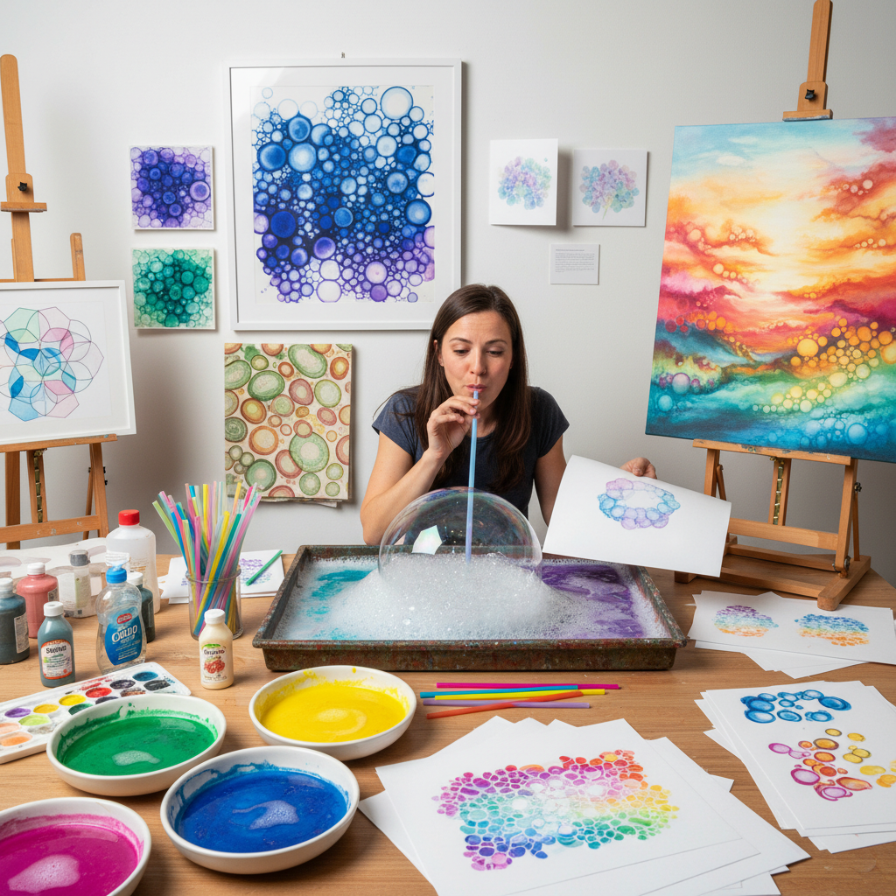

# Bubble Painting 气泡绘画

> "Bubble painting is childhood wonder made visible — soap bubbles tinted with color, blown until they overflow and burst against paper, leaving behind circular ghost-prints of iridescent spheres, each pop a tiny explosion of pigment that no brush could replicate." — Unknown

## 概述

气泡绘画（Bubble Painting）是一种将颜料（水彩、丙烯或墨水）混入肥皂水中，通过吹气产生彩色气泡，然后将纸张覆盖在气泡上或让气泡自然破裂在纸面上，留下圆形泡泡印记的创意绘画技法。气泡绘画产生的效果独特——重叠的圆形图案、细胞状的网络结构、彩虹般的色彩渐变——这些效果是其他绘画技法难以复制的。

气泡绘画的变体包括：直接吹泡法（用吸管在颜料肥皂水中吹出气泡，将纸覆盖其上）、泡泡枪法（使用泡泡枪喷射彩色气泡到纸面）、容器溢出法（在容器中吹出大量气泡直到溢出，让气泡自然落在纸上）。气泡绘画虽然常被视为儿童活动，但其产生的有机图案和细胞结构在当代艺术和设计中也有应用。

## 核心特征

| 特征 | 描述 |
|------|------|
| 气泡 | 利用肥皂气泡 |
| 偶然 | 偶然性的效果 |
| 圆形 | 圆形的图案 |
| 有机 | 有机的细胞结构 |
| 趣味 | 趣味性强 |
| 简单 | 材料简单易得 |

## 视觉特征

- **圆形**：重叠的圆形图案
- **细胞**：细胞状的网络
- **透明**：半透明的层次
- **色彩**：柔和的色彩渐变
- **有机**：有机的自然感
- **轻盈**：轻盈飘逸的质感

## 代表作品

| 作品 | 艺术家 | 年代 | 意义 |
|------|--------|------|------|
| *Bubble print abstracts* | Various | 当代 | 气泡抽象画 |
| *Bubble art backgrounds* | Various | 当代 | 气泡艺术背景 |
| *Mixed media bubble art* | Various | 当代 | 混合媒介气泡艺术 |
| *Bubble painting installations* | Various | 当代 | 气泡绘画装置 |
| *Scientific bubble imagery* | Various | 当代 | 科学气泡图像 |

## 历史时间线

| 时期 | 事件 |
|------|------|
| 古代 | 肥皂泡的发现 |
| 19世纪 | 科学对气泡结构的研究 |
| 20世纪中期 | 气泡绘画在教育中的应用 |
| 2000年代 | 社交媒体推动的流行 |
| 当代 | 气泡绘画的艺术化探索 |

## 中国语境

气泡绘画在中国的儿童美术教育和亲子活动中非常流行。中国的幼儿园和儿童美术机构将气泡绘画作为创意美术课程的一部分——其趣味性和偶然性特别适合激发儿童的创造力。中国的社交媒体（小红书、抖音）上有大量气泡绘画的教程和作品分享。一些中国的当代艺术家和设计师将气泡绘画的有机图案应用于纺织品设计、包装设计和插画创作中。

## AI生成概念图

## 与其他风格的关系

- **Pour Painting** → 倾倒绘画
- **Fluid Art** → 流体艺术
- **Abstract Art** → 抽象艺术
- **Process Art** → 过程艺术
- **Experimental Art** → 实验艺术
- **Children's Art** → 儿童艺术

---

*浮光艺志 | Chronicle of Artistry*
