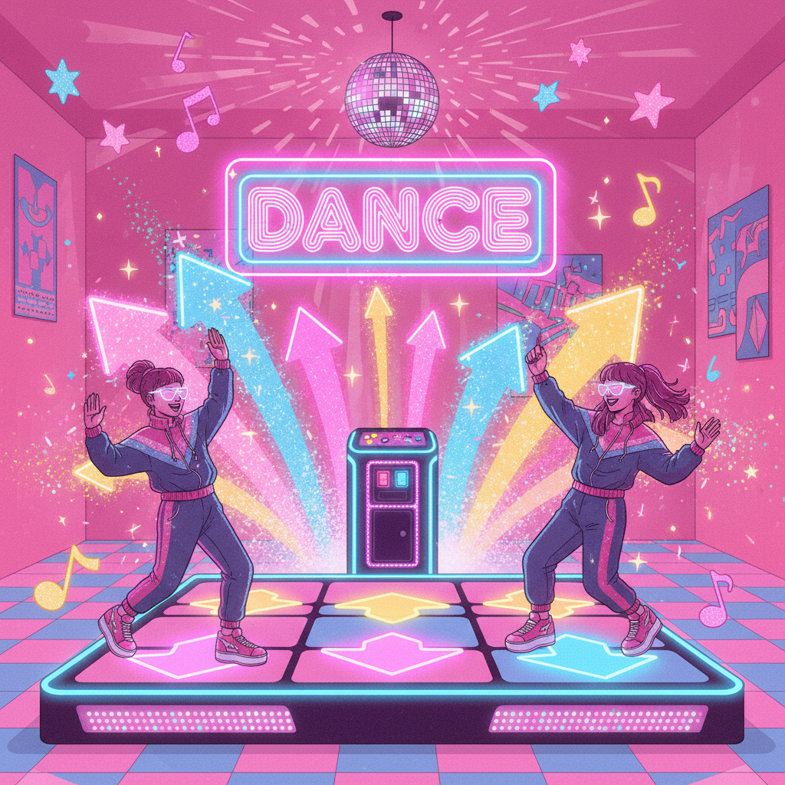

# Bubblegum Dance（泡泡糖舞曲）

> **别名**：Bubblegum Euro, Bubblegum Trance, 兔子舞（中国俗称）  
> **活跃年代**：1996 – 2005（巅峰期）；2020s 怀旧回潮  
> **起源**：北欧（丹麦为中心）

---

## 一句话定义

Bubblegum Dance 是 90 年代末至 2000 年代初从北欧诞生的一种极度欢快、色彩饱和的电子舞曲流派及视觉美学——用卡通化的形象、糖果色调和不可救药的乐观主义，创造了一个属于跳舞毯和 DDR 机台的平行宇宙。

---

## 视觉语言

| 元素 | 描述 |
|------|------|
| 色彩 | 糖果粉、电光蓝、柠檬黄、薄荷绿——高饱和无阴影 |
| 人物 | 卡通化造型、夸张表情、彩色假发、亮片服装 |
| 图形 | 星星、心形、彩虹、泡泡、闪电 |
| 字体 | 圆润胖体、气球字、3D 凸起效果 |
| 载体 | CD 封面、跳舞机界面、Flash 动画、MV |
| 空间 | 纯色背景、舞台灯光、迪斯科球 |

### 视觉 DNA 拆解

Bubblegum Dance 的视觉系统可以分解为三个层次：

**第一层：色彩策略**
- 永远使用 CMYK 色域中最饱和的区间
- 避免黑色和灰色——即使阴影也用深紫或深蓝替代
- 渐变方向永远是"从亮到更亮"，而非"从亮到暗"

**第二层：形态语言**
- 所有边缘都是圆角——没有锐角、没有直线
- 人物比例卡通化：大头、大眼、小身体
- 图形元素永远在"膨胀"状态：气球字、泡泡、充气感

**第三层：运动感**
- 即使在静态画面中也暗示运动：飞溅的星星、旋转的迪斯科球
- 闪电和速度线表示节奏感
- 人物永远在跳舞、奔跑或做夸张动作

---

## 历史时间线

| 时期 | 事件 |
|------|------|
| 1993-1995 | Eurodance 巅峰期（2 Unlimited、La Bouche），为 Bubblegum 铺路 |
| 1996 | Aqua 组建于丹麦哥本哈根，开创 Bubblegum Dance 原型 |
| 1997 | *Barbie Girl* 全球爆红（1000万+销量），定义了整个流派的视觉基调 |
| 1997 | Mattel 起诉 Aqua 侵犯 Barbie 商标，最终败诉——法院认定为戏仿 |
| 1998 | DDR（Dance Dance Revolution）从日本传入欧美和亚洲 |
| 1998-2000 | 跳舞机/跳舞毯风靡亚洲，Bubblegum Dance 成为核心曲库 |
| 1999 | Smile.dk *Butterfly* 通过 DDR 传遍全球；Vengaboys *Boom Boom Boom* 登顶多国榜单 |
| 2000 | Toy-Box *Best Friend* 发行；流派进入商业巅峰 |
| 2000-2003 | 大量组合涌现：Hit'n'Hide、Bambee、Me & My、Cartoons |
| 2003 | Aqua 宣布解散（后于2008年重组） |
| 2004-2005 | 流派商业衰退，被 Electropop、Crunk 和 R&B 取代 |
| 2008 | Aqua 重组进行巡演，但未发行新专辑 |
| 2011 | Aqua 发行回归专辑 *Megalomania*，反响平平 |
| 2020-2022 | TikTok 上 Aqua 歌曲重新走红；DDR 怀旧社区活跃 |
| 2023+ | *Barbie* 电影（Greta Gerwig）重新点燃粉色美学热潮 |

---

## 文化内核

### 快乐作为意识形态

Bubblegum Dance 的核心主张极其简单：**快乐本身就是目的**。在一个越来越讽刺、越来越"酷"的文化中，它毫不掩饰地拥抱天真、愚蠢和纯粹的身体快感。

这种"反酷"姿态在当时被音乐评论界嘲笑，但它恰恰预示了 2020 年代的文化转向——当 "cringe is dead" 成为 Z 世代的口号时，Bubblegum Dance 的精神终于被追认为一种勇气。

### 跳舞机：身体的民主化

DDR（Dance Dance Revolution）和家用跳舞毯让 Bubblegum Dance 获得了独特的传播渠道：
- 不需要音乐品味的"认证"
- 不需要夜店年龄
- 只需要一个客厅和一块毯子
- 身体运动 = 游戏得分 = 快乐

DDR 的界面设计本身就是 Bubblegum 美学的完美载体：彩色箭头在纯色背景上飞舞，得分时爆发星星和彩虹——游戏机制和视觉语言完美统一。

### 北欧悖论

Bubblegum Dance 诞生于以"冷淡"著称的北欧，这本身就是一个有趣的文化悖论：
- 丹麦、瑞典的冬季漫长而黑暗
- 北欧设计以极简和功能主义闻名
- 但 Bubblegum Dance 却是最大声、最鲜艳、最"不北欧"的文化输出

一种解释是：**正因为现实环境的压抑，才需要在音乐和视觉中创造一个极端欢乐的平行世界**。这与日本的 Kawaii 文化有相似的心理机制。

### 中国记忆

在中国，Bubblegum Dance 有独特的文化印记：
- "兔子舞"（*Come On! Everybody*）成为学校运动会、商场开业的标配
- 跳舞毯是 2000 年代初最热门的家庭娱乐设备之一
- 网吧里的 Flash 小游戏大量使用这类音乐
- 《劲舞团》（Audition Online）将 Bubblegum 美学带入网游
- 它代表了一种"电脑刚进入家庭"时期的集体欢乐

---

## 子类型与近亲

| 子类型 | 特征 | 代表 |
|--------|------|------|
| **Classic Bubblegum** | 纯粹的糖果色欢快舞曲 | Aqua, Toy-Box |
| **Bubblegum Trance** | 加入 Trance 合成器音色 | Smile.dk, Bambee |
| **Nightcore** | 将任何歌曲加速+升调，配动漫封面 | YouTube Nightcore 社区 |
| **Happy Hardcore** | 更快的 BPM（160+），更硬的节拍 | Scooter, DJ Sammy |
| **Crunkcore** | Bubblegum + Screamo + Crunk | BrokeNCYDE, Millionaires |

### Nightcore：Bubblegum 的数字幽灵

Nightcore 值得特别提及——它本质上是将任何歌曲"Bubblegum 化"的算法：
- 加速 20-30%（让人声变得更高、更"可爱"）
- 配上动漫少女封面图
- 在 YouTube 上获得数亿播放

Nightcore 证明了 Bubblegum Dance 的核心公式（高音 + 快节奏 + 可爱视觉）具有超越流派的普适性。

---

## 与其他风格的关系

| 风格 | 关系 |
|------|------|
| **McBling** | 共享 2000s 的过度装饰和"俗气即快乐"精神 |
| **Frutiger Aero** | Bubblegum Dance 的 CD 封面常采用早期 Aero 风格设计 |
| **Scene** | Scene 文化中的 Crunkcore 继承了部分 Bubblegum 的欢快能量 |
| **Electropop 08** | Lady Gaga 等人的早期作品可视为 Bubblegum Dance 的精神续作 |
| **Kidcore** | 共享原色、卡通化和"拒绝成熟"的态度 |
| **Vaporwave** | Vaporwave 有时采样 Bubblegum Dance 曲目进行减速处理——快乐的幽灵 |

---

## 争议与批评

### "这不是真正的音乐"

Bubblegum Dance 从诞生之日起就面临"不够严肃"的批评：
- 歌词被认为幼稚（"I'm a Barbie girl, in a Barbie world"）
- 制作被认为公式化（相同的 BPM、相同的和弦进行）
- 表演者被认为是"产品"而非"艺术家"

但这些批评忽略了一个事实：**Bubblegum Dance 从未试图成为"严肃音乐"**。它的目标是让人跳舞、微笑、暂时忘记世界——而在这个目标上，它极其成功。

### 性别化的贬低

与 Glitter Graphics 类似，Bubblegum Dance 因为其女性化的审美和以少女为主的受众而遭到额外的文化贬低。"给小女孩听的"这个标签本身就暗含了对女性文化消费的轻视。

---

## 代表性视觉参考

- Aqua *Barbie Girl* / *Cartoon Heroes* / *Doctor Jones* MV
- Smile.dk 专辑封面（*Future Pop*、*Smile DK*）
- DDR 游戏界面和选曲画面
- Toy-Box *Best Friend* / *Tarzan & Jane* MV
- Vengaboys *Boom Boom Boom Boom* MV
- 《劲舞团》游戏界面

---

## 延伸阅读

- [Aesthetics Wiki - Bubblegum Dance](https://aesthetics.fandom.com/wiki/Bubblegum_Dance)
- [Rate Your Music - Bubblegum Dance](https://rateyourmusic.com/genre/bubblegum-dance/)
- 本项目相关：[McBling](mcbling.md) | [Electropop 08](electropop-08.md) | [Scene](scene.md) | [Kidcore](kidcore.md)
