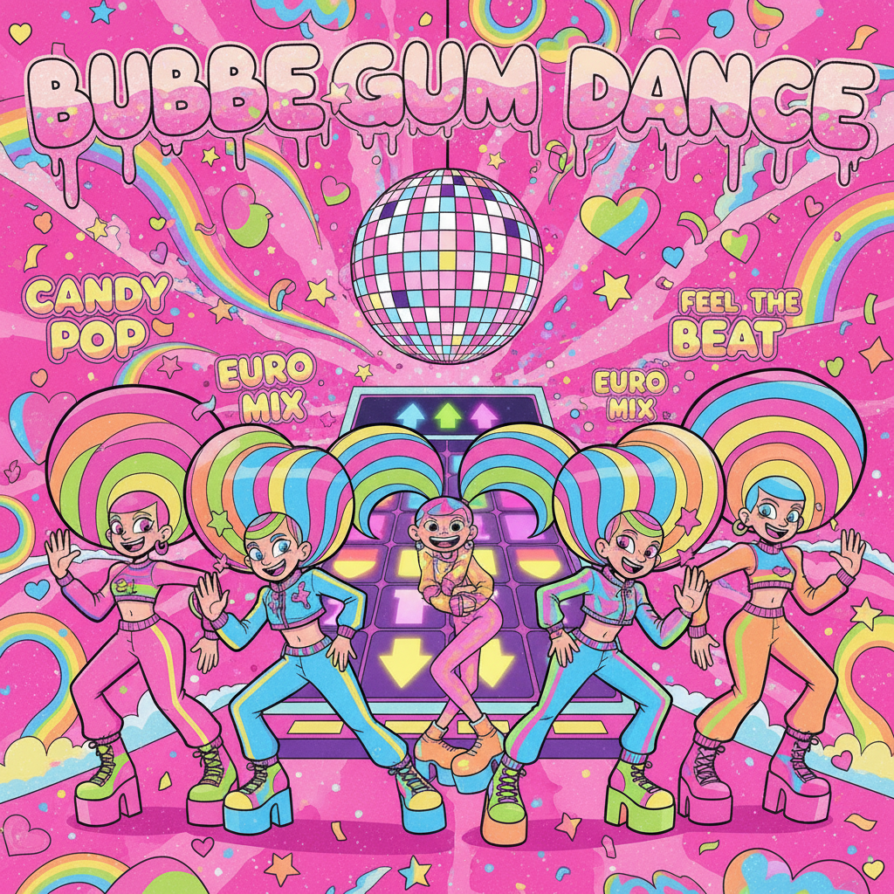

# Bubblegum Dance（泡泡糖舞曲）

> **别名**：Bubblegum Euro, 兔子舞（中国俗称）  
> **活跃年代**：1996 – 2005（巅峰期）；2020s 怀旧回潮  
> **起源**：北欧（丹麦为中心）

---

## 一句话定义

Bubblegum Dance 是 90 年代末至 2000 年代初从北欧诞生的一种极度欢快、色彩饱和的电子舞曲流派及视觉美学——用卡通化的形象、糖果色调和不可救药的乐观主义，创造了一个属于跳舞毯和 DDR 机台的平行宇宙。

---

## 视觉语言

| 元素 | 描述 |
|------|------|
| 色彩 | 糖果粉、电光蓝、柠檬黄、薄荷绿——高饱和无阴影 |
| 人物 | 卡通化造型、夸张表情、彩色假发、亮片服装 |
| 图形 | 星星、心形、彩虹、泡泡、闪电 |
| 字体 | 圆润胖体、气球字、3D 凸起效果 |
| 载体 | CD 封面、跳舞机界面、Flash 动画、MV |
| 空间 | 纯色背景、舞台灯光、迪斯科球 |

---

## 历史时间线

| 时期 | 事件 |
|------|------|
| 1996 | Aqua 组建于丹麦，开创 Bubblegum Dance 原型 |
| 1997 | *Barbie Girl* 全球爆红，定义了整个流派的视觉基调 |
| 1998-2000 | 跳舞机/跳舞毯风靡亚洲，Bubblegum Dance 成为核心曲库 |
| 1999 | Smile.dk *Butterfly* 通过 DDR 传遍全球 |
| 2000-2003 | 流派巅峰：Toy-Box、Hit'n'Hide、Bambee 等大量组合涌现 |
| 2004-2005 | 流派衰退，被 Electropop 和 R&B 取代 |
| 2020s | TikTok 上 Aqua 歌曲重新走红，DDR 怀旧社区活跃 |

---

## 文化内核

### 快乐作为意识形态

Bubblegum Dance 的核心主张极其简单：**快乐本身就是目的**。在一个越来越讽刺、越来越"酷"的文化中，它毫不掩饰地拥抱天真、愚蠢和纯粹的身体快感。

### 跳舞机：身体的民主化

DDR（Dance Dance Revolution）和家用跳舞毯让 Bubblegum Dance 获得了独特的传播渠道：
- 不需要音乐品味的"认证"
- 不需要夜店年龄
- 只需要一个客厅和一块毯子
- 身体运动 = 游戏得分 = 快乐

### 中国记忆

在中国，Bubblegum Dance 有独特的文化印记：
- "兔子舞"成为学校运动会、商场开业的标配
- 跳舞毯是 2000 年代初最热门的家庭娱乐设备
- 网吧里的 Flash 小游戏大量使用这类音乐
- 它代表了一种"电脑刚进入家庭"时期的集体欢乐

---

## 与其他风格的关系

- **McBling**：共享 2000s 的过度装饰和"俗气即快乐"精神
- **Frutiger Aero**：Bubblegum Dance 的 CD 封面常采用早期 Aero 风格设计
- **Scene**：Scene 文化中的 Crunkcore 继承了部分 Bubblegum 的欢快能量
- **Electropop 08**：Lady Gaga 等人的早期作品可视为 Bubblegum Dance 的精神续作

---

## 代表性视觉参考

- Aqua *Barbie Girl* / *Cartoon Heroes* MV
- Smile.dk 专辑封面
- DDR 游戏界面和选曲画面
- Toy-Box *Best Friend* MV

---

## 延伸阅读

- [Aesthetics Wiki - Bubblegum Dance](https://aesthetics.fandom.com/wiki/Bubblegum_Dance)
- 本项目相关：[McBling](mcbling.md) | [Electropop 08](electropop-08.md) | [Scene](scene.md)
