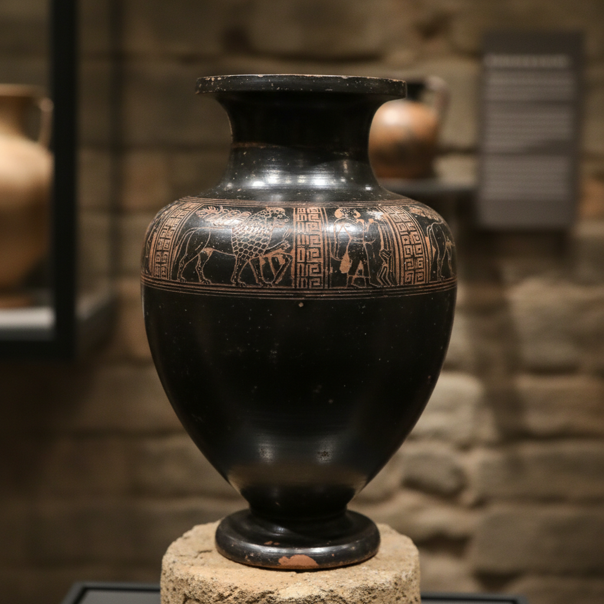

# Bucchero Art 布凯罗黑陶艺术

> "Bucchero is the dark mirror of Etruscan civilization — elegant, mysterious, and uniquely Italian." — Etruscan art history

## 概述

布凯罗黑陶艺术（Bucchero Art）是古代伊特鲁里亚文明（公元前7-4世纪）特有的黑色陶器艺术传统。布凯罗是伊特鲁里亚人最具标志性的陶瓷成就——通过在还原气氛中烧制，使陶器从表面到内部都呈现出均匀的黑色或深灰色，表面经过精心打磨后呈现出金属般的光泽。

布凯罗的名称来自西班牙语/葡萄牙语"búcaro"——指一种芳香的黑色陶器。伊特鲁里亚人在公元前7世纪发展出这种技术——通过控制窑内的还原气氛（缺氧环境），使黏土中的铁氧化物转变为黑色的氧化亚铁，从而使整个器壁呈现黑色。早期布凯罗（bucchero sottile）器壁极薄、造型优雅；晚期布凯罗（bucchero pesante）器壁较厚，装饰更加复杂，常模仿金属器皿的造型。

布凯罗黑陶艺术的核心要素包括：1）还原烧成——缺氧环境产生的黑色；2）通体黑色——从表面到内部的均匀黑色；3）金属光泽——打磨后的金属般光泽；4）模仿金属——模仿青铜和银器的造型；5）伊特鲁里亚文明——独特的文明标志；6）精细造型——薄壁和精细的造型；7）浮雕装饰——模压和刻划的浮雕装饰。

## 核心特征

| 特征 | 描述 |
|------|------|
| 还原烧成 | 缺氧环境产生黑色 |
| 通体黑色 | 表面到内部均匀黑色 |
| 金属光泽 | 打磨后金属般光泽 |
| 模仿金属 | 模仿青铜银器造型 |
| 伊特鲁里亚 | 独特文明标志 |
| 浮雕装饰 | 模压刻划浮雕装饰 |

## 视觉特征

- **深沉黑色**：均匀的深黑色或深灰色
- **金属光泽**：打磨后的闪亮表面
- **薄壁造型**：早期布凯罗的极薄器壁
- **金属器形**：模仿青铜器的造型
- **浮雕带**：环绕器身的浮雕装饰带
- **动物造型**：动物形把手和装饰

## 代表作品

| 作品 | 年代 | 意义 |
|------|------|------|
| *薄壁布凯罗杯* (Bucchero sottile) | 前7世纪 | 早期精品 |
| *厚壁布凯罗壶* (Bucchero pesante) | 前6世纪 | 晚期风格 |
| *布凯罗香炉* | 前7-6世纪 | 宗教用途 |
| *动物形把手水壶* | 前6世纪 | 造型艺术 |
| *浮雕装饰大瓮* | 前6-5世纪 | 装饰巅峰 |
| *布凯罗仿金属器* | 前7-5世纪 | 金属模仿 |

## 历史时间线

| 时期 | 事件 |
|------|------|
| 前7世纪初 | 布凯罗技术在伊特鲁里亚出现 |
| 前7世纪 | 薄壁布凯罗（sottile）鼎盛 |
| 前6世纪 | 厚壁布凯罗（pesante）发展 |
| 前5世纪 | 布凯罗出口地中海各地 |
| 前4世纪 | 布凯罗生产衰落 |
| 前3世纪 | 罗马征服后布凯罗消失 |
| 当代 | 考古研究和艺术复兴 |

## 中国语境

布凯罗黑陶与中国新石器时代的黑陶有着惊人的平行关系。中国龙山文化（约前2500-前2000年）的蛋壳黑陶——器壁薄如蛋壳、通体漆黑、表面光亮——与伊特鲁里亚的薄壁布凯罗在技术原理和美学效果上极为相似。两者都采用还原烧成获得黑色，都追求极薄的器壁和金属般的光泽。但两种传统相隔数千年和数千公里，是完全独立的发明——这说明人类在不同时空中对"黑色之美"有着共同的追求。中国黑陶比布凯罗早了约两千年——是世界上最早的还原烧成黑陶传统之一。

## 概念图

## 与其他风格的关系

- **Etruscan Art** → 伊特鲁里亚艺术
- **Greek Black-Figure** → 希腊黑绘陶（同时代）
- **Longshan Black Pottery** → 龙山黑陶（平行传统）
- **Terra Sigillata** → 红色细陶（罗马继承）
- **Metalwork** → 金属工艺（模仿对象）
- **Pit-Fired** → 坑烧（还原烧成）

---

*浮光艺志 | Chronicle of Artistry*
