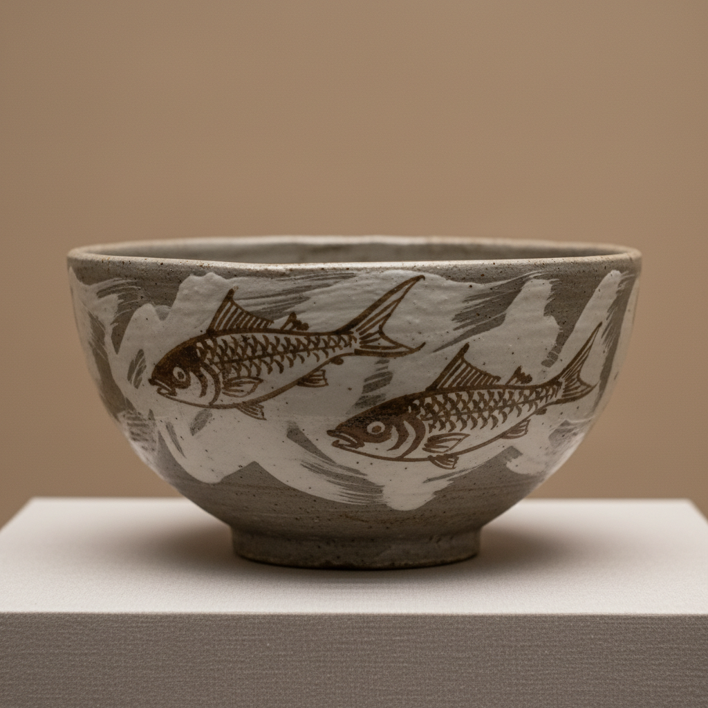

# Buncheong Art 粉青沙器艺术

> "Buncheong is freedom painted on clay — Korean stoneware of the early Joseon dynasty where potters brushed, stamped, carved, and splashed white slip over grey bodies with an improvisational energy that anticipates abstract expressionism by five centuries, each piece unique because the maker's gesture is preserved in every brushstroke and every fingerprint pressed into soft clay." — Unknown

## 概述

粉青沙器艺术（Buncheong Art）是朝鲜半岛朝鲜王朝初期（15-16世纪）发展的一种独特的陶瓷艺术。粉青沙器（분청사기/粉靑沙器）是在灰色炻器胎体上施加白色化妆土（白泥浆）进行装饰的陶瓷——其装饰技法极为丰富多样，包括刷毛（귀얄）、粉引（분장）、印花（인화）、剔花（조화）、铁画（철화）等。粉青沙器以其自由奔放的装饰风格著称——被认为是韩国陶瓷中最具现代感和艺术性的品类。

粉青沙器艺术的核心要素包括：1）白色化妆土——在灰胎上施白泥浆；2）技法多样——刷毛、印花、剔花等；3）自由奔放——即兴自由的装饰风格；4）朝鲜初期——朝鲜王朝初期的产物；5）过渡性质——从高丽青瓷到白瓷的过渡；6）民间活力——充满民间艺术活力；7）现代审美——与现代审美高度契合。

## 核心特征

| 特征 | 描述 |
|------|------|
| 白色化妆土 | 灰胎上施白泥浆 |
| 技法多样 | 刷毛印花剔花等 |
| 自由奔放 | 即兴自由装饰风格 |
| 朝鲜初期 | 朝鲜王朝初期产物 |
| 过渡性质 | 青瓷到白瓷过渡 |
| 民间活力 | 充满民间艺术活力 |

## 视觉特征

- **灰白对比**：灰色胎体与白色化妆土
- **刷痕可见**：大胆的刷毛痕迹
- **即兴装饰**：自由即兴的装饰
- **印花密布**：密集的印花图案
- **铁画奔放**：铁锈色的奔放绘画
- **质朴自然**：质朴自然的美感

## 代表作品

| 作品 | 艺术家/文化 | 年代 | 意义 |
|------|-------------|------|------|
| *粉青印花瓶* | 朝鲜 | 15世纪 | 印花技法代表 |
| *粉青刷毛碗* | 朝鲜 | 15-16世纪 | 刷毛技法代表 |
| *粉青铁画鱼纹瓶* | 朝鲜 | 15世纪 | 铁画技法代表 |
| *粉青剔花牡丹瓶* | 朝鲜 | 15世纪 | 剔花技法代表 |
| *粉青粉引碗* | 朝鲜 | 15-16世纪 | 粉引技法代表 |

## 历史时间线

| 时期 | 事件 |
|------|------|
| 14世纪末 | 高丽青瓷衰落，粉青萌芽 |
| 15世纪 | 粉青沙器的繁荣期 |
| 16世纪初 | 粉青沙器的简化 |
| 1592年 | 壬辰倭乱，粉青传统中断 |
| 当代 | 粉青沙器的复兴和研究 |

## 中国语境

粉青沙器与中国陶瓷有密切的技术渊源。其白色化妆土技法与中国磁州窑的化妆土技法有相似之处——都是在深色胎体上施加白色泥浆来改善外观。但粉青沙器发展出了独特的韩国风格——特别是刷毛技法的大胆奔放，在中国陶瓷中很少见到。粉青沙器的印花技法也与中国的印花陶瓷有关联——但韩国工匠将印花发展到了极致，创造出密集而有节奏感的装饰效果。粉青沙器对日本陶瓷产生了深远影响——1592年壬辰倭乱期间，大量朝鲜陶工被掳至日本，将粉青技法带到了日本，催生了日本的唐津烧、萩烧等陶瓷传统。粉青沙器的自由奔放风格在20世纪被重新发现——其与现代抽象艺术的契合使其成为国际陶艺界关注的焦点。

## AI生成概念图

## 与其他风格的关系

- **Korean Celadon** → 高丽青瓷
- **Joseon White** → 朝鲜白瓷
- **Cizhou Ware** → 磁州窑
- **Japanese Karatsu** → 唐津烧
- **Slip Decoration** → 化妆土装饰
- **Abstract Expressionism** → 抽象表现主义

---

*浮光艺志 | Chronicle of Artistry*
