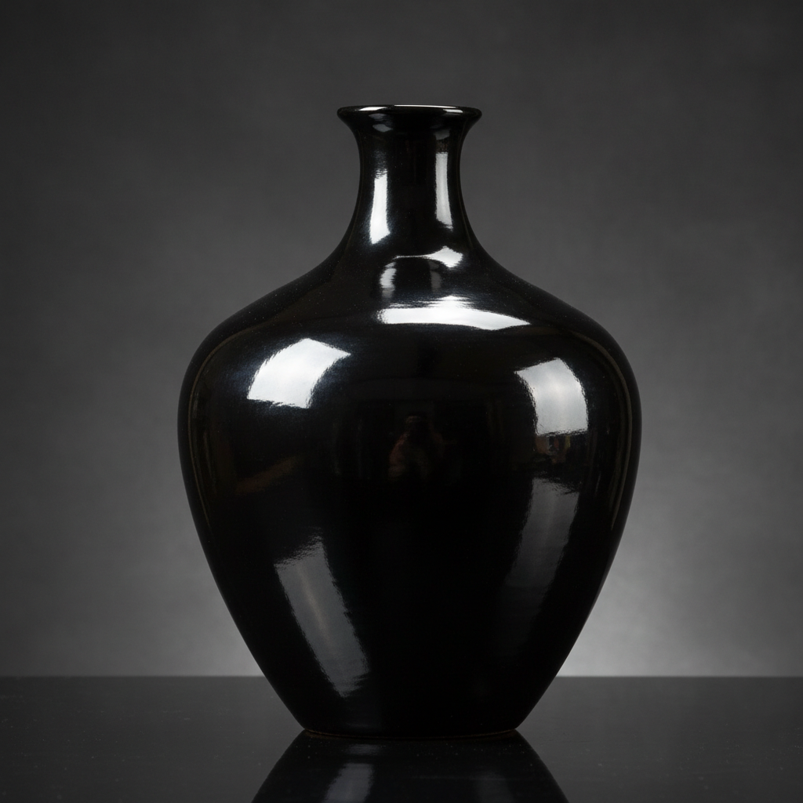

# Burnishing Art 抛光陶艺术

> "Burnishing is patience polished to a mirror — a smooth stone or the back of a spoon rubbed again and again over leather-hard clay until the surface particles align and compress into a skin so dense and reflective that it gleams like satin without any glaze, the oldest surface treatment in ceramics and still the most intimate, requiring nothing but time, pressure, and the potter's unwavering attention to every square centimeter." — Unknown

## 概述

抛光陶艺术（Burnishing Art）是一种在半干（革硬）状态的粘土表面用光滑工具（石头、勺背、玻璃等）反复摩擦压实，使表面粒子排列整齐形成光滑如缎的效果的陶瓷表面处理技法。抛光不使用任何釉料——光泽完全来自粘土粒子的物理压实和排列。这是人类最古老的陶瓷表面处理方式，在非洲、美洲原住民和古代地中海文明中都有悠久的传统。

抛光陶艺术的核心要素包括：1）革硬状态——在粘土半干时进行；2）光滑工具——使用石头或光滑物体摩擦；3）反复摩擦——需要大量耐心的反复摩擦；4）粒子压实——使表面粘土粒子排列整齐；5）无釉光泽——不使用釉料的自然光泽；6）低温烧制——通常在较低温度烧制保持光泽；7）丝绸质感——如丝绸般的柔和光泽。

## 核心特征

| 特征 | 描述 |
|------|------|
| 物理抛光 | 通过摩擦压实表面 |
| 无釉光泽 | 不使用釉料的自然光泽 |
| 丝绸质感 | 柔和的丝绸般光泽 |
| 耐心工艺 | 需要大量时间和耐心 |
| 古老技法 | 最古老的表面处理方式 |
| 低温保持 | 低温烧制保持抛光效果 |

## 视觉特征

- **丝绸光泽**：柔和的非玻璃质光泽
- **温暖色调**：粘土本色的温暖色调
- **光滑表面**：极其光滑的触感
- **无釉质感**：不同于釉面的自然光泽
- **深色效果**：熏烧后的深色抛光
- **原始优雅**：质朴中的优雅美感

## 代表作品

| 作品 | 艺术家/文化 | 年代 | 意义 |
|------|-------------|------|------|
| *古罗马terra sigillata* | 古罗马 | 1-4世纪 | 古典抛光陶 |
| *Maria Martinez黑陶* | Maria Martinez | 20世纪 | 美国原住民抛光 |
| *非洲抛光陶器* | 非洲各族 | 传统 | 非洲抛光传统 |
| *Magdalene Odundo作品* | Magdalene Odundo | 当代 | 当代抛光大师 |
| *当代抛光陶* | 各地陶艺家 | 当代 | 抛光的现代演绎 |

## 历史时间线

| 时期 | 事件 |
|------|------|
| 新石器时代 | 最早的抛光陶器 |
| 古代文明 | 各大文明的抛光传统 |
| 古罗马 | Terra sigillata的工业化抛光 |
| 传统延续 | 非洲和美洲的持续传统 |
| 当代 | 抛光作为艺术表达手段 |

## 中国语境

抛光技法在中国有古老的历史。中国新石器时代的某些陶器——特别是龙山文化的黑陶——就经过了精细的抛光处理，表面光滑如漆。中国的黑陶传统——从龙山文化到当代——都包含抛光工艺。中国当代陶艺中，抛光作为一种追求自然质感的表面处理方式受到关注。抛光陶的"无釉之美"与中国传统美学中对"天然去雕饰"的追求相呼应。中国的紫砂壶——虽然不是传统意义上的抛光——其表面的"包浆"效果也是一种使用中的自然抛光。

## AI生成概念图

## 与其他风格的关系

- **Terra Sigillata** → 印纹红陶
- **Smoke Firing** → 熏烧
- **Black Pottery** → 黑陶
- **Pit Firing** → 坑烧
- **Primitive Pottery** → 原始陶器
- **Surface Treatment** → 表面处理

---

*浮光艺志 | Chronicle of Artistry*
