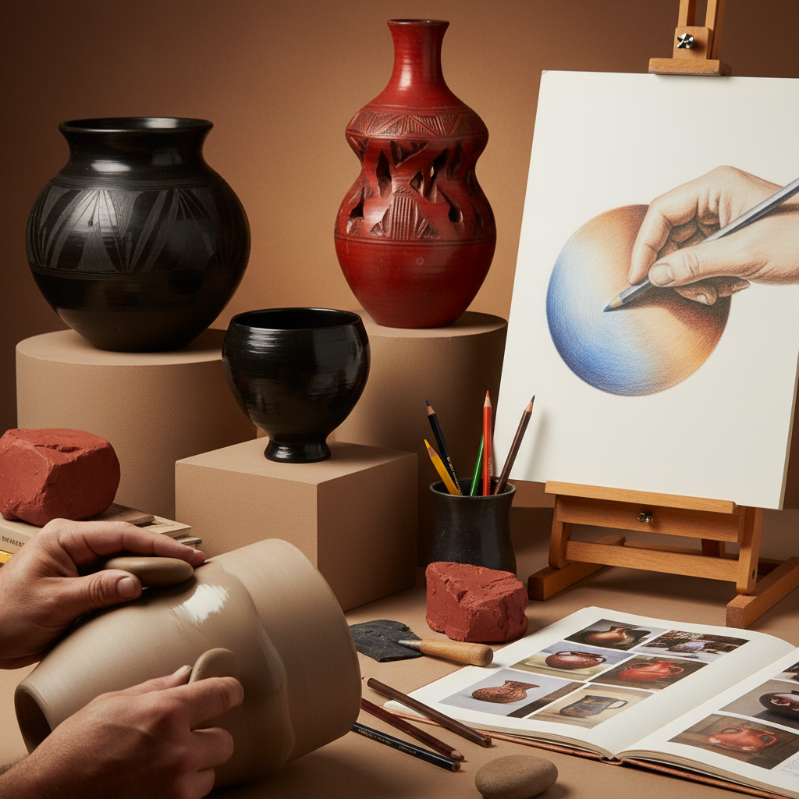

# Burnishing Technique 抛光技法

> "Burnishing is the art of patience made visible — rubbing a surface with such persistent devotion that rough clay becomes mirror, dull graphite becomes silver, and the ordinary is transformed into the luminous through nothing more than pressure and time." — Unknown

## 概述

抛光技法（Burnishing Technique）是一种通过反复摩擦和压磨使材料表面产生光泽的技法——广泛应用于陶瓷、素描、金属加工和皮革工艺等领域。在陶瓷中，抛光是指在陶器未烧制前（皮革硬度阶段），用光滑的石头、勺子背面或其他硬质工具反复摩擦器物表面，压平粘土颗粒，使表面产生光滑如镜的效果——无需施釉即可获得美丽的光泽。

在素描中，抛光（burnishing）是指用无色铅笔或硬质工具在彩色铅笔画上施加压力，将颜料颗粒压入纸张纤维，产生光滑、饱和的表面效果。陶瓷抛光的历史极为悠久——世界各地的原住民文化（如美洲原住民的黑陶、非洲的抛光陶器、中国的黑陶）都有精美的抛光陶器传统。

## 核心特征

| 特征 | 描述 |
|------|------|
| 摩擦 | 通过摩擦产生光泽 |
| 压力 | 施加压力压平表面 |
| 耐心 | 需要极大的耐心 |
| 光泽 | 产生自然光泽 |
| 无釉 | 陶瓷中无需施釉 |
| 多领域 | 应用于多个领域 |

## 视觉特征

- **光泽**：自然的光泽
- **光滑**：光滑的表面
- **反射**：柔和的反射
- **质感**：细腻的质感
- **温暖**：温暖的光泽感
- **自然**：自然的美感

## 代表作品

| 作品 | 艺术家 | 年代 | 意义 |
|------|--------|------|------|
| *Pueblo black pottery* | Maria Martinez | 20世纪 | 美洲原住民抛光黑陶 |
| *Longshan black pottery* | 中国工匠 | 新石器时代 | 中国龙山黑陶 |
| *African burnished vessels* | 非洲工匠 | 传统 | 非洲抛光陶器 |
| *Contemporary burnished ceramics* | Various | 当代 | 当代抛光陶艺 |
| *Burnished colored pencil art* | Various | 当代 | 彩铅抛光技法 |

## 历史时间线

| 时期 | 事件 |
|------|------|
| 新石器时代 | 最早的抛光陶器 |
| 龙山文化 | 中国黑陶的抛光传统 |
| 古代 | 全球各文化的抛光传统 |
| 传统 | 美洲原住民的抛光黑陶 |
| 20世纪 | Maria Martinez的黑陶复兴 |
| 当代 | 抛光技法在当代陶艺和素描中的应用 |

## 中国语境

抛光技法在中国有极其悠久的历史——中国新石器时代的龙山文化黑陶以其极致的抛光工艺闻名于世，被称为"蛋壳黑陶"。中国的良渚文化也有精美的抛光陶器。中国的当代陶艺教育中，抛光作为一种表面处理技法被教授。中国的彩色铅笔画教育中，抛光技法是实现照片级写实效果的重要手段。中国的漆器传统中也有类似的抛光工艺。

## AI生成概念图

## 与其他风格的关系

- **Pottery** → 陶器
- **Colored Pencil** → 彩色铅笔
- **Polishing** → 抛光
- **Black Pottery** → 黑陶
- **Surface Treatment** → 表面处理
- **Lacquerware** → 漆器

---

*浮光艺志 | Chronicle of Artistry*
