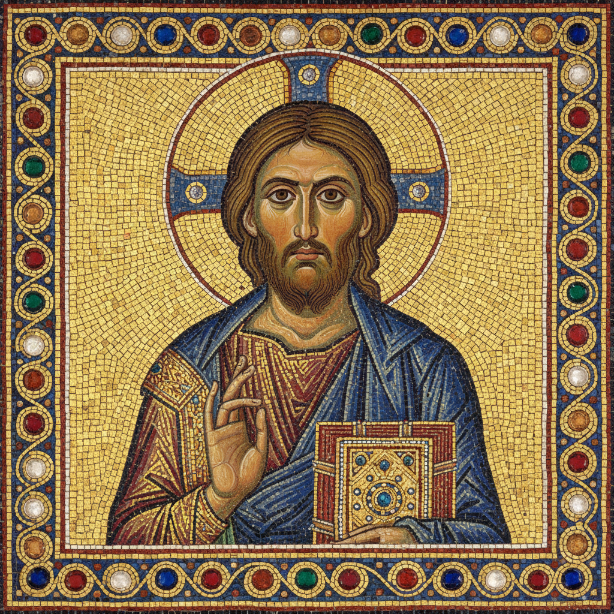

# Byzantine Art 拜占庭艺术

> **"金色的永恒——当天堂降临人间的墙壁。"**

## 概述

拜占庭艺术（Byzantine Art）是东罗马帝国（330–1453年）发展出的独特视觉艺术传统，以金色马赛克、圣像画（Icon）和宏伟的教堂建筑闻名于世。它融合了希腊罗马古典传统、东方装饰性和基督教神学，创造出一种超越尘世、指向神圣的视觉语言。拜占庭艺术深刻影响了东正教世界、意大利文艺复兴早期以及当代宗教艺术。

## 时间线

| 时期 | 特征 |
|------|------|
| 早期 (330–726) | 从罗马传统过渡，发展马赛克和圣像 |
| 圣像破坏运动 (726–843) | 禁止宗教图像，转向十字架和装饰纹样 |
| 马其顿文艺复兴 (843–1056) | 圣像恢复，古典风格复兴 |
| 科穆宁时期 (1081–1185) | 情感表达增强，人文主义萌芽 |
| 帕列奥洛格文艺复兴 (1261–1453) | 最后的辉煌，影响意大利早期文艺复兴 |

## 核心特征

- **金色背景**：象征神圣之光和永恒天国
- **正面性**：圣人面向观者，建立精神交流
- **等级比例**：人物大小取决于神圣等级而非透视
- **反自然主义**：扁平化、程式化的人物造型
- **象征色彩**：每种颜色都有神学含义（蓝=神性，红=人性）
- **马赛克**：金色玻璃镶嵌创造闪烁的超自然光效

## 主要形式

| 形式 | 特征 |
|------|------|
| 马赛克 Mosaic | 金色玻璃镶嵌，圣索菲亚大教堂、拉文纳 |
| 圣像画 Icon | 木板蛋彩画，供信徒祈祷的"神圣窗口" |
| 手抄本彩饰 | 福音书插图，金箔装饰 |
| 象牙雕刻 | 精致的浮雕板和圣物箱 |
| 建筑 | 穹顶、半圆拱、集中式平面 |

## 视觉特征

- 金色马赛克背景的闪烁光效
- 大眼睛、细长鼻、小嘴的程式化面容
- 厚重的衣褶线条（源自古典传统）
- 严格的图像学程序（每位圣人有固定姿态和属性）
- 建筑空间的象征性而非写实性
- 文字铭文作为画面有机组成部分

## 与其他风格的关系

| 风格 | 关系 |
|------|------|
| 古典希腊罗马 | 继承并转化古典传统 |
| 伊斯兰艺术 | 互相影响，共享装饰性 |
| 哥特艺术 | 拜占庭影响了早期哥特 |
| 文艺复兴 | Giotto 从拜占庭传统中突破 |
| 俄罗斯圣像画 | 直接继承拜占庭传统 |
| 当代圣像画 | 东正教世界延续至今 |

## 概念图

---

*浮光艺志 | Chronicle of Artistry*
