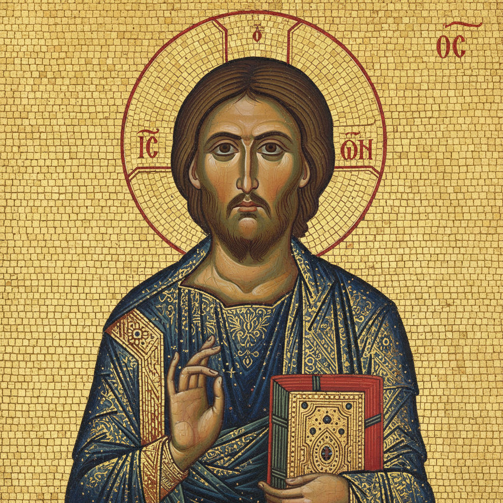

# Byzantine Painting 拜占庭绘画

> **时期：** 330年–1453年  
> **关键词：** 圣像画、金色马赛克、正面性、神圣庄严、东正教

## 概述

Byzantine Painting（拜占庭绘画）是东罗马帝国延续千年的宗教艺术传统——画家们（更准确地说是圣像画师）用严格的正面构图、金色背景和程式化的面容描绘基督、圣母和圣徒。这不是"画"，而是"窗口"——通向神圣世界的视觉通道。每一笔都遵循神学规范，每一个姿态都承载着千年不变的信仰。

## 风格特征

- **正面性**：人物面向观者的庄严姿态
- **金色背景**：代表神圣光芒的永恒空间
- **程式化面容**：大眼睛、细长鼻、小嘴
- **平面化**：拒绝透视和立体感
- **马赛克**：闪烁的金色和宝石色镶嵌

## 代表人物与作品

- 拉文纳圣维塔莱教堂马赛克
- 君士坦丁堡圣索菲亚大教堂
- 安德烈·鲁布廖夫《三位一体》
- 西奈山圣凯瑟琳修道院圣像

## 概念图

