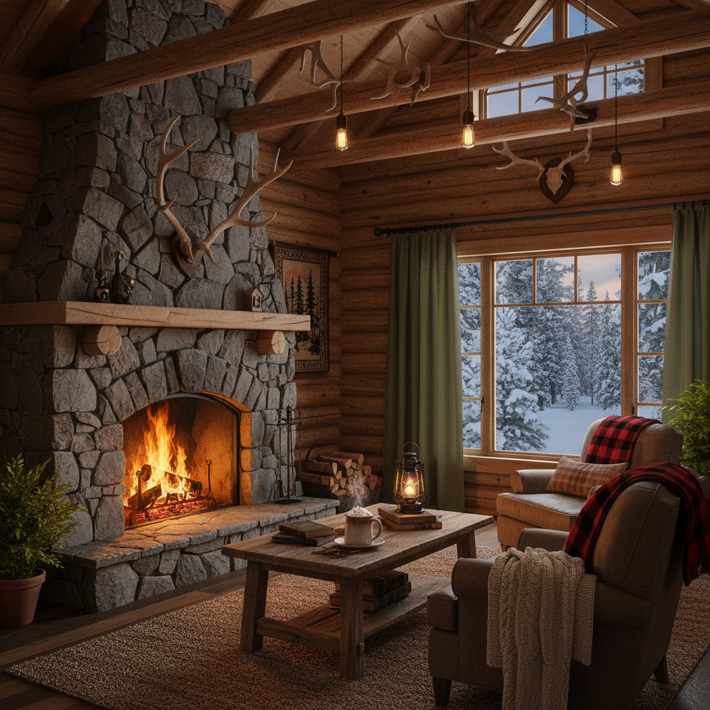

# Cabincore 木屋核



> **"松木壁炉、格纹毛毯、窗外的雪——在山间小屋里过一个永恒的冬天。"**

## 概述

| 维度 | 描述 |
|------|------|
| 时期 | 2020–至今 |
| 别名 | Cabincore, Cabin Aesthetic, Lodge Aesthetic |
| 核心色彩 | 深棕、暖红、森林绿、米白、金色 |
| 关键元素 | 原木、壁炉、格纹、毛皮、热可可 |
| 代表人物 | Pinterest/TikTok 社区驱动 |
| 关联风格 | Cottagecore, Mountaincore, Hygge, Rustic |

---

## 历史脉络

| 年份 | 事件 |
|------|------|
| 1800s | 美国拓荒时代的原木小屋 |
| 1900s | 国家公园 Lodge 建筑风格 |
| 2016 | Hygge（丹麦舒适哲学）全球流行 |
| 2020 | Cabincore 在疫情期间兴起 |
| 2022 | 与"远程工作+山间生活"趋势交叉 |

### 核心哲学

Cabincore 的精神是**"在壁炉旁，时间停止了——温暖就是一切"**：
- 温暖 = 安全（壁炉、毛毯、热饮）
- 简单 = 满足（"不需要WiFi"）
- 冬天 = 美（不是要忍受的季节）
- 与 Cottagecore 共享"逃离城市"
- 区别：Cabincore = 山间/冬季，Cottagecore = 田园/春夏

---

## 视觉语法

### 色彩系统

```
主色：
  深棕 (#3E2723) — 原木、皮革
  暖红 (#8B0000) — 格纹、壁炉光
  森林绿 (#1B5E20) — 松树、常绿
  米白 (#F5F5DC) — 羊毛、雪
  金色 (#DAA520) — 火光、蜂蜜

辅色：
  黑色 (#1A1A1A) — 铸铁、夜晚
  灰色 (#696969) — 石头、烟
  橙色 (#CC5500) — 秋叶、火焰

质感：
  原木 — 未加工的木材
  羊毛 — 毛毯、袜子
  格纹 — 法兰绒、苏格兰格
  石头 — 壁炉、地基
  皮革 — 靴子、椅子
```

### 标志性元素

| 类别 | 元素 |
|------|------|
| 空间 | 原木墙、石壁炉、木梁天花板 |
| 物件 | 热可可、毛毯、蜡烛、书 |
| 服装 | 法兰绒衬衫、羊毛袜、登山靴 |
| 动物 | 鹿角装饰、熊、松鼠 |
| 户外 | 雪景、松林、劈柴、星空 |
| 态度 | 温暖、简单、安宁、自给自足 |

---

## 与千禧怀旧的关系

### 疫情时代的"逃离幻想"
- 2020 封锁 = "我想住在山里的小屋"
- Cabincore = 对城市生活的浪漫化逃离
- 与远程工作的结合 = "真的可以实现"
- 从幻想到生活方式的转化

### 与 Hygge 的关系
- Hygge = 丹麦的"舒适哲学"
- Cabincore = Hygge 的"美国山间版"
- 两者共享"温暖""简单""蜡烛"
- Cabincore 更偏"荒野""自给自足"

---

## 中国语境

- 与中国"民宿"文化的交叉
- 莫干山/丽江的木屋民宿
- 中国冬季"围炉煮茶"趋势
- 与中国"慢生活"概念的融合

---

## 设计应用

| 场景 | 应用方式 |
|------|----------|
| 空间 | 原木+石头+壁炉+暖色光+格纹 |
| 品牌 | 温暖+手工+天然+舒适+冬季 |
| 时尚 | 法兰绒+羊毛+皮革+层叠+暖色 |
| 餐饮 | 热饮+烘焙+木质餐具+温暖氛围 |

---

## 相关风格

← [Cottagecore 田园核](cottagecore.md) | [Mountaincore 山核](mountaincore.md) →

↑ [返回千禧怀旧目录](README.md) | [返回总目录](../README.md)
