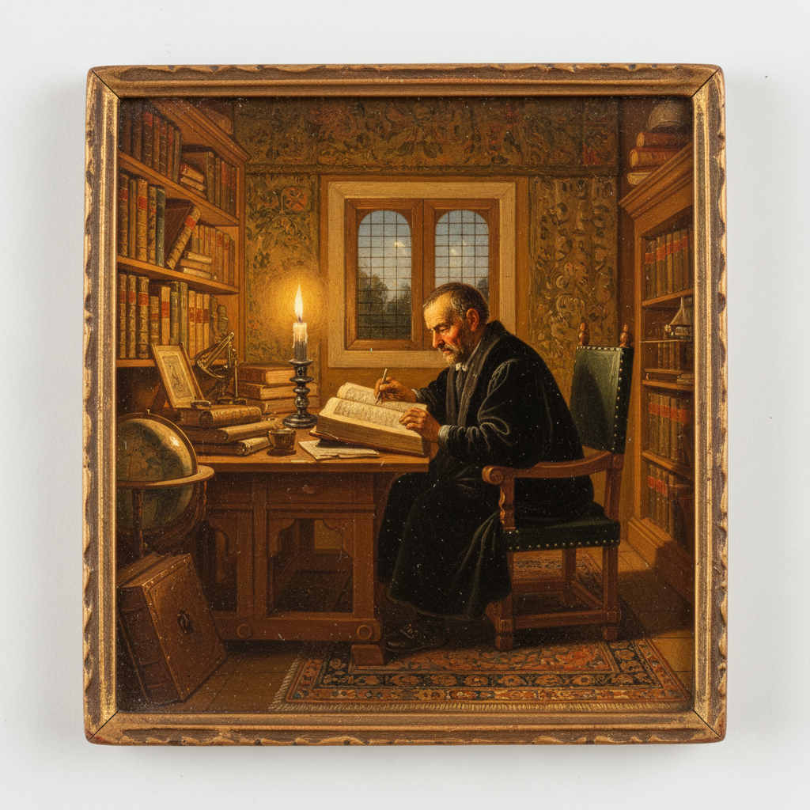

# Cabinet Painting 小品画

> **时期：** 17世纪–18世纪  
> **关键词：** 小尺幅、精细笔触、私人收藏、珍奇柜、亲密观赏

## 概述

Cabinet Painting（小品画）是专为私人收藏室或"珍奇柜"创作的小尺幅精品画。在17世纪荷兰，富裕市民的家中没有宫殿般的大墙，却有精致的收藏室——这些巴掌大的画作以极其精细的笔触描绘微缩世界，需要观者凑近细看，是一种私密的、亲密的视觉享受。

## 风格特征

- **小尺幅**：通常不超过50厘米
- **极细笔触**：近乎微缩画的精密度
- **珍贵材料**：铜板、象牙等精细基底
- **私密观赏**：为近距离细看而设计
- **精品意识**：每一寸画面都经过精心打磨

## 代表人物与作品

- 赫拉尔德·道 莱顿精细画派
- 弗兰斯·凡·米里斯 室内小品
- 阿德里安·凡·德·维尔夫 铜板小画
- 当代：微缩画复兴运动

## 概念图

