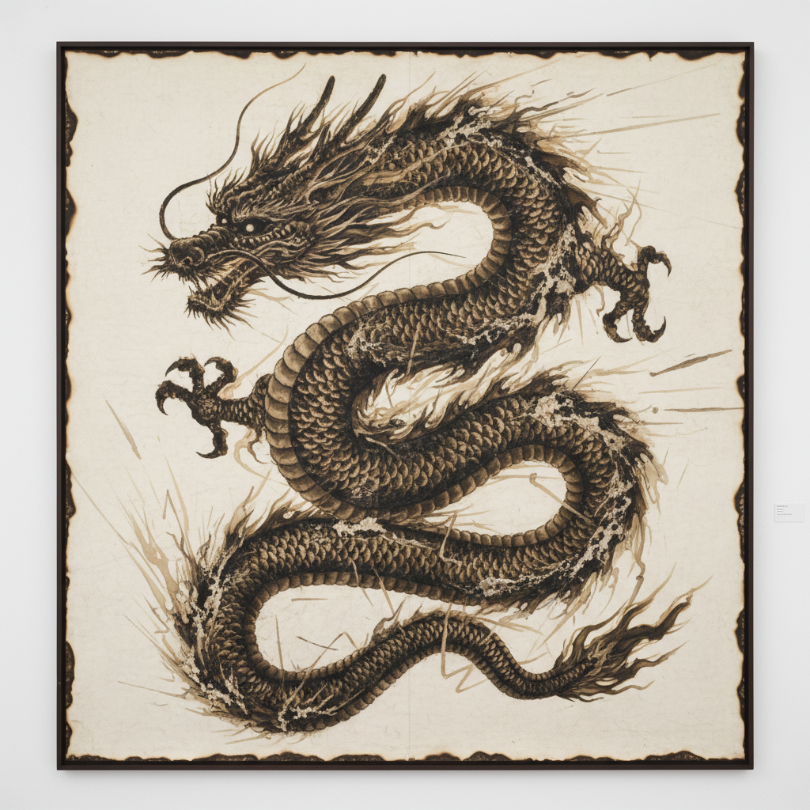

# Cai Guo-Qiang 蔡国强

> **流派**: 当代艺术 · 装置艺术 · 爆破艺术  
> **时期**: 1957–至今 中国/美国  
> **关键词**: 火药画、爆破艺术、天梯、东方哲学

## 概述

蔡国强是当代最具视觉冲击力的中国艺术家之一。他以火药为核心媒介——在画布或纸上铺设火药并引爆，利用爆炸的不可控性创造出介于毁灭与创造之间的图像。他的大型户外爆破项目（如"天梯"）将整个天空变为画布，用烟火书写短暂而壮丽的视觉诗篇。

## 视觉特征

- **火药灼痕**: 爆炸在纸面留下的焦黑痕迹和烟熏色调
- **不可控美学**: 拥抱爆炸的随机性和偶然性
- **巨大尺度**: 户外爆破项目可达数百米
- **东方意象**: 龙、虎、山水等中国传统图像的火药版本
- **短暂性**: 爆破瞬间即逝，只留下记录影像

## 代表作品

- 《天梯》(Sky Ladder, 2015) — 500米高的烟火梯
- 2008北京奥运会开幕式"大脚印"烟火
- 《不合时宜：舞台一》(Inopportune: Stage One, 2004)
- 火药草图系列

## 历史影响

蔡国强将中国四大发明之一的火药从武器转化为艺术媒介，在全球当代艺术中开辟了独特的"爆破美学"。他证明了中国传统哲学（阴阳、气、道）可以成为当代艺术创作的方法论。

## 相关风格

- [Xu Bing 徐冰](xu-bing.md)
- [Land Art 大地艺术](land-art.md)
- [Performance Art 行为艺术](performance-art.md)
