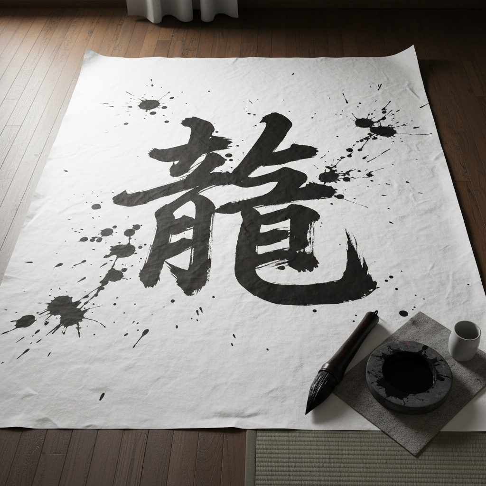

# Calligraphy Art 书法艺术

> "Calligraphy is the art of writing beautifully, but also the art of thinking beautifully." — 井上有一

## 概述

书法艺术（Calligraphy Art）是以文字书写为核心的艺术形式，通过笔画的节奏、力度、速度和空间布局表达美学和情感。它是东亚文明（中国、日本、韩国）和伊斯兰文明中最核心的艺术传统之一，也是西方中世纪手抄本和当代字体设计的根基。

20世纪以来，书法从传统的文字书写扩展为抽象表现——井上有一的"一字书"、徐冰的"天书"、布里昂·居奈的阿拉伯书法绘画，都将书法推入当代艺术的语境。

## 核心特征

| 特征 | 描述 |
|------|------|
| 笔墨媒介 | 毛笔/硬笔/芦苇笔与墨/墨水的互动 |
| 时间性 | 书写是不可逆的时间过程 |
| 身体性 | 全身的气息、力量通过笔尖传达 |
| 文字与图像 | 在可读文字和抽象图像之间游走 |
| 修养 | 书法是人格修养的外在表现 |
| 传统 | 深厚的师承和经典传统 |

## 视觉特征

- **线条**：粗细变化、枯润对比、速度感
- **墨色**：浓淡干湿焦——五色之墨
- **空间**：字间、行间的留白与呼吸
- **节奏**：如音乐般的韵律和节拍
- **材料**：宣纸/和纸的渗透效果
- **尺度**：从小楷到榜书的巨大跨度

## 代表作品

| 作品 | 艺术家 | 年代 | 意义 |
|------|--------|------|------|
| *兰亭序* | 王羲之 | 353 | "天下第一行书"——书法的最高典范 |
| *祭侄文稿* | 颜真卿 | 758 | "天下第二行书"——悲愤的极致 |
| *愚徹* | 井上有一 | 1960s | 一字书——书法的抽象表现主义 |
| *天书* | 徐冰 | 1987-91 | 伪文字——书法的概念艺术转化 |
| *Hurufiyya* | Various | 1950s+ | 阿拉伯书法的现代主义转化 |
| *Logomotives* | Brody Neuenschwander | 2000s | 西方书法的当代实验 |

## 历史时间线

| 时期 | 事件 |
|------|------|
| 前1400年 | 甲骨文——中国书法的起源 |
| 4世纪 | 王羲之——书法成为独立艺术 |
| 7世纪 | 阿拉伯书法随伊斯兰教传播 |
| 8-9世纪 | 日本假名书法发展 |
| 中世纪 | 西方手抄本的装饰书法 |
| 1950s | 井上有一——前卫书法运动 |
| 1950s | Hurufiyya——阿拉伯书法现代主义 |
| 1980s | 徐冰、谷文达——书法的当代艺术转化 |
| 2000s-至今 | 书法在当代艺术、设计、数字媒体中的复兴 |

## 子类型

| 子类型 | 特征 |
|--------|------|
| 中国书法 | 篆隶楷行草——五体系统 |
| 日本书道 | 假名书法、前卫书法 |
| 阿拉伯书法 | 库法体、纳斯赫体——几何与流动 |
| 西方书法 | 哥特体、意大利体、当代手写 |
| 前卫书法 | 井上有一——书法的抽象化 |
| 概念书法 | 徐冰——文字系统的解构 |

## 中国语境

书法是中国文化的核心艺术。从甲骨文到当代，书法贯穿了中国文明的全部历史。中国书法不仅是视觉艺术，更是哲学、修养和身份的表达。当代中国书法面临传统与创新的张力——一方面是对经典的继承和临摹传统，另一方面是邱振中、王冬龄等艺术家将书法推向当代艺术的实验。书法教育在中小学的回归、书法展览的繁荣、以及书法在设计中的应用，都显示了这一古老艺术的持续生命力。

## 争议与遗产

- **争议**：前卫书法还是书法吗？不可读的"书法"是否背叛了文字？
- **传统vs创新**：临摹传统与个人表达的永恒张力
- **数字时代**：键盘取代手写——书法是否会消亡？
- **遗产**：证明了线条本身可以承载最深刻的人类情感
- **当代回响**：字体设计、品牌书法、数字书法工具、书法疗愈

## AI生成概念图

## 与其他风格的关系

- **Abstract Expressionism** → 抽象表现主义受东方书法影响（Kline、Motherwell）
- **Ink Painting** → 水墨画与书法共享笔墨媒介和美学
- **Minimalism** → 极简主义的"少即是多"与书法的留白相通
- **Conceptual Art** → 徐冰将书法转化为概念艺术
- **Islamic Art** → 阿拉伯书法是伊斯兰艺术的核心
- **Typography** → 字体设计是书法的工业化延伸

---

*浮光艺志 | Chronicle of Artistry*
