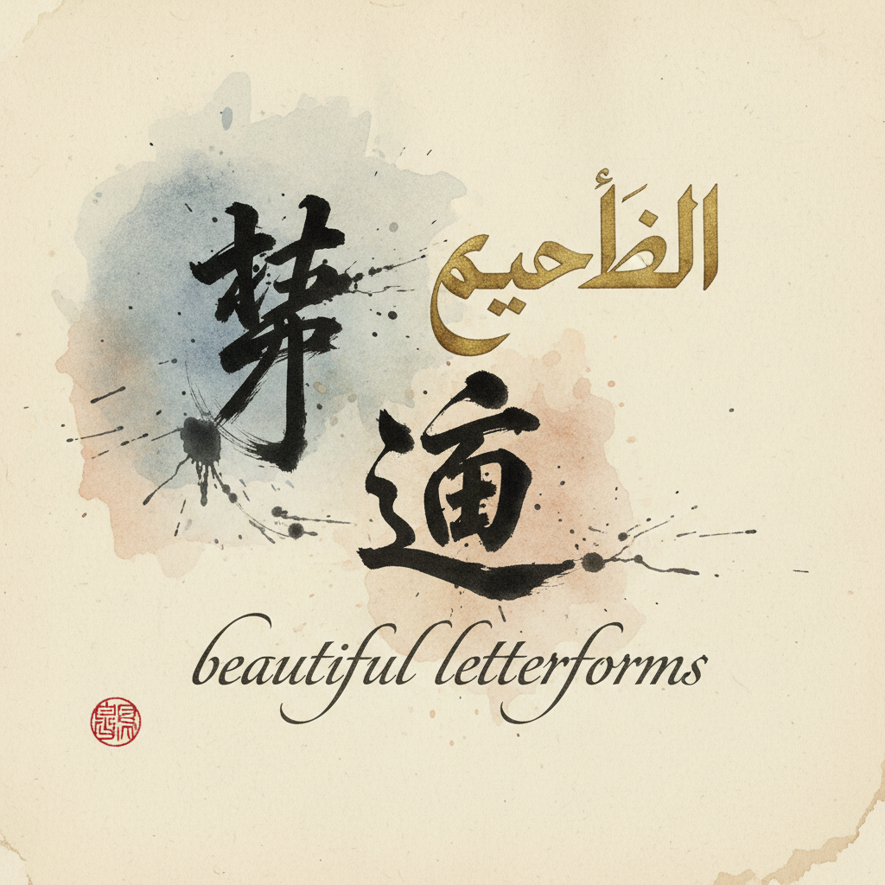

# Calligraphy 书法 | 書道 / الخط / Calligraphie

> **"笔尖的舞蹈——从甲骨到宣纸，从芦苇笔到鹅毛笔，文字本身就是最古老的艺术。"**

## 概述

书法（Calligraphy / 書道 しょどう / الخط العربي / Calligraphie）是以文字书写为载体的视觉艺术，将实用的文字提升为审美对象。世界上有三大独立的书法传统：东亚书法（中国書法→日本書道→韩国書藝）、伊斯兰书法（الخط العربي）和西方书法（Latin Calligraphy）。每种传统都发展出独特的工具、风格和美学体系。书法不仅是视觉艺术，更是身体的修行——呼吸、姿态、心境都融入每一笔中。

## 三大传统

| 传统 | 工具 | 核心美学 |
|------|------|----------|
| 东亚 | 毛笔、墨、宣纸 | 气韵生动、骨法用笔 |
| 伊斯兰 | 芦苇笔（Qalam） | 几何精确、神圣文字 |
| 西方 | 鹅毛笔/金属笔尖 | 节奏、比例、装饰 |

## 东亚书法主要书体

| 书体 | 特征 |
|------|------|
| 篆书 | 最古老，圆润对称 |
| 隶书 | 蚕头雁尾 |
| 楷书 | 端正规范 |
| 行书 | 流畅连贯 |
| 草书 | 极度简化，如舞蹈 |

## 伊斯兰书法主要字体

| 字体 | 特征 |
|------|------|
| Naskh نسخ | 日常书写，清晰 |
| Thuluth ثلث | 装饰性，清真寺 |
| Diwani ديواني | 奥斯曼宫廷 |
| Nastaliq نستعلیق | 波斯/乌尔都 |
| Kufic كوفي | 最古老，几何 |

## 核心特征

- **工具性**：笔、墨、纸的物质性
- **身体性**：呼吸和姿态的修行
- **时间性**：不可修改的一次性
- **精神性**：书写即冥想
- **文化性**：承载文明的记忆
- **美学性**：文字本身的视觉美

## 视觉特征

- 墨色的浓淡干湿变化
- 笔画的粗细节奏
- 结构的平衡与张力
- 留白的空间美学
- 线条的力量与优雅
- 整体的气韵和节奏

## 与其他风格的关系

| 风格 | 关系 |
|------|------|
| Typography字体设计 | 书法是字体的源头 |
| Blackletter哥特字体 | 西方书法的一种 |
| 泥金手抄本 | 书法+装饰 |
| 当代抽象艺术 | 书法的抽象表现 |
| 平面设计 | 书法的当代应用 |

## 概念图

---

*浮光艺志 | Chronicle of Artistry*
