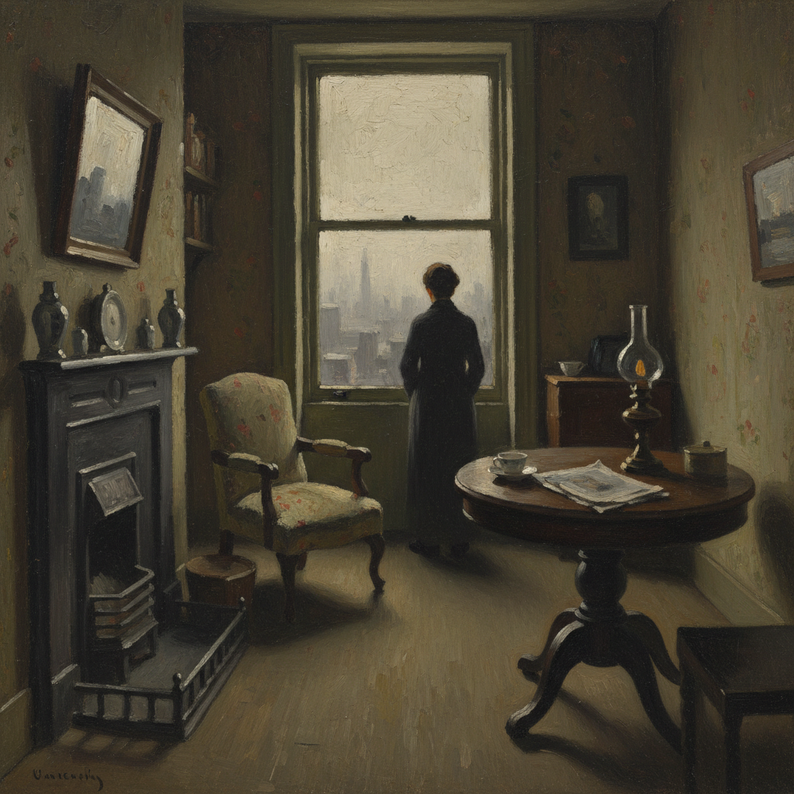

# Camden Town Group 卡姆登镇画派

> **时期：** 1911年–1913年  
> **关键词：** 伦敦城市生活、后印象派影响、日常场景、英国现代主义先驱

## 概述

Camden Town Group（卡姆登镇画派）是1911年在伦敦成立的短命但影响深远的艺术团体，以沃尔特·西克特为精神领袖。他们将法国后印象派的色彩和笔触带入英国，描绘伦敦北部卡姆登镇的日常生活——廉价旅馆、音乐厅、街角小店——用粗犷的笔触和暗沉的色调记录工人阶级的真实世界。

## 风格特征

- **城市日常**：卧室、音乐厅、街景等平凡场景
- **暗沉色调**：褐色、橄榄绿、暗紫的伦敦色彩
- **粗犷笔触**：受后印象派影响的厚涂技法
- **亲密视角**：室内场景的近距离观察
- **社会记录**：工人阶级生活的不加修饰

## 代表人物与作品

- 沃尔特·西克特 音乐厅系列
- 斯宾塞·戈尔 花园与风景
- 哈罗德·吉尔曼 室内场景
- 罗伯特·贝文 马匹与街景

## 概念图

