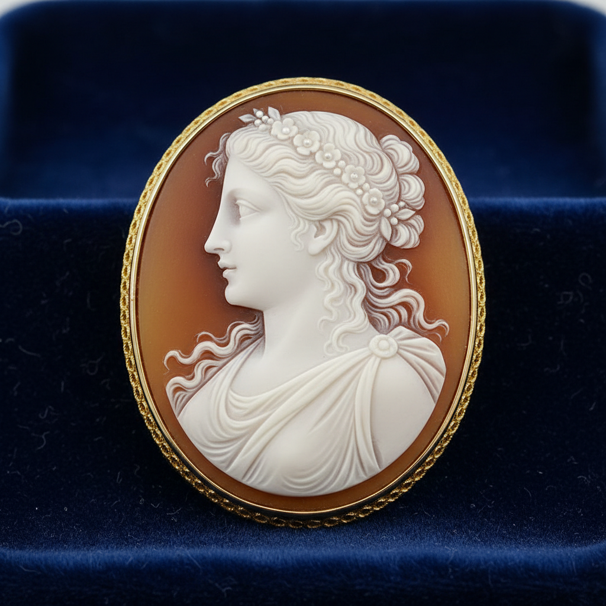

# Cameo Carving Art 浮雕宝石艺术

> "Cameo carving is portraiture in stone — the carver exploits the natural layers of banded agate, shell, or hardstone to create relief portraits and scenes where the raised figure appears in one color against a contrasting background. It is sculpture at its most miniature and most demanding: every detail of a face, every fold of drapery, every curl of hair must be carved in a space no larger than a coin, using the stone's own geology as palette." — Unknown

## 概述

浮雕宝石艺术（Cameo Carving Art）是在具有多层色彩的材料（如玛瑙、贝壳、珊瑚或硬石）上雕刻浮雕图案的传统工艺——利用材料的天然色层差异，将上层雕刻成凸起的图案，露出下层作为背景色，创造出精美的双色或多色浮雕效果。浮雕宝石是西方珠宝和装饰艺术中最精致的传统之一。

浮雕宝石艺术的实践包括：1）贝壳浮雕——在多层贝壳上雕刻；2）玛瑙浮雕——在带状玛瑙上雕刻；3）硬石浮雕——在各种硬石上雕刻；4）珊瑚浮雕——在珊瑚上雕刻浮雕；5）肖像浮雕——经典的侧面肖像；6）神话场景——神话和寓言场景；7）当代浮雕宝石——将传统技法与现代设计结合的创作。

## 核心特征

| 特征 | 描述 |
|------|------|
| 浮雕 | 凸起的浮雕效果 |
| 色层 | 利用天然色层 |
| 微型 | 极小尺度的雕刻 |
| 肖像 | 经典的肖像传统 |
| 古典 | 古典美学传统 |
| 精密 | 极其精密的雕刻 |

## 视觉特征

- **浮雕**：凸起的白色图案
- **对比**：图案与背景的色彩对比
- **精细**：极其精细的雕刻细节
- **古典**：古典的肖像和场景
- **椭圆**：经典的椭圆形构图
- **优雅**：优雅精致的整体感

## 代表作品

| 作品 | 艺术家/文化 | 年代 | 意义 |
|------|-------------|------|------|
| *Gonzaga Cameo* | 古希腊 | 公元前3世纪 | 冈扎加浮雕 |
| *Gemma Augustea* | 古罗马 | 公元1世纪 | 奥古斯都宝石 |
| *Torre del Greco shells* | 意大利 | 19世纪至今 | 意大利贝壳浮雕 |
| *Victorian cameo jewelry* | 英国 | 19世纪 | 维多利亚浮雕首饰 |
| *Contemporary cameos* | 当代 | 当代 | 当代浮雕宝石 |

## 历史时间线

| 时期 | 事件 |
|------|------|
| 公元前4世纪 | 古希腊浮雕宝石的起源 |
| 古罗马 | 浮雕宝石的黄金时代 |
| 文艺复兴 | 浮雕宝石的复兴 |
| 19世纪 | 维多利亚时代的大规模流行 |
| 当代 | 浮雕宝石的艺术化发展 |

## 中国语境

浮雕宝石艺术在中国有一定的认知和实践。中国传统的玉雕中有类似浮雕宝石的"俏色"技法——利用玉石的天然色彩差异进行巧雕。中国的玛瑙雕刻中有利用色层进行浮雕的传统——特别是在辽宁阜新的玛瑙雕刻中。中国当代的珠宝设计中，浮雕宝石作为一种经典的西方珠宝形式获得了关注——一些中国珠宝设计师开始创作融合中西元素的浮雕作品。中国的贝壳雕刻传统中有类似浮雕宝石的技法——利用贝壳的多层结构进行浮雕。中国的一些宝石雕刻师开始学习西方浮雕宝石技法——将其与中国传统雕刻美学结合。

## AI生成概念图

## 与其他风格的关系

- **Intaglio** → 凹雕宝石
- **Gem Cutting** → 宝石切割
- **Coral Carving** → 珊瑚雕刻
- **Portrait Art** → 肖像艺术
- **Classical Art** → 古典艺术
- **Jewelry** → 珠宝艺术

---

*浮光艺志 | Chronicle of Artistry*
