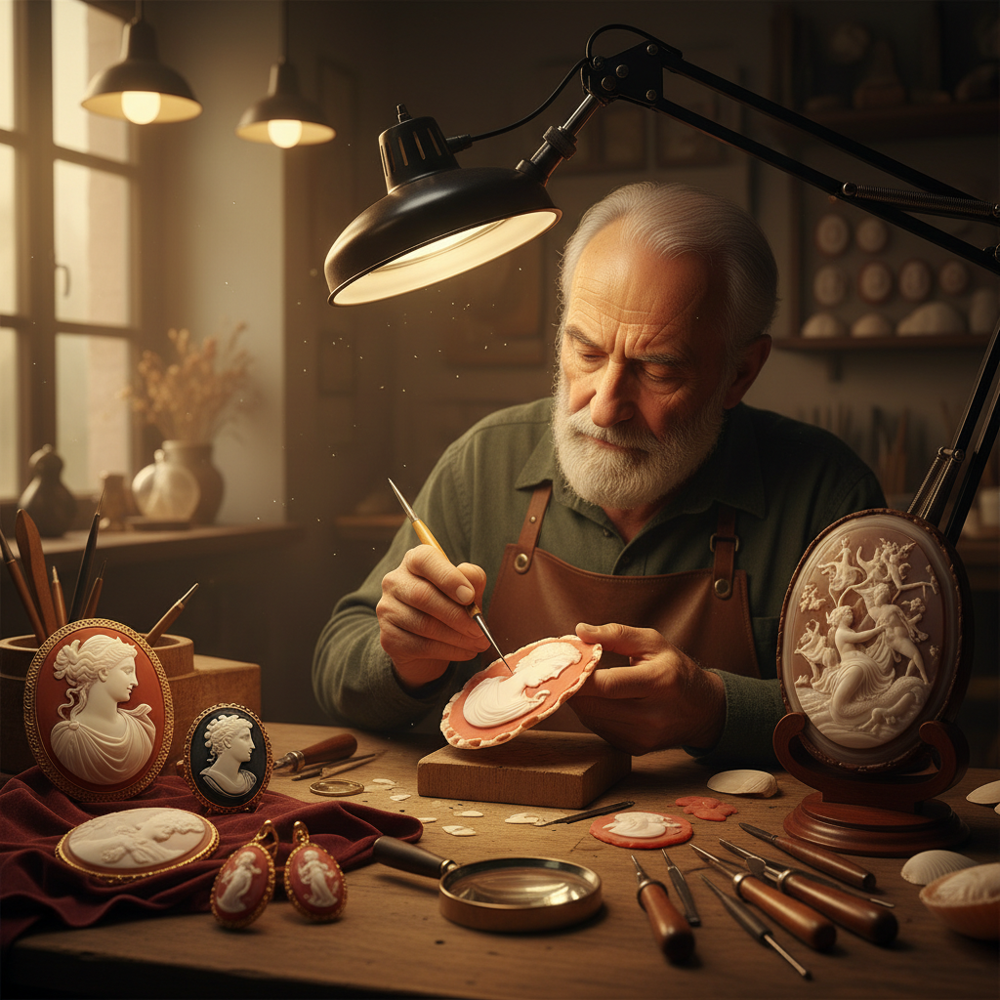

# Cameo 浮雕宝石

> "Cameo cutting is painting in stone — the artist reads the layers of shell or agate like a book, carving away to reveal figures that seem to float between the pale relief and the darker ground." — Unknown

## 概述

浮雕宝石（Cameo）是在具有多色层次的材料（如贝壳、玛瑙、缟玛瑙、珊瑚等）上雕刻出浮雕图案的工艺。Cameo的核心技法是利用材料的天然层状结构——在浅色层上雕刻出图案（通常是人物肖像或神话场景），露出深色的底层作为背景，形成强烈的色彩对比。

Cameo与Intaglio（凹雕）相反——Cameo是凸起的浮雕，而Intaglio是凹陷的雕刻。Cameo的历史极其悠久——从古希腊罗马时代就是极受珍视的艺术品和首饰。最经典的Cameo材料是贝壳（shell cameo）——利用海螺壳的白色外层和橙色/棕色内层的对比。意大利的Torre del Greco是世界贝壳Cameo的中心。

## 核心特征

| 特征 | 描述 |
|------|------|
| 浮雕 | 凸起的浮雕 |
| 层次 | 利用材料的层状结构 |
| 对比 | 浅色图案深色背景 |
| 肖像 | 经典的肖像题材 |
| 精细 | 极其精细的雕刻 |
| 珍贵 | 珍贵的艺术品 |

## 视觉特征

- **浮雕**：凸起的浮雕效果
- **对比**：浅色与深色的对比
- **精细**：极精细的面部细节
- **椭圆**：经典的椭圆形
- **古典**：古典的美感
- **层次**：材料的天然层次

## 代表作品

| 作品 | 艺术家 | 年代 | 意义 |
|------|--------|------|------|
| *Gemma Augustea* | 匿名 | 公元9-12年 | 奥古斯都宝石 |
| *Gonzaga Cameo* | 匿名 | 公元前3世纪 | 冈扎加浮雕 |
| *Portland Vase cameo glass* | 匿名 | 公元1世纪 | 波特兰花瓶 |
| *Victorian shell cameos* | Various | 维多利亚时代 | 维多利亚贝壳浮雕 |
| *Italian Torre del Greco* | Various | 当代 | 意大利贝壳浮雕 |

## 历史时间线

| 时期 | 事件 |
|------|------|
| 公元前3世纪 | 希腊化时期Cameo的繁荣 |
| 古罗马 | 罗马帝国Cameo的鼎盛 |
| 文艺复兴 | Cameo收藏的复兴 |
| 18-19世纪 | 贝壳Cameo的大众化 |
| 维多利亚时代 | Cameo首饰的极度流行 |
| 当代 | 意大利Cameo传统的延续 |

## 中国语境

浮雕宝石在中国的珠宝收藏和鉴赏领域有一定的知名度——中国的古董收藏家对西方古典Cameo有所了解。中国传统工艺中虽然没有完全对应的Cameo传统，但中国的玉雕中有类似的"俏色"技法——利用玉石的天然色彩分布进行巧雕。中国的一些高端珠宝店销售意大利进口的贝壳Cameo首饰。中国的珠宝设计教育中也介绍Cameo作为重要的宝石雕刻形式。

## AI生成概念图

## 与其他风格的关系

- **Intaglio Gem** → 凹雕宝石
- **Shell Carving** → 贝雕
- **Gem Cutting** → 宝石切割
- **Relief Sculpture** → 浮雕
- **Jewelry Making** → 首饰制作
- **Glyptics** → 宝石雕刻术

---

*浮光艺志 | Chronicle of Artistry*
