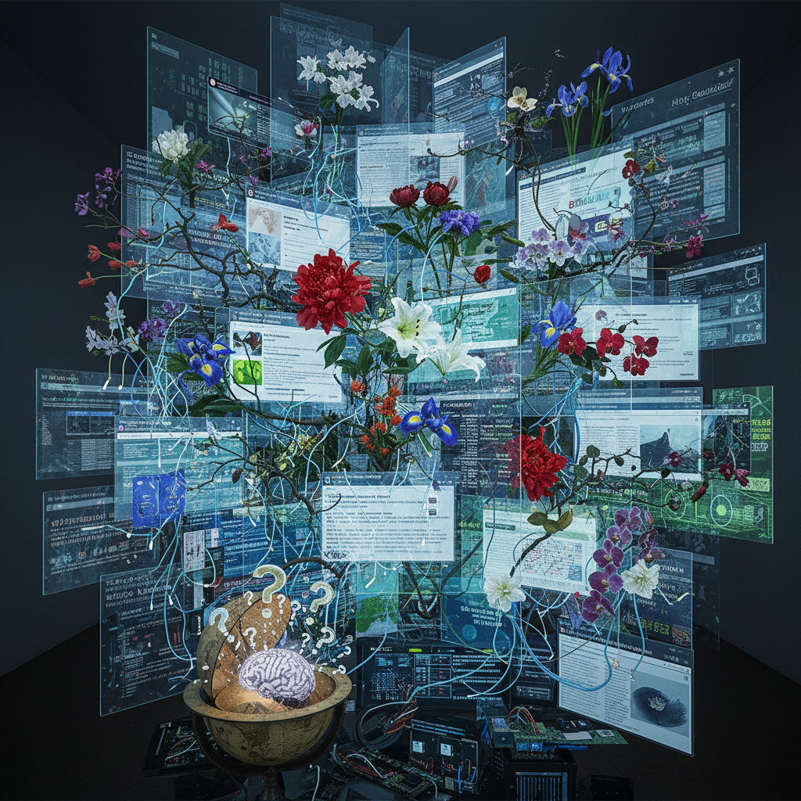

# Camille Henrot 卡米耶·昂罗

> **时期：** 1978–至今  
> **关键词：** 信息过载、百科全书冲动、花艺装置、数字时代焦虑

## 概述

Camille Henrot 是法国艺术家，以探索信息过载和知识分类的焦虑而闻名。她的作品跨越视频、雕塑、绘画和花艺装置，试图在互联网时代重新理解"万物的秩序"——从创世神话到浏览器标签页，从百科全书到社交媒体的无限滚动。

## 风格特征

- **百科全书冲动**：试图将所有知识纳入一个系统
- **花艺装置**：用插花表达不同文化的宇宙观
- **信息美学**：浏览器界面、搜索结果等数字视觉语言
- **跨媒介**：视频、青铜雕塑、水彩、装置自由切换
- **焦虑与幽默**：对知识焦虑的自嘲式表达

## 代表作品

- *Grosse Fatigue*（2013，威尼斯银狮奖）
- *The Pale Fox*（2014–2015）
- *Is it possible to be a revolutionary and like flowers?*（2012）
- *Saturday*（2017）

## 概念图

