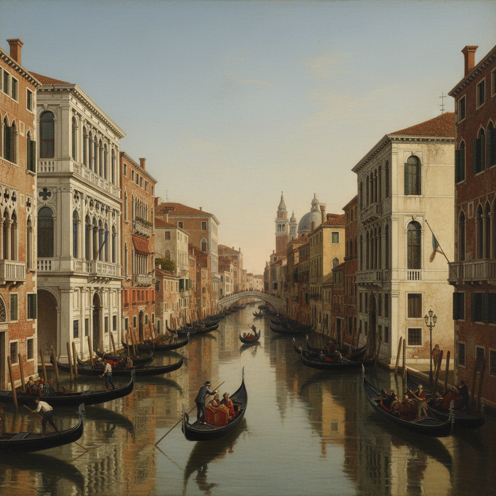

# Canaletto 卡纳莱托

> "Venice is the most triumphant city I have ever seen." — Canaletto

## 概述

卡纳莱托（Canaletto，本名 Giovanni Antonio Canal，1697–1768）是意大利威尼斯画派的风景画大师，以精确描绘威尼斯城市景观（vedute）闻名。他用几何透视和明亮光线记录了18世纪威尼斯的运河、广场和建筑，作品既是艺术杰作也是珍贵的历史文献。

## 核心特征

| 特征 | 描述 |
|------|------|
| 城市风景 | 威尼斯运河、广场的精确记录 |
| 几何透视 | 使用暗箱辅助的精准构图 |
| 明亮光线 | 地中海阳光下的清晰建筑 |
| 水面反射 | 运河水面的光影变化 |
| 建筑细节 | 每一块砖石都精确可辨 |
| 日常生活 | 贡多拉、市民、节庆活动 |

## 代表作品

| 作品 | 年代 | 意义 |
|------|------|------|
| *The Grand Canal from Palazzo Flangini* | 1738 | 大运河全景的经典 |
| *The Bucintoro at the Molo* | 1732 | 威尼斯节庆的壮观 |
| *Piazza San Marco* | 1723 | 圣马可广场的永恒 |
| *The Stonemason's Yard* | 1725 | 日常威尼斯的诗意 |

## AI生成概念图

## 与其他风格的关系

- **Vedutismo** → 城市风景画传统的巅峰
- **Guardi** → 同时代威尼斯风景画家
- **Camera Obscura** → 早期光学辅助绘画
- **Photography** → 预示了摄影的纪实精神
