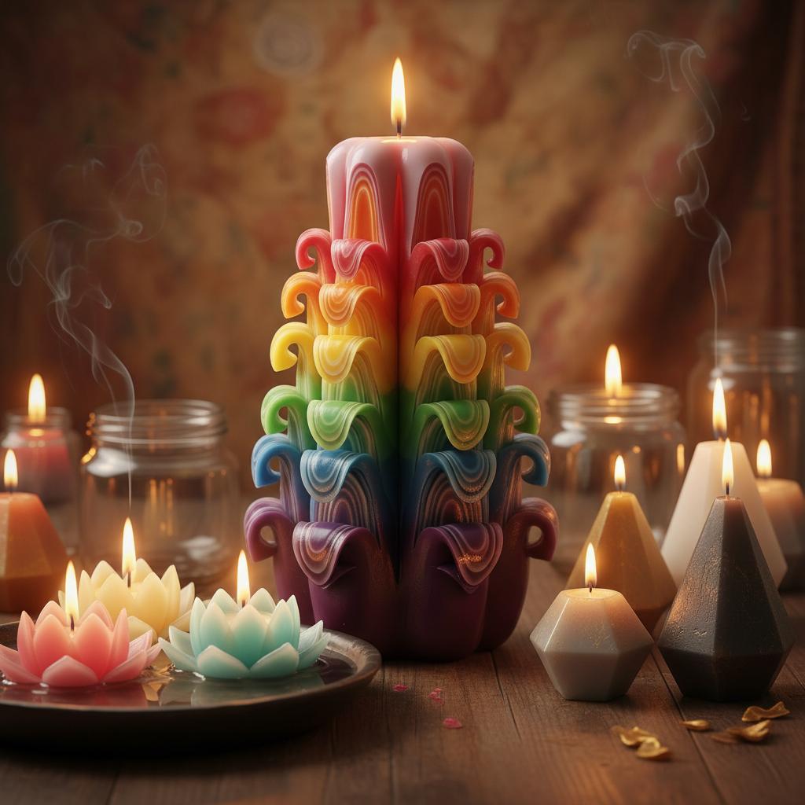

# Candle Art 蜡烛艺术

> "A candle is light in its most intimate form — a small flame dancing on a wick, casting warm shadows, filling a room with soft golden glow and sometimes with fragrance. But beyond illumination, wax is a sculptor's medium: it can be carved, molded, layered, dipped, and colored into forms of extraordinary beauty. Candle art transforms this ancient light source into objects that are as beautiful unlit as they are when burning." — Unknown

## 概述

蜡烛艺术（Candle Art）是以蜡为主要材料进行艺术创作的实践——通过浇注、雕刻、层叠、浸蘸、彩绘等技法，将蜡烛从简单的照明工具提升为装饰艺术品和雕塑。蜡烛艺术探索了蜡的可塑性、半透明性和燃烧时的动态美。

蜡烛艺术的实践包括：1）雕刻蜡烛——在蜡烛表面雕刻精美图案；2）层叠蜡烛——多色蜡层叠创造的彩虹效果；3）浮雕蜡烛——用模具制作的浮雕装饰蜡烛；4）花卉蜡烛——模拟花朵造型的蜡烛；5）容器蜡烛——在精美容器中的香薰蜡烛；6）蜡雕塑——用蜡创造的纯艺术雕塑；7）蜡烛装置——用大量蜡烛创造的空间装置。

## 核心特征

| 特征 | 描述 |
|------|------|
| 可塑 | 蜡的高度可塑性 |
| 半透明 | 蜡的半透明质感 |
| 温暖 | 温暖的视觉和触觉 |
| 燃烧 | 燃烧时的动态美 |
| 香氛 | 可融入香氛 |
| 短暂 | 燃烧后消失的短暂性 |

## 视觉特征

- **半透明**：蜡的半透明光泽
- **色彩**：丰富的染色可能
- **光影**：烛光的温暖光影
- **层次**：多色层叠的效果
- **雕刻**：精细的雕刻细节
- **流动**：融化蜡的流动感

## 代表作品

| 作品 | 艺术家 | 年代 | 意义 |
|------|--------|------|------|
| *Carved candles* | Various | 当代 | 雕刻蜡烛 |
| *Dutch carved candles* | 荷兰传统 | 17世纪至今 | 荷兰雕花蜡烛 |
| *Candle installations* | Various | 当代 | 蜡烛装置艺术 |
| *Wax sculptures* | Various | 当代 | 蜡雕塑 |
| *Artisan candles* | Various | 当代 | 手工艺术蜡烛 |

## 历史时间线

| 时期 | 事件 |
|------|------|
| 古代 | 蜡烛的发明和使用 |
| 中世纪 | 教堂蜡烛的装饰化 |
| 17世纪 | 荷兰雕花蜡烛的发展 |
| 20世纪 | 蜡烛从照明到装饰的转变 |
| 当代 | 手工蜡烛和蜡烛艺术的复兴 |

## 中国语境

蜡烛艺术在中国有独特的文化背景。中国古代的蜡烛文化丰富——从宫廷的龙凤花烛到民间的红烛喜烛，蜡烛在中国传统文化中有重要的象征意义。中国传统婚礼中的"花烛"是精美的装饰蜡烛——雕刻有龙凤、花卉等吉祥图案。中国当代的手工蜡烛产业发展迅速——从香薰蜡烛到艺术蜡烛，中国的蜡烛市场在快速增长。中国的一些蜡烛艺术家创作了融合中国传统美学的作品——如仿古铜器造型的蜡烛、融入中国传统香料的香薰蜡烛、以及用中国传统色彩搭配的装饰蜡烛。中国的蜡烛DIY工作坊在城市中非常流行——成为年轻人喜爱的手工体验活动。

## AI生成概念图

## 与其他风格的关系

- **Wax Art** → 蜡艺术
- **Sculpture** → 雕塑
- **Ephemeral Art** → 短暂艺术
- **Light Art** → 光艺术
- **Aromatherapy Art** → 芳香艺术
- **Decorative Art** → 装饰艺术

---

*浮光艺志 | Chronicle of Artistry*
