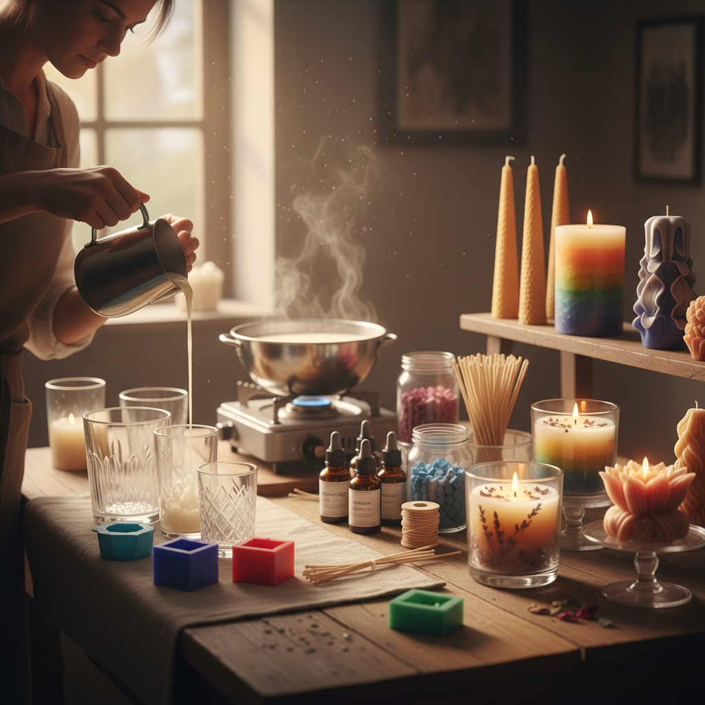

# Candle Making 蜡烛制作

> "Candle making is sculpting with light — the maker shapes wax knowing that its final purpose is to transform itself into flame and fragrance." — Unknown

## 概述

蜡烛制作（Candle Making）是将蜡（蜂蜡、石蜡、大豆蜡等）通过熔化、浇注、浸蘸或压制等方式制作成蜡烛的工艺。蜡烛制作是一门古老的实用工艺——在电灯发明之前，蜡烛是人类最重要的照明工具。如今，蜡烛制作已从实用工艺转变为装饰艺术和芳香疗法的载体。当代蜡烛制作融合了色彩设计、香氛调配、容器选择和造型雕塑——从极简的白色柱状蜡烛到复杂的多层彩色蜡烛、从手工浸蘸的锥形蜡烛到精美的容器香薰蜡烛。

蜡烛制作的哲学在于：为消逝而创造——蜡烛的美在于它注定要燃烧殆尽，在消逝中释放光明和芬芳。

## 核心特征

| 特征 | 描述 |
|------|------|
| 蜡材 | 多种蜡材可选 |
| 熔化 | 熔化浇注成型 |
| 芯线 | 灯芯的选择 |
| 香氛 | 可添加香精 |
| 色彩 | 可添加颜料 |
| 造型 | 多样的造型 |

## 视觉特征

- **温暖**：温暖的蜡质色调
- **光泽**：蜡的柔和光泽
- **造型**：多样的形态
- **层次**：多层色彩的层次
- **质感**：蜡的独特质感
- **光影**：燃烧时的光影

## 代表作品

| 作品 | 艺术家 | 年代 | 意义 |
|------|--------|------|------|
| *Medieval beeswax candles* | 匿名 | 中世纪 | 传统蜂蜡蜡烛 |
| *Diptyque candles* | Diptyque | 1963+ | 现代香薰蜡烛先驱 |
| *Ingo Maurer light art* | Ingo Maurer | 1970s+ | 蜡烛光艺术 |
| *Artisan pillar candles* | Various | 当代 | 手工柱状蜡烛 |
| *Contemporary candle art* | Various | 当代 | 当代蜡烛艺术 |

## 历史时间线

| 时期 | 事件 |
|------|------|
| 公元前3000年 | 古埃及的早期蜡烛 |
| 古罗马 | 蜡烛的广泛使用 |
| 中世纪 | 蜂蜡蜡烛的教堂使用 |
| 19世纪 | 石蜡的发明和工业化 |
| 1990s+ | 香薰蜡烛的流行 |
| 当代 | 手工蜡烛的艺术化 |

## 中国语境

蜡烛在中国有悠久的历史——中国古代的蜡烛主要用蜂蜡和白蜡（白蜡虫分泌的蜡）制作。中国传统的红色蜡烛在婚礼、祭祀和节日中有重要的文化意义。当代中国的手工蜡烛产业发展迅速——从香薰蜡烛品牌到蜡烛DIY工作坊，蜡烛制作已成为流行的手工爱好和创业方向。中国的大豆蜡香薰蜡烛市场增长迅速，许多本土品牌将中国传统香料（如檀香、桂花、白茶）融入蜡烛设计。

## AI生成概念图

## 与其他风格的关系

- **Wax Art** → 蜡艺术
- **Encaustic** → 蜡画
- **Soap Making** → 皂艺
- **Perfumery** → 调香
- **Sculpture** → 雕塑
- **Light Art** → 光艺术

---

*浮光艺志 | Chronicle of Artistry*
