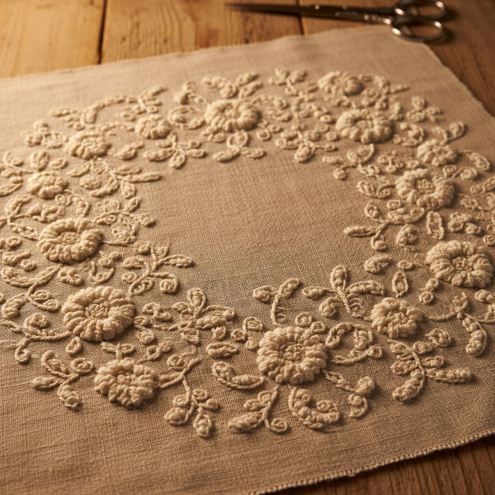

# Candlewicking Art 烛芯绣艺术

> "Candlewicking is embroidery born of necessity — colonial American women, lacking fine imported threads, used the soft cotton roving intended for candle wicks to create raised knot designs on unbleached muslin. The result is a textile of quiet beauty: cream-on-cream patterns of French knots and colonial knots that create a bumpy, textured surface reminiscent of hobnail glass or popcorn stitch crochet." — Unknown

## 概述

烛芯绣艺术（Candlewicking Art）是一种使用粗棉线（原本用于制作蜡烛芯的棉绳）在未漂白的棉布上绣制凸起结粒图案的刺绣技法——以其朴素的材料、单色的效果和独特的纹理著称。烛芯绣起源于美国殖民时期，是早期美国妇女在缺乏精细刺绣材料时的创造性替代。

烛芯绣艺术的实践包括：1）法国结——经典的凸起结粒；2）殖民结——较大的装饰结粒；3）回针——勾勒图案轮廓；4）茎针——绣制线条和茎干；5）缎面绣——填充较大区域；6）剪绒——剪开线圈创造绒毛效果；7）当代烛芯绣——将传统技法与现代设计结合的创作。

## 核心特征

| 特征 | 描述 |
|------|------|
| 朴素 | 朴素的材料和效果 |
| 结粒 | 凸起的结粒纹理 |
| 单色 | 白色或米色单色 |
| 美式 | 美国殖民传统 |
| 纹理 | 丰富的触觉纹理 |
| 实用 | 实用与装饰结合 |

## 视觉特征

- **结粒**：密集的凸起结粒
- **单色**：米色或白色的单色
- **纹理**：丰富的触觉纹理
- **朴素**：朴素自然的美感
- **图案**：花卉和几何图案
- **柔和**：柔和温暖的整体感

## 代表作品

| 作品 | 艺术家/文化 | 年代 | 意义 |
|------|-------------|------|------|
| *Colonial bedspreads* | 美国 | 18世纪 | 殖民时期床罩 |
| *Tufted bedspreads* | 美国 | 19世纪 | 簇绒床罩 |
| *Appalachian candlewicking* | 美国 | 19世纪 | 阿巴拉契亚烛芯绣 |
| *Revival candlewicking* | 美国 | 20世纪 | 复兴烛芯绣 |
| *Contemporary candlewicking* | 当代 | 当代 | 当代烛芯绣 |

## 历史时间线

| 时期 | 事件 |
|------|------|
| 18世纪 | 烛芯绣在美国殖民地的起源 |
| 19世纪 | 烛芯绣的普及和发展 |
| 19世纪末 | 工业化导致的衰落 |
| 1970-80年代 | 烛芯绣的手工艺复兴 |
| 当代 | 烛芯绣的现代化和创新 |

## 中国语境

烛芯绣艺术在中国有一定的认知度。中国传统的"打籽绣"与烛芯绣有技术上的相似之处——都使用结粒创造纹理效果。中国的一些手工艺社区开始介绍烛芯绣——将其作为一种简单易学的刺绣入门技法。中国的家纺设计中，烛芯绣风格的纹理效果被机器模拟——用于床品和靠垫的装饰。中国的一些设计师将烛芯绣的朴素美学与中国传统图案结合——创造具有东方韵味的纹理刺绣作品。中国的手工艺教育中，烛芯绣因其材料简单和效果独特而受到初学者的欢迎——作为体验刺绣乐趣的入门选择。

## AI生成概念图

## 与其他风格的关系

- **Whitework** → 白色刺绣
- **Quilting** → 绗缝艺术
- **Folk Art** → 民间艺术
- **Colonial Art** → 殖民艺术
- **Textile Art** → 纺织艺术
- **Embroidery** → 刺绣艺术

---

*浮光艺志 | Chronicle of Artistry*
