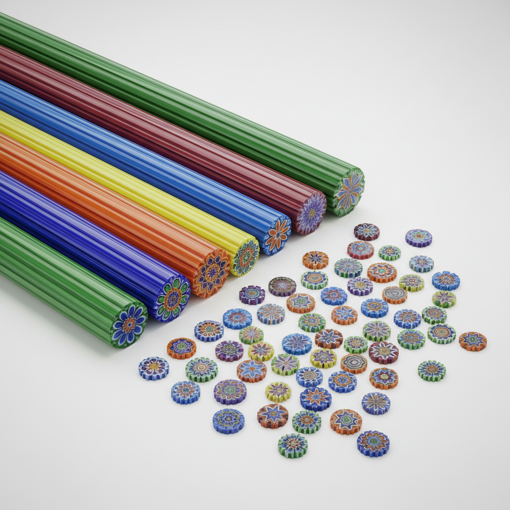

# Canework 玻璃棒工艺

> "Canework is the DNA of glass — each rod carries a pattern that repeats infinitely when sliced." — Unknown

## 概述

玻璃棒工艺（Canework）是制作具有复杂内部图案的玻璃棒（cane）的技法——通过将不同颜色的玻璃层层组合、拉伸，使截面呈现出精美的图案。这些玻璃棒可以被切片用于千花玻璃（Millefiori）、镶嵌于吹制玻璃中，或独立作为装饰元素。从威尼斯的传统玻璃棒到当代的复杂murrine，玻璃棒工艺是玻璃艺术中最基础也最神奇的技法之一——在一根细棒中封存一个完整的图案世界。

玻璃棒工艺的魅力在于：缩放的魔法——无论拉伸到多细，截面的图案始终保持完美的比例和细节。

## 核心特征

| 特征 | 描述 |
|------|------|
| 内部图案 | 图案在玻璃内部 |
| 拉伸 | 通过拉伸缩小图案 |
| 截面 | 截面呈现完整图案 |
| 多色 | 多种颜色的组合 |
| 可重复 | 同一棒可切无数片 |
| 基础 | 许多玻璃技法的基础 |

## 视觉特征

- **截面**：精美的横截面图案
- **色彩**：鲜艳的多色组合
- **对称**：通常具有对称性
- **精细**：拉伸后的精细图案
- **重复**：可无限重复的图案
- **透明**：玻璃的透明质感

## 代表作品

| 作品 | 艺术家 | 年代 | 意义 |
|------|--------|------|------|
| *Murano cane glass* | 匿名 | 15世纪+ | 威尼斯玻璃棒传统 |
| *Zanfirico canes* | 匿名 | 16世纪 | 螺旋纹玻璃棒 |
| *Loren Stump portraits* | Loren Stump | 2000s+ | 超写实人像玻璃棒 |
| *Latticino* | 匿名 | 16世纪 | 乳白色网纹玻璃棒 |
| *Contemporary murrine* | Various | 当代 | 当代复杂玻璃棒 |

## 历史时间线

| 时期 | 事件 |
|------|------|
| 古埃及 | 早期的玻璃棒制作 |
| 罗马时期 | 罗马玻璃棒技法 |
| 15世纪 | 威尼斯穆拉诺岛的发展 |
| 16世纪 | Zanfirico和Latticino的发明 |
| 19世纪 | 法国镇纸中的应用 |
| 当代 | 超写实和复杂玻璃棒 |

## 中国语境

玻璃棒工艺在中国传统中较少独立发展，但博山琉璃中有类似的多色玻璃组合技法。当代中国的玻璃艺术家正在学习和探索这一技法。中国传统的"料器"（北京料器）中也有将不同颜色玻璃组合的技法，虽然具体工艺不同，但体现了类似的多色玻璃组合美学。

## AI生成概念图

## 与其他风格的关系

- **Millefiori** → 千花玻璃使用玻璃棒切片
- **Glass Blowing** → 玻璃棒嵌入吹制玻璃
- **Murano Glass** → 威尼斯玻璃传统
- **Lampwork** → 灯工玻璃中的应用
- **Pattern Design** → 图案设计的玻璃表达
- **Paperweight Art** → 镇纸中的玻璃棒

---

*浮光艺志 | Chronicle of Artistry*
