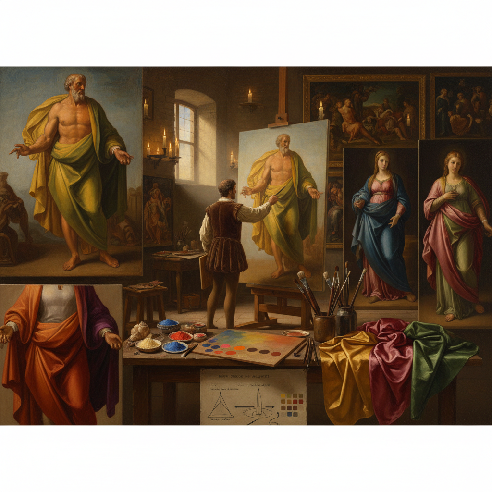

# Cangiante Technique 变色技法

> "Cangiante is color's sleight of hand — when a pigment cannot go lighter or darker without losing its identity, the painter shifts to an entirely different hue to continue the modeling, yellow becoming white in highlights and blue becoming black in shadows, creating drapery that shimmers with iridescent color changes like shot silk catching light from different angles, a technique that turns limitation into luminosity." — Unknown

## 概述

变色技法（Cangiante），来自意大利语"cangiare"（改变），是一种当某种颜色无法通过简单加白或加黑来表现更亮或更暗的色调时，转而使用完全不同色相的颜色来继续明暗建模的绘画技法。例如：黄色在高光处变为白色，橙色在阴影处变为红色或紫色，蓝色在最暗处变为黑色。

Cangiante是米开朗基罗（Michelangelo）在西斯廷教堂天顶画中最著名的技法之一——他画的先知和女先知的衣袍展示了惊人的色彩变化。Cangiante与文艺复兴时期颜料的局限性有关——某些颜料（如群青蓝）非常昂贵，加白后会变得粉气，加黑后会变脏，因此画家选择用其他颜色来表现明暗变化。这种"限制中的创新"反而创造了独特的视觉效果——衣袍看起来像是用变色丝绸制成的。

## 核心特征

| 特征 | 描述 |
|------|------|
| 变色 | 明暗变化中改变色相 |
| 替代 | 用不同颜色替代明暗 |
| 丝绸感 | 创造变色丝绸效果 |
| 限制 | 源于颜料的局限性 |
| 米开朗基罗 | 米开朗基罗的标志技法 |
| 文艺复兴 | 文艺复兴时期的技法 |

## 视觉特征

- **变色**：色相随明暗变化
- **丝绸**：变色丝绸的效果
- **鲜艳**：保持色彩的鲜艳度
- **戏剧**：戏剧性的色彩变化
- **立体**：强烈的立体感
- **华丽**：华丽的视觉效果

## 代表作品

| 作品 | 艺术家 | 年代 | 意义 |
|------|--------|------|------|
| *Sistine Chapel ceiling* | Michelangelo | 1508-1512 | 西斯廷天顶画的cangiante |
| *Doni Tondo* | Michelangelo | 约1507 | 多尼圆形画 |
| *Prophets and Sibyls* | Michelangelo | 1508-1512 | 先知和女先知的衣袍 |
| *Raphael's drapery* | Raphael | 16世纪 | 拉斐尔的变色衣袍 |
| *Pontormo paintings* | Pontormo | 16世纪 | 蓬托尔莫的变色技法 |

## 历史时间线

| 时期 | 事件 |
|------|------|
| 14世纪 | Cangiante的早期实践 |
| 15世纪 | 文艺复兴画家的发展 |
| 1508-1512 | 米开朗基罗的西斯廷天顶 |
| 16世纪 | 矫饰主义的cangiante |
| 当代 | Cangiante的学术研究 |

## 中国语境

变色技法在中国的西方美术史教育中作为文艺复兴绘画技法的重要内容被介绍。中国的美术院校在讲解米开朗基罗和西斯廷教堂时会详细分析cangiante。中国的一些写实油画家在创作中借鉴cangiante的色彩变化原理。有趣的是，中国传统绘画中的"随类赋彩"原则与cangiante有不同的色彩哲学——中国画追求"固有色"的表现，而cangiante则大胆改变固有色来服务于明暗表现。

## AI生成概念图

## 与其他风格的关系

- **Michelangelo** → 米开朗基罗
- **Sfumato** → 晕涂法
- **Chiaroscuro** → 明暗法
- **Unione** → 统一技法
- **Renaissance** → 文艺复兴
- **Mannerism** → 矫饰主义

---

*浮光艺志 | Chronicle of Artistry*
