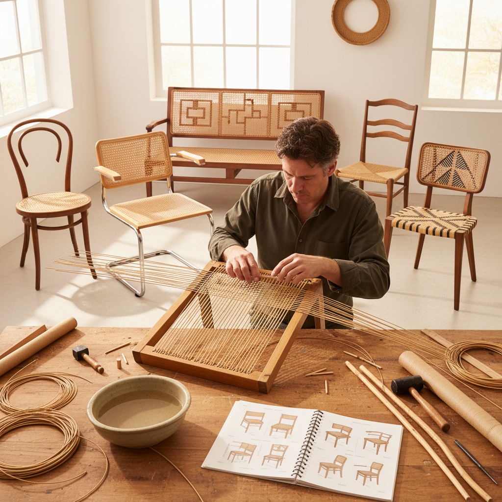

# Caning Art 藤编艺术

> "Caning is weaving a seat from nothing but strands of rattan — threading each strand through holes drilled in the chair frame, building up a pattern of interlocking diagonals that creates a surface both strong enough to support a person's weight and flexible enough to give slightly with every movement. A well-caned seat is a small miracle of engineering: hundreds of individual strands working together as a unified membrane." — Unknown

## 概述

藤编艺术（Caning Art）是使用藤条（rattan）或类似材料编织椅面、靠背和其他家具部件的传统手工艺——通过将藤条穿过框架上的孔洞，按照特定的编织图案交叉编织，形成既美观又耐用的网状表面。藤编是家具修复和制作中的重要技艺。

藤编艺术的实践包括：1）手工穿孔藤编——传统的六步穿孔编织法；2）机织藤面——预编织的藤面片材；3）急流编织——使用宽藤条的编织；4）丹麦绳编——使用纸绳的椅面编织；5）灯芯草编——使用灯芯草的座面编织；6）当代藤编——将传统技法与现代设计结合的创作。

## 核心特征

| 特征 | 描述 |
|------|------|
| 编织 | 精密的交叉编织 |
| 弹性 | 天然的弹性舒适 |
| 耐久 | 极其耐用的结构 |
| 透气 | 网状结构的透气性 |
| 修复 | 可修复和更换 |
| 传统 | 深厚的家具传统 |

## 视觉特征

- **网格**：规则的网格图案
- **对角**：对角线的交叉编织
- **透光**：半透明的网状效果
- **质感**：藤条的自然质感
- **几何**：精确的几何图案
- **优雅**：优雅精致的外观

## 代表作品

| 作品 | 艺术家/文化 | 年代 | 意义 |
|------|-------------|------|------|
| *Thonet bentwood chairs* | Thonet | 19世纪至今 | 曲木藤编椅 |
| *Chinese Chippendale* | 英国 | 18世纪 | 中国风藤编 |
| *Hans Wegner chairs* | Wegner | 20世纪 | 丹麦设计藤编 |
| *Breuer Cesca chair* | Breuer | 1928 | 现代主义藤编 |
| *Contemporary caning* | 当代 | 当代 | 当代藤编设计 |

## 历史时间线

| 时期 | 事件 |
|------|------|
| 古代 | 藤编在亚洲的起源 |
| 17世纪 | 藤编传入欧洲 |
| 18-19世纪 | 藤编椅的黄金时代 |
| 20世纪 | 现代设计中的藤编 |
| 当代 | 藤编的复兴和创新 |

## 中国语境

藤编艺术在中国有极其悠久的传统——中国是藤编的发源地之一。中国南方地区（广东、广西、云南、海南）盛产藤条——这些地区有数千年的藤编传统。中国的藤编家具在17世纪通过东印度公司传入欧洲——引发了欧洲的"中国风"藤编热潮。中国传统的藤编不仅用于家具——还包括藤箱、藤篮、藤席、藤帽等各种日用品。中国的藤编技艺被列入多项非物质文化遗产——如广东的藤编、贵州的藤编等。中国当代的家具设计师重新发现藤编的美学价值——将传统藤编与现代设计结合。中国的藤编产业在全球市场中占有重要地位——中国是世界上最大的藤编产品出口国之一。

## AI生成概念图

## 与其他风格的关系

- **Basket Weaving** → 编篮艺术
- **Furniture Design** → 家具设计
- **Rattan Art** → 藤艺术
- **Textile Art** → 纺织艺术
- **Danish Design** → 丹麦设计
- **Folk Art** → 民间艺术

---

*浮光艺志 | Chronicle of Artistry*
