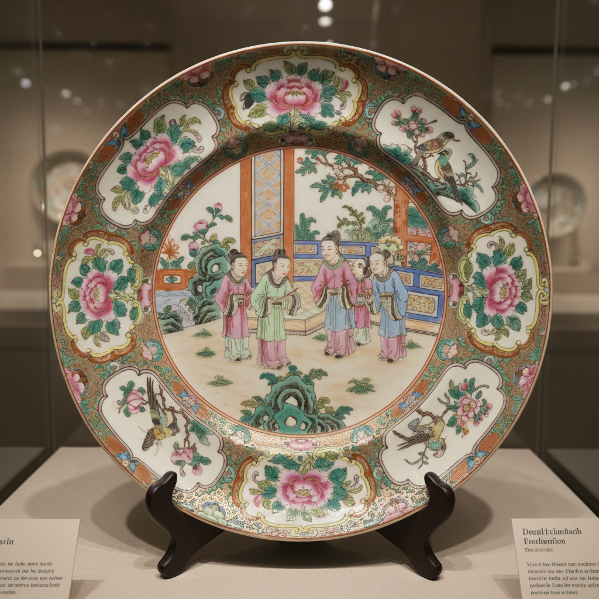

# Canton Ware Art 广彩艺术

> "Canton ware is porcelain dressed for export — white Jingdezhen blanks shipped south to Guangzhou workshops where painters covered every surface with dense overglaze enamels in rose, green, and gold, figures in garden pavilions surrounded by butterflies and peonies, a decorative excess that delighted Western buyers and defined Chinese porcelain in the European imagination for two centuries." — Unknown

## 概述

广彩艺术（Canton Ware Art）是18-19世纪在广州（Canton）加工的一种外销彩瓷艺术。广彩瓷器的生产采用独特的分工模式——素白瓷胎在景德镇烧制，然后运到广州的彩绘作坊进行釉上彩绘和二次烧成。广彩以其浓密华丽的装饰风格著称——大量使用粉红、绿色和金色，画面密集地填满整个器面，几乎不留空白。

广彩艺术的核心要素包括：1）广州加工——在广州进行彩绘；2）釉上彩——低温釉上彩绘技法；3）满工装饰——密集填满的装饰风格；4）色彩浓艳——粉红、绿色、金色为主；5）外销导向——为西方市场生产；6）人物故事——大量人物故事题材；7）花鸟蝴蝶——丰富的花鸟装饰。

## 核心特征

| 特征 | 描述 |
|------|------|
| 广州加工 | 在广州进行彩绘 |
| 釉上彩 | 低温釉上彩绘 |
| 满工装饰 | 密集填满装饰 |
| 色彩浓艳 | 粉红绿色金色 |
| 外销导向 | 为西方市场生产 |
| 人物故事 | 大量人物故事题材 |

## 视觉特征

- **满工密布**：装饰密集填满器面
- **粉红为主**：大量粉红色调
- **金彩点缀**：丰富的金色装饰
- **人物场景**：庭院人物场景
- **花鸟蝴蝶**：花卉、鸟类、蝴蝶
- **开光构图**：开光式的构图方式

## 代表作品

| 作品 | 艺术家/文化 | 年代 | 意义 |
|------|-------------|------|------|
| *广彩人物大盘* | 广州 | 18世纪 | 经典广彩风格 |
| *广彩花鸟瓶* | 广州 | 19世纪 | 花鸟题材 |
| *广彩茶具* | 广州 | 18-19世纪 | 外销茶具 |
| *广彩餐具套装* | 广州 | 18世纪 | 成套餐具 |
| *当代广彩* | 广州 | 当代 | 非遗传承 |

## 历史时间线

| 时期 | 事件 |
|------|------|
| 17世纪末 | 广彩的起源 |
| 18世纪 | 广彩的繁荣期 |
| 1757年 | 一口通商，广州独占外贸 |
| 19世纪 | 广彩的持续发展 |
| 当代 | 广彩列入非物质文化遗产 |

## 中国语境

广彩是中国外销瓷中最具地方特色的品类之一。广州作为清代唯一的对外贸易口岸（1757-1842年），发展出了独特的彩瓷加工产业——十三行附近的彩绘作坊雇佣了大量画工，形成了流水线式的生产模式。广彩的装饰风格深受西方市场审美的影响——西方买家喜欢密集华丽的装饰，广州画工便发展出了"满工"的风格来迎合市场需求。广彩虽然在中国传统审美中不被视为最高雅的瓷器——文人更欣赏留白和简约——但它代表了中国陶瓷工匠适应全球市场的能力和智慧。今天，广彩已被列入中国国家级非物质文化遗产名录——广州仍有传承人在延续这一传统技艺。

## AI生成概念图

## 与其他风格的关系

- **Famille Rose** → 粉彩
- **Rose Medallion** → 玫瑰勋章瓷
- **Export Porcelain** → 外销瓷
- **Armorial Porcelain** → 纹章瓷
- **Kraak Porcelain** → 克拉克瓷
- **Overglaze Enamel** → 釉上彩

---

*浮光艺志 | Chronicle of Artistry*
