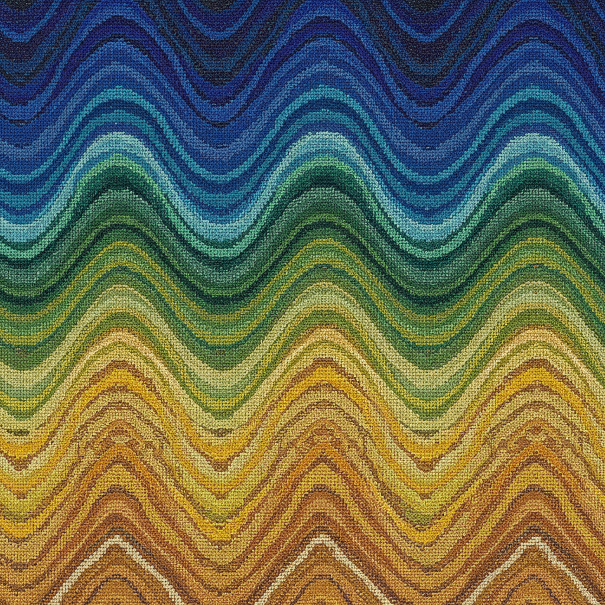

# Canvas Work Art 帆布绣艺术

> "Canvas work is architecture in thread — every stitch occupies a precise intersection of warp and weft on an open-weave ground, building geometric patterns with mathematical certainty. From Florentine flame stitch to Hungarian point, the stitches march in counted steps across the grid, creating optical effects of depth, movement, and luminosity through nothing more than the angle and length of yarn over canvas threads." — Unknown

## 概述

帆布绣艺术（Canvas Work Art）是一种在开放网格帆布（canvas）上进行计数刺绣的技法——通过在帆布的经纬交叉点上精确放置针脚来创造图案。帆布绣（也称为needlepoint）包括多种针法，从简单的帐篷针到复杂的装饰针法，可以创造出从几何图案到写实画面的各种效果。

帆布绣艺术的实践包括：1）帐篷针（Tent Stitch）——最基本的斜向针法；2）佛罗伦萨针（Florentine/Bargello）——火焰图案的长针法；3）匈牙利针（Hungarian Stitch）——砖块状图案；4）苏格兰针（Scotch Stitch）——方块图案；5）拜占庭针（Byzantine Stitch）——阶梯状图案；6）混合针法——多种针法组合创造纹理；7）当代帆布绣——将传统技法与现代设计结合的创作。

## 核心特征

| 特征 | 描述 |
|------|------|
| 网格 | 在网格帆布上工作 |
| 计数 | 精确计数的针法 |
| 几何 | 几何图案效果 |
| 多针 | 多种装饰针法 |
| 耐用 | 结实耐用的成品 |
| 全覆 | 完全覆盖帆布 |

## 视觉特征

- **几何**：精确的几何图案
- **纹理**：丰富的针法纹理
- **规整**：规整有序的针脚
- **光学**：光学深度效果
- **色彩**：色彩的渐变和对比
- **立体**：针法创造的立体感

## 代表作品

| 作品 | 艺术家/文化 | 年代 | 意义 |
|------|-------------|------|------|
| *Florentine bargello chairs* | 意大利 | 文艺复兴 | 佛罗伦萨火焰针椅面 |
| *Medieval canvas work* | 欧洲 | 中世纪 | 中世纪帆布绣 |
| *Victorian Berlin woolwork* | 英国 | 19世纪 | 维多利亚帆布绣 |
| *Kaffe Fassett needlepoint* | 英国 | 当代 | 当代帆布绣设计 |
| *Contemporary canvas art* | 国际 | 当代 | 当代帆布绣艺术 |

## 历史时间线

| 时期 | 事件 |
|------|------|
| 中世纪 | 帆布绣的早期发展 |
| 文艺复兴 | Bargello火焰针的流行 |
| 17-18世纪 | 帆布绣家具的黄金时代 |
| 19世纪 | 柏林毛线绣的大众化 |
| 当代 | 帆布绣的艺术化发展 |

## 中国语境

帆布绣在中国有一定的认知和实践基础。中国的十字绣产业（2000-2010年代）实质上是帆布绣的一种形式——在网格布上按图纸刺绣。中国传统的挑花绣也是一种计数绣——在布料的经纬线上精确放置针脚。中国的手工市场中，帆布绣套件（needlepoint kits）——作为一种休闲手工产品有一定市场。中国当代的纤维艺术教育中，帆布绣作为基础技法——在相关课程中教授。中国的一些设计师将帆布绣的几何美学——应用于室内装饰和时尚配饰设计。

## AI生成概念图

## 与其他风格的关系

- **Bargello** → 火焰针绣
- **Cross Stitch** → 十字绣
- **Berlin Wool Work** → 柏林毛线绣
- **Tapestry** → 挂毯
- **Needlepoint** → 针绣
- **Geometric Art** → 几何艺术

---

*浮光艺志 | Chronicle of Artistry*
