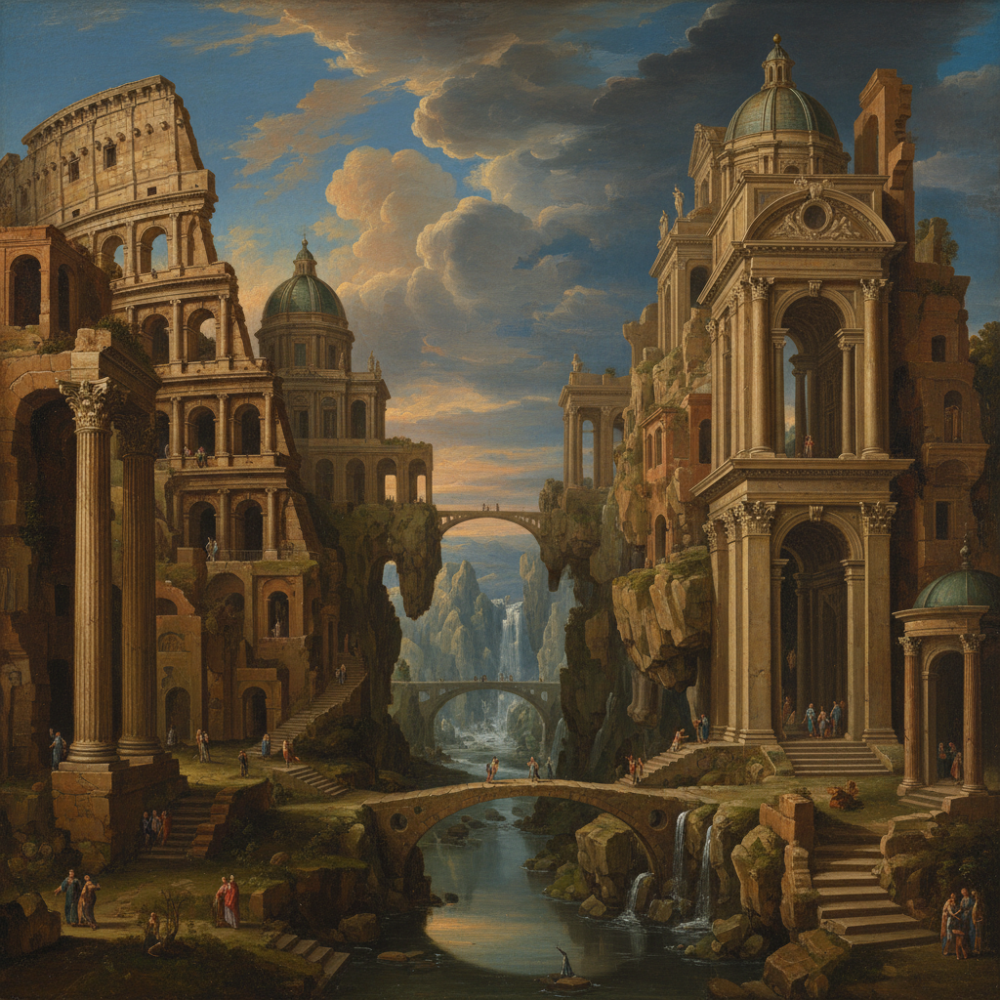

# Capriccio Art 随想画

> **时期：** 17世纪–19世纪  
> **关键词：** 建筑幻想、虚构景观、废墟想象、时空错置、诗意重组

## 概述

Capriccio（随想画）是将真实建筑和虚构场景自由组合的绘画类型——把罗马的万神殿搬到威尼斯运河边，让古代废墟与当代建筑并置。它是画家的建筑白日梦，用精确的透视技法描绘从未存在的风景，在真实与想象之间创造诗意的第三空间。

## 风格特征

- **时空错置**：不同时代和地点的建筑并置
- **废墟美学**：对古代遗迹的浪漫想象
- **精确幻想**：用写实技法描绘虚构场景
- **戏剧光影**：强调氛围的光线处理
- **叙事暗示**：建筑组合暗示历史故事

## 代表人物与作品

- 乔瓦尼·保罗·帕尼尼 罗马随想曲
- 卡纳莱托 威尼斯随想画
- 于贝尔·罗贝尔 废墟幻想
- 皮拉内西《想象的监狱》

## 概念图

