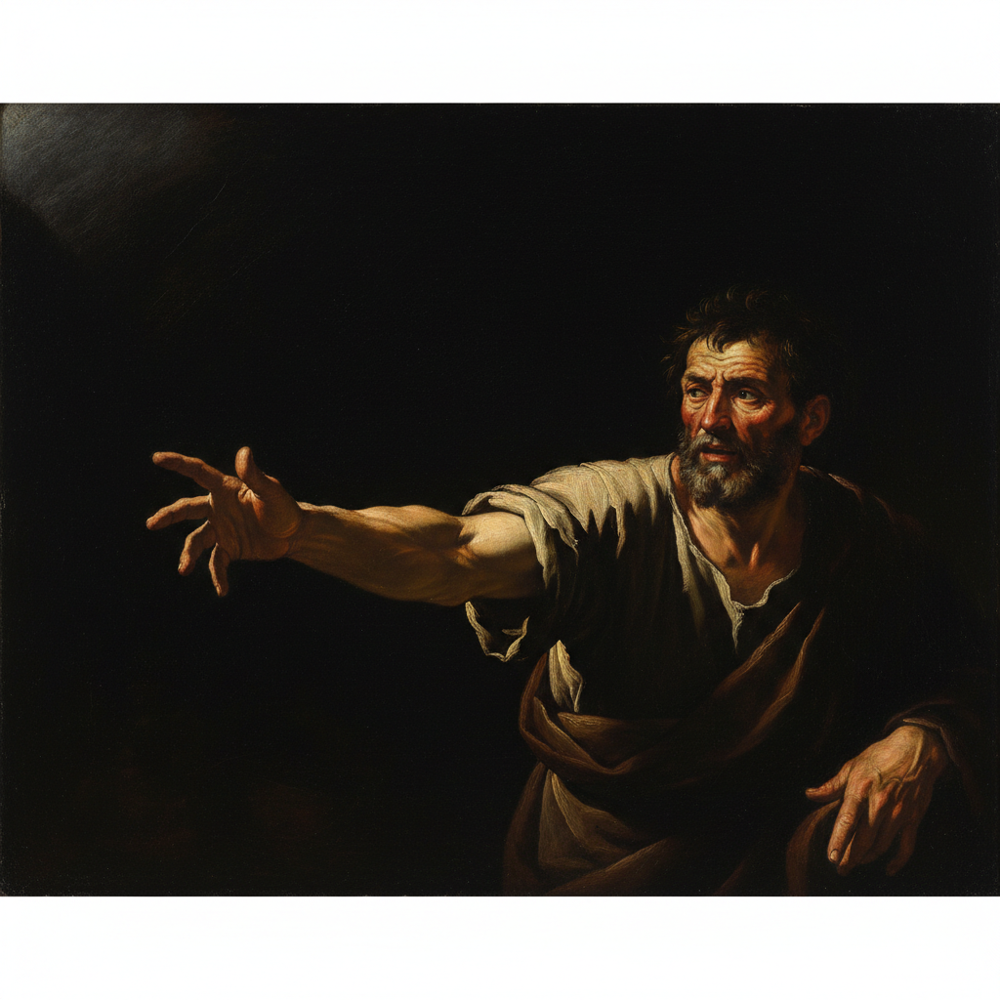

# Caravaggio 卡拉瓦乔

> "All works, no matter what or by whom painted, are nothing but bagatelles and child's work... unless they are done from life." — Caravaggio

## 概述

米开朗基罗·梅里西·达·卡拉瓦乔（Michelangelo Merisi da Caravaggio，1571–1610）是巴洛克绘画的奠基人，也是西方艺术史上最具革命性和争议性的画家之一。他以极端的明暗对比（tenebrism）、从街头模特直接写生的激进现实主义、以及暴力戏剧性的构图彻底改变了欧洲绘画的方向。

卡拉瓦乔的一生如同他的画作一样充满戏剧性——天才、暴力、逃亡、早逝。他38岁死于热病，却在短暂的生涯中影响了此后四百年的艺术。

## 核心特征

| 特征 | 描述 |
|------|------|
| 暗色主义 | 极端的明暗对比——光从黑暗中切割出形体 |
| 激进现实 | 圣人画成乞丐，天使画成街头少年 |
| 戏剧瞬间 | 捕捉最戏剧性的一刻——刀落、手伸、头转 |
| 无底稿 | 直接在画布上作画，不画素描底稿 |
| 黑色背景 | 深不见底的黑色背景 |
| 心理张力 | 人物之间的心理紧张关系 |

## 视觉特征

- **光线**：如聚光灯般的强烈定向光
- **背景**：几乎纯黑的深色背景
- **人物**：真实的、不理想化的面容和身体
- **动态**：戏剧性的对角线构图和手势
- **色彩**：深红、金褐、白色在黑暗中燃烧
- **质感**：极致的写实——皮肤、布料、金属、水果

## 代表作品

| 作品 | 年代 | 意义 |
|------|------|------|
| *The Calling of Saint Matthew* | 1599-1600 | 光线即神恩——巴洛克绘画的开端 |
| *Judith Beheading Holofernes* | c.1599 | 暴力与美的极端结合 |
| *The Entombment of Christ* | 1603-04 | 影响了鲁本斯和后世无数画家 |
| *David with the Head of Goliath* | c.1610 | 歌利亚的头是卡拉瓦乔的自画像 |
| *Bacchus* | c.1596 | 早期作品——街头少年扮演酒神 |
| *The Supper at Emmaus* | 1601 | 瞬间的戏剧性——认出基督的一刻 |

## 真实作品（公共领域）

卡拉瓦乔的作品已进入公共领域：

| 作品 | 来源 |
|------|------|
| *The Calling of Saint Matthew* | [Wikimedia](https://commons.wikimedia.org/wiki/File:The_Calling_of_Saint_Matthew-Caravaggo_(1599-1600).jpg) |
| *Bacchus* | [Uffizi](https://www.uffizi.it/en/artworks/bacchus) |
| *Judith Beheading Holofernes* | [Wikimedia](https://commons.wikimedia.org/wiki/File:Judith_Beheading_Holofernes_by_Caravaggio.jpg) |

> ⚠️ 本条目优先使用真实作品。如需本地图片，请从上述来源手动下载后放入 `assets/artworks/caravaggio/` 并压缩。

## AI生成概念图

## 影响与遗产

- **Caravaggisti** → 直接追随者遍布欧洲（Gentileschi、Ribera、La Tour）
- **Rembrandt** → 伦勃朗的明暗法深受卡拉瓦乔影响
- **Baroque** → 巴洛克绘画的戏剧性源头
- **Film Noir** → 黑色电影的打光直接继承卡拉瓦乔
- **Photography** → 摄影中的戏剧性布光

## 与其他风格的关系

- **Tenebrism** → 暗色主义的创始人
- **Baroque** → 巴洛克绘画的奠基者
- **Chiaroscuro** → 将明暗法推向极端
- **Realism** → 激进现实主义的先驱
- **Dutch Golden Age** → 通过 Utrecht Caravaggisti 影响荷兰绘画

---

*浮光艺志 | Chronicle of Artistry*
