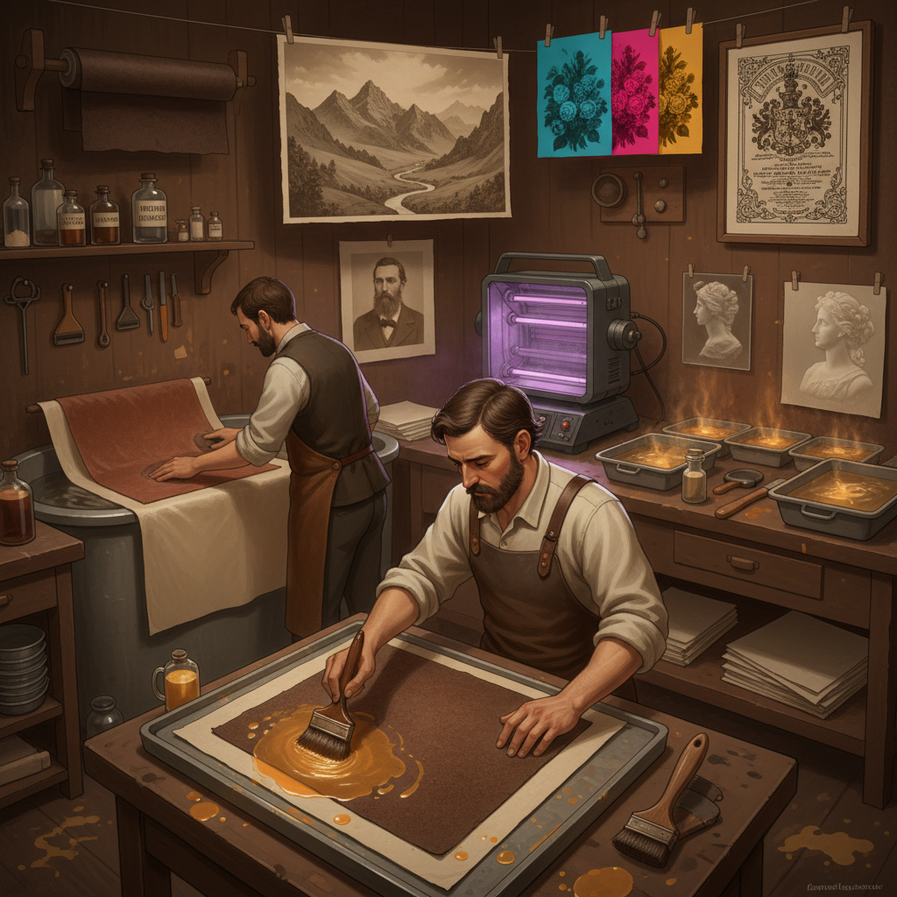

# Carbon Printing 碳素印刷

> "Carbon printing is photography's most permanent voice — pigmented gelatin tissue transferred to paper, producing images of extraordinary tonal range and archival permanence, each print a continuous-tone masterpiece that will outlast silver, outlast platinum, outlast perhaps the memory of the photographer who made it." — Unknown

## 概述

碳素印刷（Carbon Printing）是一种使用碳颜料（或其他永久性颜料）悬浮在明胶中制作摄影印刷品的历史性摄影技法。碳素印刷由Joseph Swan在1864年发明，是19世纪最重要的摄影印刷工艺之一——因其极其优秀的色调范围、永久性和美感而被称为"摄影印刷的王者"。

碳素印刷的过程：将含有颜料的明胶层（carbon tissue）涂在纸基上，用重铬酸盐溶液使其感光，通过负片接触曝光后，明胶在受光区域硬化（交联）。将曝光后的组织转移到最终纸张上，用温水冲洗掉未硬化的明胶，留下与原始负片色调对应的颜料浮雕图像。碳素印刷品具有连续色调、极宽的色调范围和几乎无限的保存寿命。

## 核心特征

| 特征 | 描述 |
|------|------|
| 颜料 | 使用永久性颜料 |
| 明胶 | 明胶作为载体 |
| 转印 | 转印到最终纸张 |
| 永久 | 极其永久的保存 |
| 色调 | 极宽的色调范围 |
| 连续 | 连续色调效果 |

## 视觉特征

- **色调**：极其丰富的色调层次
- **深度**：深邃的暗部细节
- **质感**：微妙的浮雕质感
- **永久**：永久性的颜料色彩
- **柔和**：柔和的色调过渡
- **高贵**：高贵典雅的质感

## 代表作品

| 作品 | 艺术家 | 年代 | 意义 |
|------|--------|------|------|
| *Carbon prints* | Joseph Swan | 1864 | 技法的发明 |
| *Pictorialist carbon prints* | Various | 1890-1920s | 画意摄影时代 |
| *Contemporary carbon prints* | Various | 当代 | 当代碳素印刷 |
| *Tri-color carbon prints* | Various | 当代 | 三色碳素印刷 |
| *Carbon transfer portraits* | Various | 当代 | 碳素转印肖像 |

## 历史时间线

| 时期 | 事件 |
|------|------|
| 1855年 | Poitevin的早期实验 |
| 1864年 | Joseph Swan完善碳素印刷 |
| 1870-1920年代 | 碳素印刷的黄金时代 |
| 1930-80年代 | 商业碳素印刷的衰落 |
| 1990年代至今 | 替代摄影运动中的复兴 |

## 中国语境

碳素印刷在中国属于非常小众的历史性摄影技法。中国的摄影艺术院校在替代摄影和摄影史课程中介绍碳素印刷。随着中国替代摄影社区的发展和对"永久性印刷品"的追求，碳素印刷作为"最永久的摄影印刷工艺"有潜在的吸引力。中国的一些收藏家和摄影爱好者开始关注碳素印刷的独特美感和保存价值。

## AI生成概念图

## 与其他风格的关系

- **Gum Bichromate** → 重铬酸胶印
- **Platinum Printing** → 铂金印刷
- **Bromoil** → 溴油印刷
- **Woodburytype** → 伍德伯里印刷
- **Alternative Photography** → 替代摄影
- **Pigment Printing** → 颜料印刷

---

*浮光艺志 | Chronicle of Artistry*
