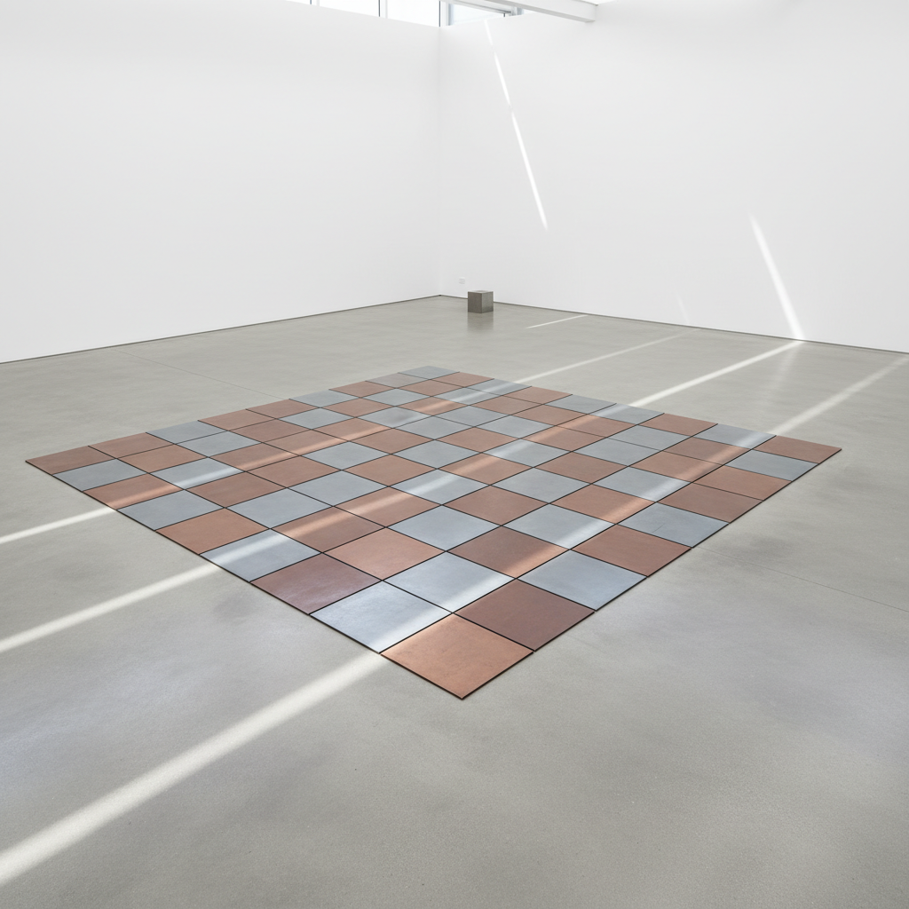

# Carl Andre 卡尔·安德烈

> **时期：** 1935–2024  
> **关键词：** 地板雕塑、金属方块、极简主义、水平性

## 概述

Carl Andre 是美国极简主义雕塑家，以直接放置在地面上的金属板和木块雕塑闻名。他的作品拒绝底座、拒绝垂直性、拒绝表现——将雕塑还原为材料在空间中的物理存在。观者被邀请踩踏在作品上行走，从而以身体感知材料的差异（铜、铅、锌、镁的不同触感和声响）。

## 风格特征

- **水平铺设**：雕塑平铺于地面，拒绝传统雕塑的垂直纪念碑性
- **工业材料原样**：金属板、砖块、木材不经加工，保持工业原貌
- **网格排列**：元素以简单的网格或线性序列排列
- **可行走性**：观者可以踩踏作品，以身体感知材料
- **场所特定**：作品与所在空间的地面建立不可分割的关系

## 代表作品

- *Equivalent VIII*（1966，耐火砖）
- *144 Magnesium Square*（1969）
- *Stone Field Sculpture*（1977）
- *Cedar Piece*（1964）

## 历史意义

Andre 将雕塑从垂直的纪念碑传统解放为水平的物质体验，他的"雕塑即场所"理念影响了后来的场域特定艺术和装置艺术。他的作品引发了关于"什么是艺术"的持久公共辩论。

## 概念图

