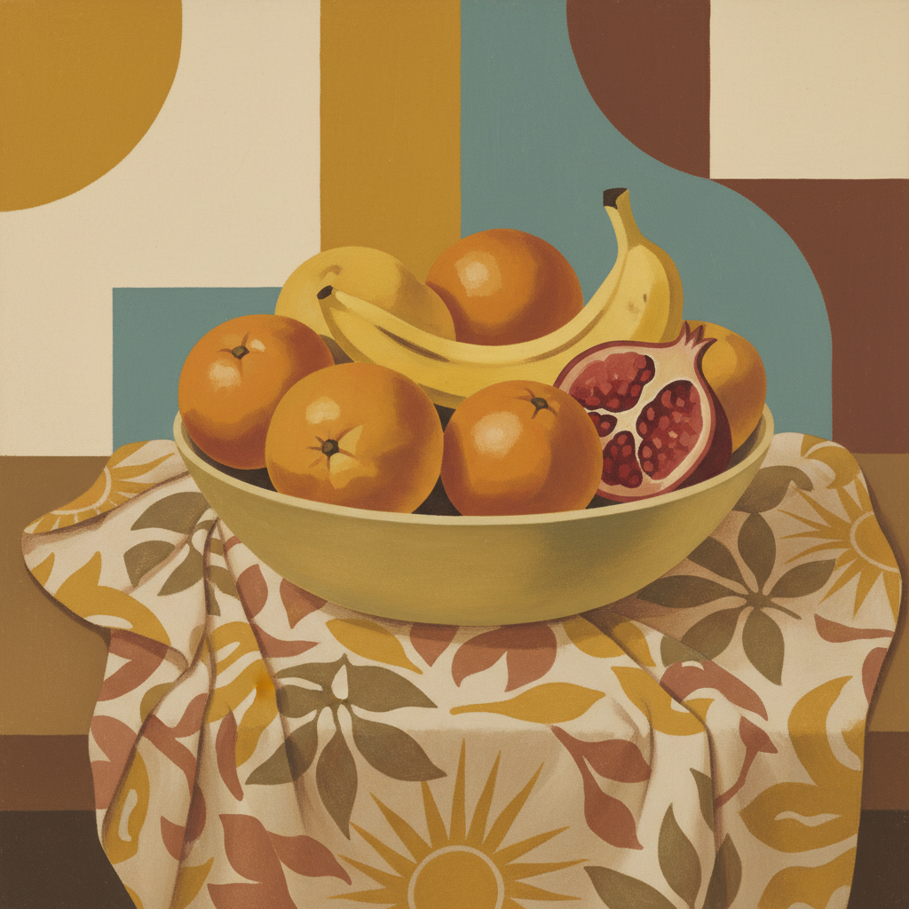

# Casein Art 酪蛋白绘画艺术

> "Casein paint is milk transformed into pigment — the protein extracted from curdled milk becomes a binder of remarkable strength and versatility, creating a paint that dries to a velvety matte finish with the opacity of gouache and the permanence of oil. It is an ancient medium, used by Egyptian tomb painters and medieval illuminators, that offers the modern artist a water-soluble paint of extraordinary covering power and archival stability." — Unknown

## 概述

酪蛋白绘画艺术（Casein Art）是使用酪蛋白（从牛奶中提取的蛋白质）作为颜料粘合剂的绘画技法——酪蛋白颜料以水调和，干燥后形成天鹅绒般的哑光表面，具有极强的遮盖力和耐久性。酪蛋白是人类最古老的绘画媒介之一，可追溯到古埃及，在20世纪中期曾作为插画和商业艺术的重要媒介。

酪蛋白绘画艺术的实践包括：1）纯酪蛋白画——使用纯酪蛋白颜料的哑光绘画；2）酪蛋白底层——作为油画的底层使用；3）酪蛋白壁画——用于墙面装饰的酪蛋白画；4）混合媒介——与其他媒介结合使用；5）插画应用——商业插画中的酪蛋白技法；6）酪蛋白雕塑——用酪蛋白制作的塑料（Galalith）；7）当代酪蛋白画——将传统技法与现代表达结合的创作。

## 核心特征

| 特征 | 描述 |
|------|------|
| 牛奶 | 源自牛奶蛋白质 |
| 哑光 | 天鹅绒般的哑光 |
| 遮盖 | 极强的遮盖力 |
| 水溶 | 水溶性易于使用 |
| 耐久 | 干燥后极其耐久 |
| 古老 | 数千年的历史 |

## 视觉特征

- **哑光**：天鹅绒般的哑光表面
- **平滑**：平滑均匀的色彩
- **不透明**：高度不透明的效果
- **柔和**：柔和温暖的色调
- **层次**：可以层层叠加
- **细腻**：细腻精致的质感

## 代表作品

| 作品 | 艺术家/文化 | 年代 | 意义 |
|------|-------------|------|------|
| *Egyptian tomb paintings* | 古埃及 | 古代 | 最早的酪蛋白画 |
| *Medieval manuscripts* | 中世纪 | 中世纪 | 手抄本装饰 |
| *Mid-century illustrations* | 美国 | 1940-60年代 | 商业插画黄金时代 |
| *Zorn palette studies* | 当代 | 当代 | 限色调研究 |
| *Contemporary casein works* | 当代 | 当代 | 当代酪蛋白画 |

## 历史时间线

| 时期 | 事件 |
|------|------|
| 古代 | 古埃及使用酪蛋白颜料 |
| 中世纪 | 手抄本和壁画中的应用 |
| 19世纪 | 酪蛋白塑料（Galalith）的发明 |
| 1940-60年代 | 商业插画中的黄金时代 |
| 当代 | 酪蛋白画的艺术复兴 |

## 中国语境

酪蛋白绘画在中国的认知相对有限但正在增长。中国传统绘画使用的胶矾（动物胶）与酪蛋白有类似的蛋白质粘合原理——但来源不同。中国当代的一些画家开始尝试酪蛋白颜料——被其独特的哑光质感和遮盖力吸引。中国的美术材料市场中，酪蛋白颜料作为一种特殊媒介正在获得关注——特别是在追求传统质感的画家中。中国的插画教育中，酪蛋白作为一种经典的插画媒介被介绍——虽然使用不如丙烯和水彩普及。中国的一些艺术家将酪蛋白与中国传统绘画技法结合——探索东西方绘画材料的融合可能。中国的乳制品产业发展也为酪蛋白颜料的本地生产提供了原料基础。

## AI生成概念图

## 与其他风格的关系

- **Tempera** → 蛋彩画
- **Gouache** → 水粉画
- **Oil Painting** → 油画
- **Fresco** → 壁画
- **Illustration** → 插画艺术
- **Encaustic** → 蜡画

---

*浮光艺志 | Chronicle of Artistry*
