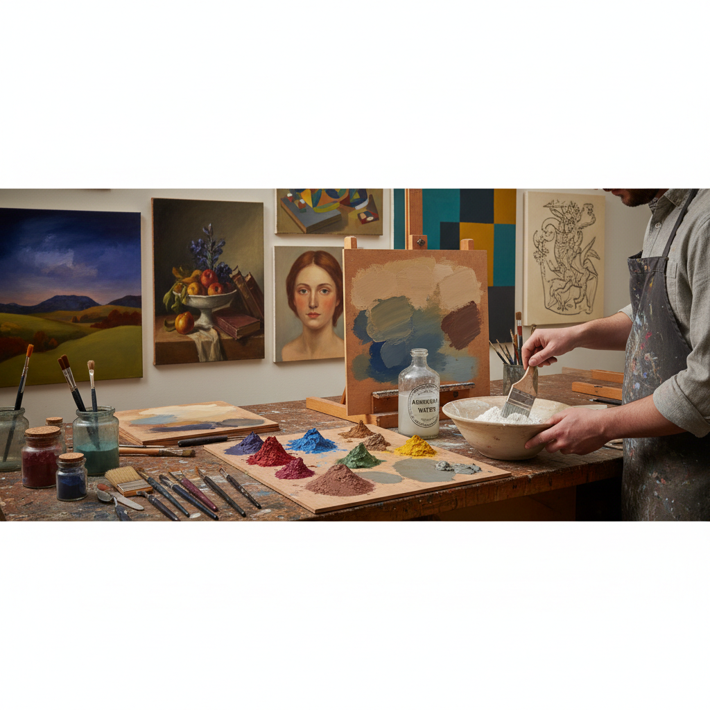

# Casein Painting 酪蛋白画

> "Casein is milk turned to stone — the protein that once nourished calves becomes, when mixed with pigment and dried, a paint film harder than oil, more matte than tempera, and as permanent as the limestone caves where our ancestors first painted." — Unknown

## 概述

酪蛋白画（Casein Painting）是一种以酪蛋白（牛奶中的主要蛋白质）为粘合剂的绘画技法。酪蛋白与碱性物质（如氨水或石灰）混合后形成粘合剂，将颜料粉末绑定到画面上。酪蛋白画干燥后形成极其坚硬、耐水的哑光表面——比蛋彩画更硬，比油画更哑光。

酪蛋白画的历史可追溯到古埃及和古罗马——酪蛋白被用作颜料粘合剂和木材胶水已有数千年。在20世纪，酪蛋白画作为一种独立的绘画媒介获得了艺术家的关注——它的快干特性、强烈的哑光效果和可以像水彩一样稀释或像油画一样厚涂的灵活性使其独具魅力。酪蛋白画干燥后可以用油画颜料覆盖，因此也常被用作油画的底层。

## 核心特征

| 特征 | 描述 |
|------|------|
| 酪蛋白 | 牛奶蛋白为粘合剂 |
| 坚硬 | 干燥后极其坚硬 |
| 哑光 | 强烈的哑光效果 |
| 快干 | 干燥速度快 |
| 灵活 | 可稀可厚 |
| 耐水 | 干燥后耐水 |

## 视觉特征

- **哑光**：强烈的哑光表面
- **柔和**：柔和的色调
- **粉质**：略带粉质感
- **平整**：平整的画面
- **深沉**：深沉的色彩
- **古典**：古典的质感

## 代表作品

| 作品 | 艺术家 | 年代 | 意义 |
|------|--------|------|------|
| *Ancient Egyptian paintings* | 古埃及工匠 | 公元前 | 早期酪蛋白应用 |
| *Casein illustrations* | Various | 20世纪 | 插画中的酪蛋白画 |
| *Zorn casein studies* | Anders Zorn | 19世纪 | 酪蛋白画研究 |
| *Contemporary casein works* | Various | 当代 | 当代酪蛋白画 |
| *Casein underpainting* | Various | 当代 | 酪蛋白底层画法 |

## 历史时间线

| 时期 | 事件 |
|------|------|
| 古代 | 酪蛋白作为粘合剂的使用 |
| 古埃及/罗马 | 酪蛋白在绘画中的应用 |
| 中世纪 | 酪蛋白在装饰和手稿中的使用 |
| 19世纪 | 商业酪蛋白颜料的出现 |
| 20世纪 | 酪蛋白画作为独立媒介的发展 |
| 当代 | 酪蛋白画的小众复兴 |

## 中国语境

酪蛋白画在中国相对小众，但在一些对传统绘画材料感兴趣的艺术家和教育者中有知名度。中国的一些美术材料研究者对酪蛋白画的材料特性进行了研究。酪蛋白画的"天然材料、耐久性强"特点与中国传统绘画对材料品质的重视有共鸣。一些中国画家在探索替代绘画媒介时会尝试酪蛋白画。

## AI生成概念图

## 与其他风格的关系

- **Tempera Painting** → 蛋彩画
- **Gouache** → 水粉画
- **Oil Painting** → 油画
- **Fresco** → 湿壁画
- **Watercolor** → 水彩画
- **Distemper** → 胶彩画

---

*浮光艺志 | Chronicle of Artistry*
