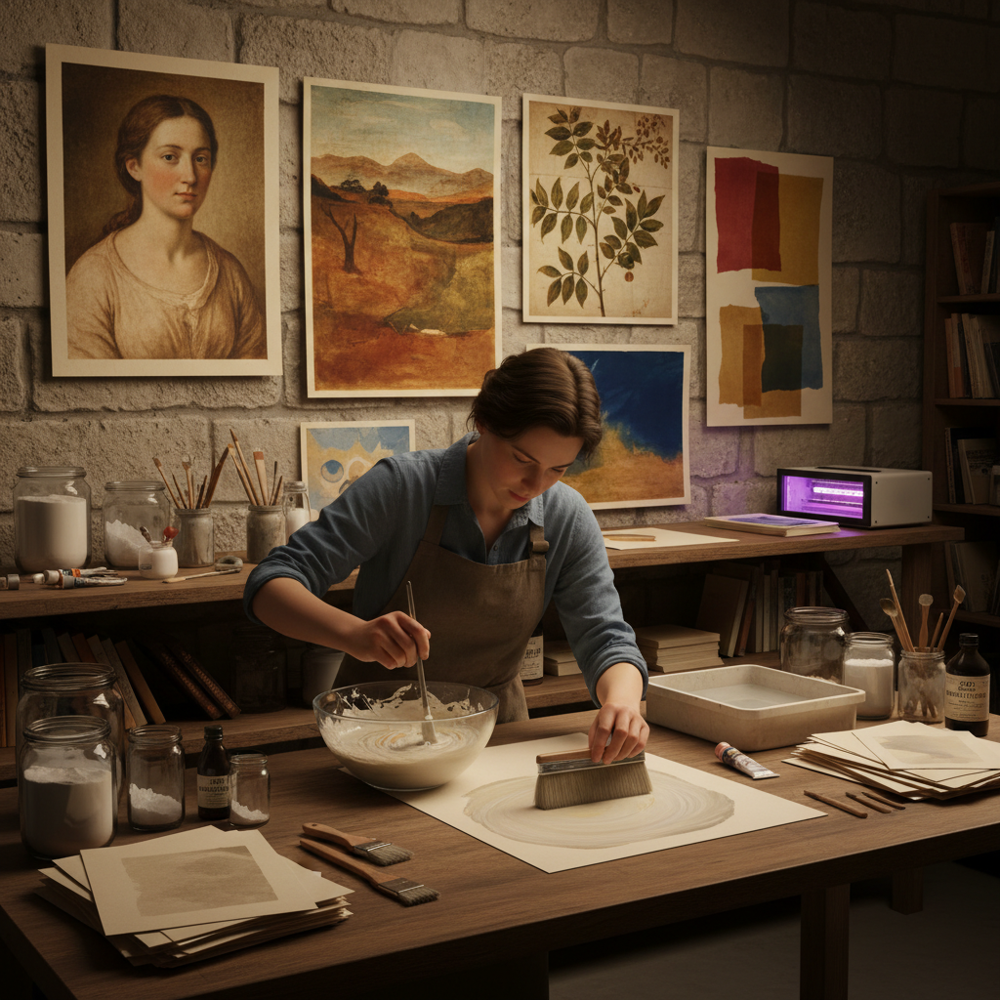

# Casein Printing 酪蛋白印刷

> "Casein printing is photography in milk protein — the same substance that binds ancient cave paintings and medieval tempera, now sensitized with dichromate and exposed to light, producing images with a matte, fresco-like quality that seems to emerge from the paper itself like pigment absorbed into plaster." — Unknown

## 概述

酪蛋白印刷（Casein Printing）是一种使用酪蛋白（casein，牛奶中的主要蛋白质）作为胶体载体，混合颜料和重铬酸盐感光剂的替代摄影印刷工艺。酪蛋白印刷属于重铬酸盐胶体印刷（dichromate colloid printing）家族——与重铬酸胶印（gum bichromate）类似，但使用酪蛋白代替阿拉伯胶作为胶体。

酪蛋白印刷的过程：将酪蛋白粉溶解在碱性溶液中，混合水彩颜料和重铬酸铵，涂在纸张上，干燥后通过负片接触曝光（紫外线）。曝光使酪蛋白硬化（交联），未曝光区域的酪蛋白在水中溶解冲洗掉，留下与曝光量对应的颜料图像。酪蛋白印刷品具有独特的哑光、壁画般的质感——比阿拉伯胶印刷更细腻、更均匀。

## 核心特征

| 特征 | 描述 |
|------|------|
| 酪蛋白 | 牛奶蛋白作为载体 |
| 重铬酸盐 | 重铬酸盐感光 |
| 颜料 | 使用水彩颜料 |
| 哑光 | 哑光壁画质感 |
| 多层 | 可多层叠印 |
| 细腻 | 比胶印更细腻 |

## 视觉特征

- **哑光**：哑光的壁画质感
- **细腻**：细腻均匀的色调
- **柔和**：柔和的色彩
- **纸感**：与纸张融为一体
- **颜料**：颜料的质感
- **古典**：古典壁画的感觉

## 代表作品

| 作品 | 艺术家 | 年代 | 意义 |
|------|--------|------|------|
| *Casein prints* | Various | 早期20世纪 | 早期酪蛋白印刷 |
| *Contemporary casein prints* | Various | 当代 | 当代酪蛋白印刷 |
| *Multi-layer casein prints* | Various | 当代 | 多层酪蛋白印刷 |
| *Casein over cyanotype* | Various | 当代 | 酪蛋白叠印氰版 |

## 历史时间线

| 时期 | 事件 |
|------|------|
| 古代 | 酪蛋白作为颜料粘合剂的使用 |
| 19世纪末 | 酪蛋白印刷的早期实验 |
| 20世纪初 | 画意摄影中的应用 |
| 20世纪中期 | 技法的衰落 |
| 当代 | 替代摄影中的复兴 |

## 中国语境

酪蛋白印刷在中国属于非常小众的实验性替代摄影技法。中国的替代摄影社区中，重铬酸胶印（gum bichromate）比酪蛋白印刷更为常见。随着中国替代摄影爱好者对更多工艺的探索，酪蛋白印刷作为一种"壁画质感"的独特印刷方式有潜在的发展空间。中国的一些实验摄影艺术家可能会将酪蛋白印刷与中国传统壁画的美学联系起来。

## AI生成概念图

## 与其他风格的关系

- **Gum Bichromate** → 重铬酸胶印
- **Carbon Printing** → 碳素印刷
- **Cyanotype** → 氰版印刷
- **Tempera Painting** → 蛋彩画
- **Alternative Photography** → 替代摄影
- **Fresco** → 壁画

---

*浮光艺志 | Chronicle of Artistry*
