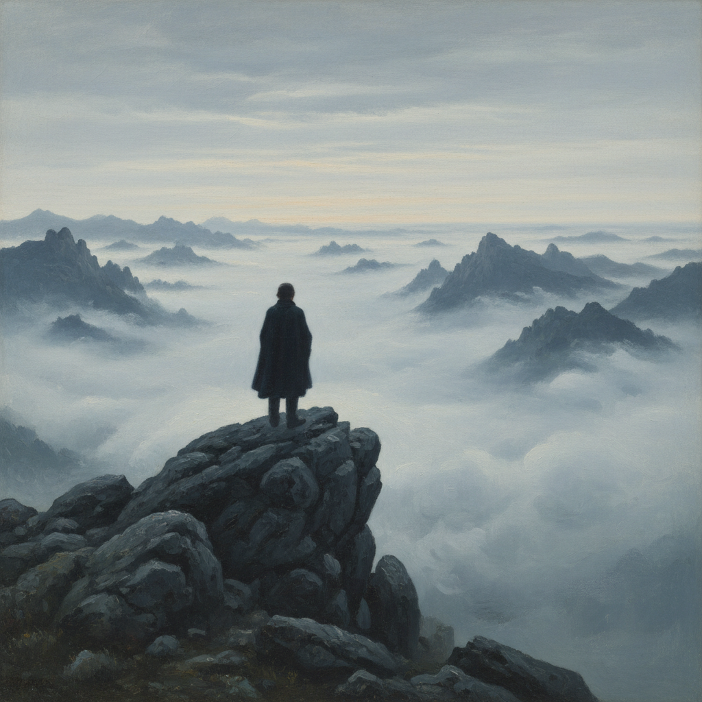

# Caspar David Friedrich 卡斯帕·大卫·弗里德里希

> "Der Maler soll nicht bloß malen, was er vor sich sieht, sondern auch, was er in sich sieht." — Caspar David Friedrich
> ("画家不应只画他眼前所见，还应画他内心所见。")

## 概述

卡斯帕·大卫·弗里德里希（Caspar David Friedrich，1774–1840）是德国浪漫主义绘画的最高代表，也是西方艺术史上最深刻的精神性风景画家。他将风景画从单纯的自然描绘提升为哲学和宗教冥想的载体——每一片雾、每一棵枯树、每一个背对观者的人物都承载着关于生死、信仰和无限的沉思。

弗里德里希的画面常常呈现一种超越时间的寂静，人物面对浩瀚自然时的孤独与崇高成为浪漫主义的标志性图像。

## 核心特征

| 特征 | 描述 |
|------|------|
| Rückenfigur | 背对观者的人物——邀请观者进入画面 |
| 精神性风景 | 风景作为内心状态和宗教情感的投射 |
| 崇高与无限 | 面对自然无限时的敬畏与渺小感 |
| 对称构图 | 严谨的几何构图，常有中轴线 |
| 薄雾与光 | 朦胧的大气效果，神秘的光线 |
| 废墟与死亡 | 哥特废墟、枯树、墓地的象征 |

## 视觉特征

- **人物**：背对观者（Rückenfigur），凝视远方
- **光线**：黎明或黄昏的微光，月光，雾中的光
- **色调**：冷蓝、灰紫、银白为主，偶有金色暖光
- **空间**：前景暗色剪影 → 中景雾气 → 远景无限
- **元素**：枯树、十字架、哥特废墟、大海、山峰
- **氛围**：寂静、孤独、崇高、冥想

## 代表作品

| 作品 | 年代 | 意义 |
|------|------|------|
| *Wanderer above the Sea of Fog* | c.1818 | 浪漫主义的标志性图像 |
| *The Abbey in the Oakwood* | 1810 | 死亡与信仰的冥想 |
| *Chalk Cliffs on Rügen* | 1818 | 自然的崇高与人的渺小 |
| *The Sea of Ice (Das Eismeer)* | 1824 | 自然力量的冷酷与壮美 |
| *Two Men Contemplating the Moon* | 1819 | 友谊与宇宙的对话 |
| *Moonrise over the Sea* | 1822 | 月光下的精神性风景 |

## 真实作品（公共领域）

弗里德里希的作品已进入公共领域：

| 作品 | 来源 |
|------|------|
| *Wanderer above the Sea of Fog* | [Hamburger Kunsthalle](https://www.hamburger-kunsthalle.de/) / [Wikimedia](https://commons.wikimedia.org/wiki/File:Caspar_David_Friedrich_-_Wanderer_above_the_sea_of_fog.jpg) |
| *The Abbey in the Oakwood* | [Alte Nationalgalerie Berlin](https://www.smb.museum/) |
| *The Sea of Ice* | [Hamburger Kunsthalle](https://www.hamburger-kunsthalle.de/) |

> ⚠️ 本条目优先使用真实作品。如需本地图片，请从上述来源手动下载后放入 `assets/artworks/caspar-david-friedrich/` 并压缩。

## AI生成概念图（备用）

## 历史背景

1. **1774年**：出生于瑞典统治下的格赖夫斯瓦尔德
2. **1794年**：进入哥本哈根美术学院
3. **1798年**：定居德累斯顿，终生未离开
4. **1808年**：《山上的十字架》引发"风景画能否表达宗教"的争论
5. **1810年代**：创作高峰期，浪漫主义运动核心人物
6. **1835年**：中风后创作力衰退
7. **1840年**：在贫困和被遗忘中去世
8. **20世纪**：被重新发现，成为浪漫主义的象征

## 与其他风格的关系

- **Romanticism** → 德国浪漫主义绘画的最高代表
- **Sublime** → 崇高美学的视觉化典范
- **Symbolism** → 风景中的象征性影响了象征主义
- **Tonalism** → 色调统一和氛围营造的先驱
- **Grimshaw** → 共享月光、雾气和孤独氛围的表现
- **Surrealism** → 梦幻般的风景影响了超现实主义

---

*浮光艺志 | Chronicle of Artistry*
