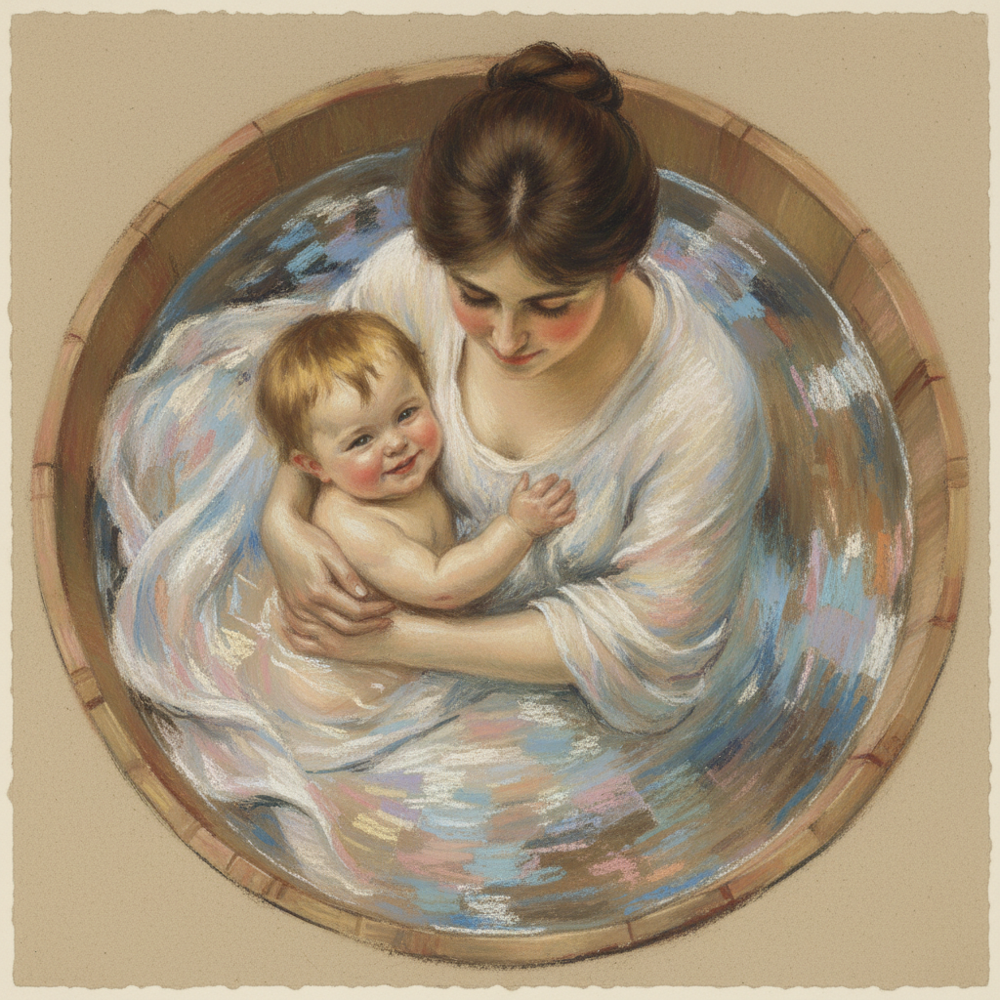

# Mary Cassatt 卡萨特

> "I think that if you shake the tree, you ought to be around when the fruit falls to pick it up." — Mary Cassatt

## 概述

玛丽·卡萨特（Mary Cassatt，1844–1926）是美国印象派画家，长期旅居巴黎，是德加的挚友和印象派展览的核心参与者。她以描绘母子关系的亲密场景闻名，将日本版画的构图智慧融入西方油画。

## 核心特征

| 特征 | 描述 |
|------|------|
| 母子主题 | 母亲与孩子的亲密互动 |
| 日本影响 | 大胆裁切、平面构图、装饰线条 |
| 粉彩技法 | 精湛的色粉画技巧 |
| 女性日常 | 茶会、阅读、梳妆、沐浴 |
| 温暖色调 | 柔和的粉、蓝、绿 |
| 心理深度 | 捕捉人物间的情感联系 |

## 代表作品

| 作品 | 年代 | 意义 |
|------|------|------|
| *The Child's Bath* | 1893 | 日本构图与母爱的完美融合 |
| *Little Girl in a Blue Armchair* | 1878 | 童年的自然姿态 |
| *The Letter* | 1890–91 | 彩色版画杰作 |
| *In the Loge* | 1878 | 女性观看者的主体性 |

## AI生成概念图

## 与其他风格的关系

- **Degas** → 德加邀请她加入印象派，终身友谊
- **Morisot** → 同为印象派女性先驱
- **Japonisme** → 深受日本版画影响
- **Impressionism** → 美国印象派的桥梁人物
