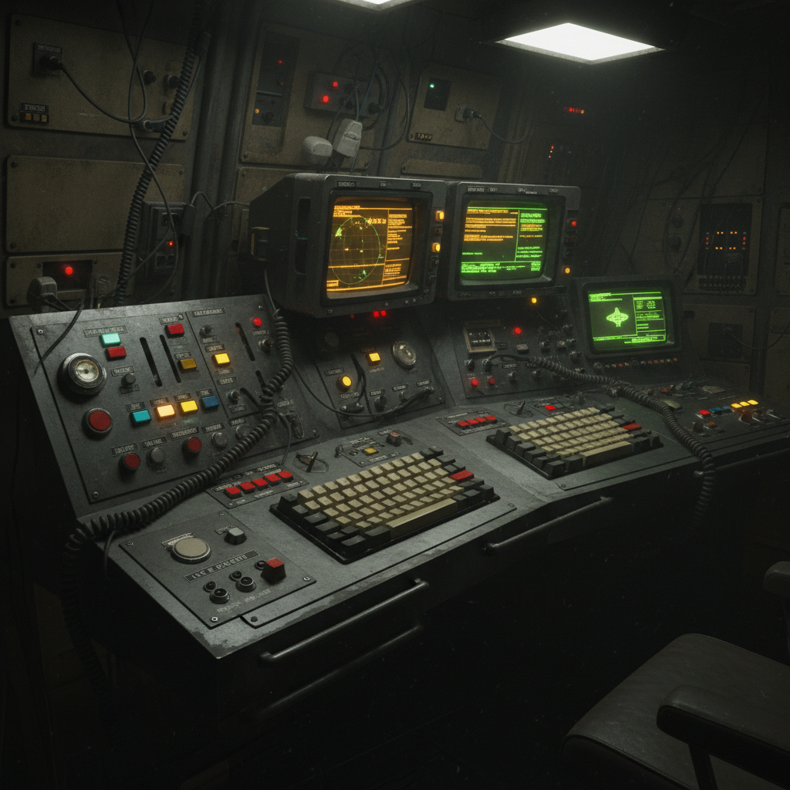

#카세트 퓨처리즘 / Cassette Futurism 补充：多语言视角

> 本文件是对已有 `cassette-futurism.md` 的多语言补充说明。

## 各国语境中的 Cassette Futurism

### 日语：カセット・フューチャリズム
日本语境下，Cassette Futurism 与1980年代日本电子产品设计（Sony Walkman、Sharp X68000、NEC PC-98）有天然亲缘关系。日本是这一美学的重要实物来源地——大量70-80年代的日本工业设计产品本身就是Cassette Futurism的活标本。

### 韩语：카세트 퓨처리즘
韩国语境中，该风格与"레트로 퓨처리즘"（复古未来主义）紧密关联。韩国现代卡片公司（Hyundai Card）曾专题报道"카세트 퓨처리즘"的当代复兴，将其与80年代韩国经济起飞时期的科技乐观主义联系。

### 中文：磁带未来主义
中文互联网上常被称为"磁带未来主义"，与蒸汽朋克、赛博朋克并列讨论。核心吸引力在于：当代电子产品设计越来越同质化（玻璃板+圆角矩形），而70-80年代的电子产品拥有丰富的物理按键、旋钮、天线和独特的工业造型。

## 关键视觉DNA（跨语言共识）

| 元素 | 说明 |
|------|------|
| CRT显示器 | 绿色/琥珀色磷光屏幕 |
| 物理按键阵列 | 大量拨动开关、旋钮、滑块 |
| 磁带/软盘 | 数据存储的物理实体感 |
| 米色/灰色塑料 | 80年代电子产品标志性外壳色 |
| LED数字显示 | 七段数码管、红色LED点阵 |
| 粗壮天线 | 可伸缩的金属天线 |

## 代表作品（补充）

- 游戏《Alien: Isolation》（2014）——完美复现1979年《异形》电影的Cassette Futurism美学
- 游戏《Signalis》（2022）——融合日本80年代科幻动画与Cassette Futurism
- Apple II、Commodore 64、NEC PC-98系列的实物设计

## 概念图

---

*最后更新：2026-07-26*
