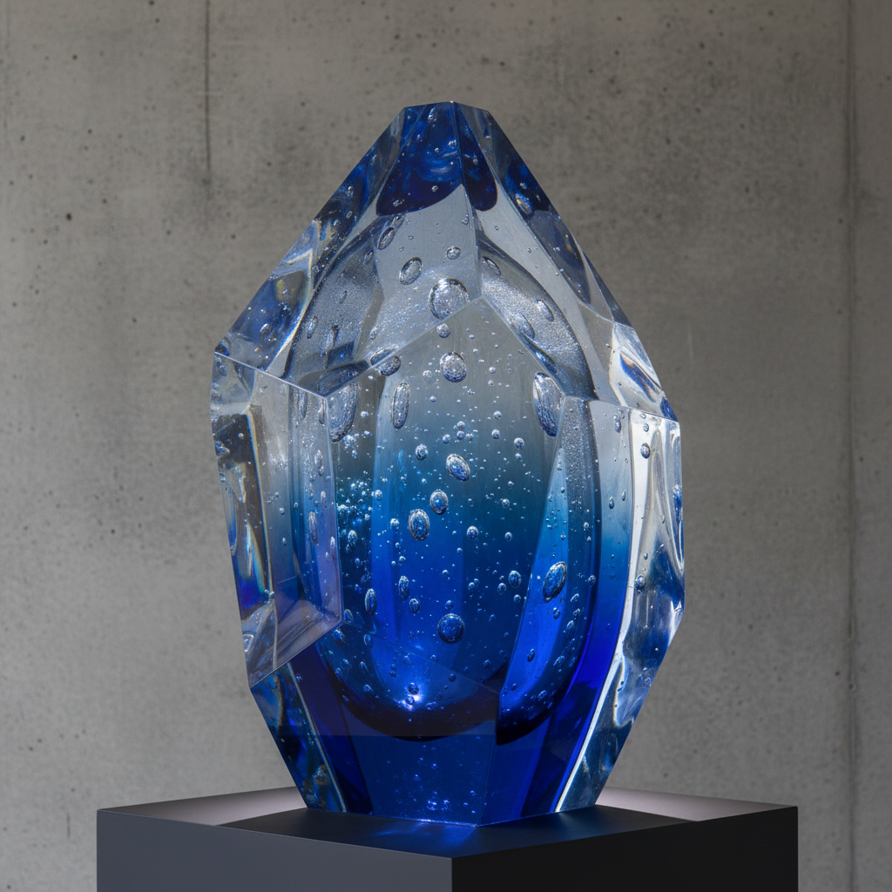

# Cast Glass Art 铸造玻璃艺术

> "Cast glass is sculpture born from a mold — molten glass or crushed glass fragments are poured or packed into a refractory form, then heated in a kiln until they flow together and fill every detail of the cavity, emerging after days of slow cooling as solid, weighty objects that hold light within their mass like frozen pools of color." — Unknown

## 概述

铸造玻璃艺术（Cast Glass Art）是一种将玻璃熔化后注入模具或将玻璃碎片/粉末填入模具后在窑中加热熔合的雕塑性技法——铸造玻璃作品通常具有实心或厚壁的特征，能够捕捉和折射光线，创造出独特的光学效果和雕塑感。这种技法适合创作大型雕塑和建筑装饰。

铸造玻璃艺术的实践包括：1）模具制作——制作耐火模具（通常用石膏和硅砂）；2）脱蜡铸造——用蜡模制作后脱蜡铸造；3）窑铸——将玻璃碎片填入模具在窑中熔化；4）退火——极其缓慢的冷却过程（大型作品可能需要数月）；5）冷加工——铸造后的切割、打磨和抛光；6）光学效果——利用玻璃的光学特性；7）当代铸造——将传统技法与现代雕塑创作结合。

## 核心特征

| 特征 | 描述 |
|------|------|
| 模具 | 使用模具成型 |
| 实心 | 通常为实心或厚壁 |
| 重量 | 具有重量感 |
| 光学 | 独特的光学效果 |
| 雕塑 | 雕塑性的表现 |
| 缓慢 | 极其缓慢的退火 |

## 视觉特征

- **厚重**：实心玻璃的厚重感
- **光学**：光线在内部的折射
- **透明**：透明或半透明的质感
- **雕塑**：雕塑般的形态
- **色彩**：内部色彩的深度
- **表面**：打磨后的光滑表面

## 代表作品

| 作品 | 艺术家/文化 | 年代 | 意义 |
|------|-------------|------|------|
| *Stanislav Libenský sculptures* | 捷克 | 20世纪 | 利本斯基铸造雕塑 |
| *Howard Ben Tré columns* | 美国 | 20世纪 | 霍华德·本·特雷柱体 |
| *Karen LaMonte figures* | 美国 | 当代 | 卡伦·拉蒙特人体 |
| *Bertil Vallien boat forms* | 瑞典 | 当代 | 贝蒂尔·瓦利恩船形 |
| *Contemporary cast glass* | 国际 | 当代 | 当代铸造玻璃 |

## 历史时间线

| 时期 | 事件 |
|------|------|
| 古代 | 早期的玻璃铸造 |
| 19世纪 | 法国pâte de verre的发展 |
| 20世纪中 | 捷克铸造玻璃学派 |
| 1960年代 | 工作室玻璃运动 |
| 当代 | 铸造玻璃的全球实践 |

## 中国语境

铸造玻璃在中国有重要的发展。中国的琉璃铸造——脱蜡铸造琉璃是中国当代玻璃艺术的重要方向。中国的琉璃工房（Liuli Gongfang）——是国际知名的中国铸造琉璃品牌。中国的玻璃艺术教育中，铸造玻璃作为重要的技法方向——在清华美院、中国美院等院校中教授。中国当代的玻璃艺术家——在铸造玻璃领域有大量创作。中国的公共艺术中，铸造玻璃雕塑——在城市空间中越来越多地出现。中国的工艺美术展览中，铸造玻璃是重要的参展类别。

## AI生成概念图

## 与其他风格的关系

- **Kiln-formed Glass** → 窑制玻璃
- **Pâte de Verre** → 粉末烧结玻璃
- **Glass Sculpture** → 玻璃雕塑
- **Lost Wax** → 脱蜡铸造
- **Studio Glass** → 工作室玻璃
- **Optical Glass** → 光学玻璃

---

*浮光艺志 | Chronicle of Artistry*
