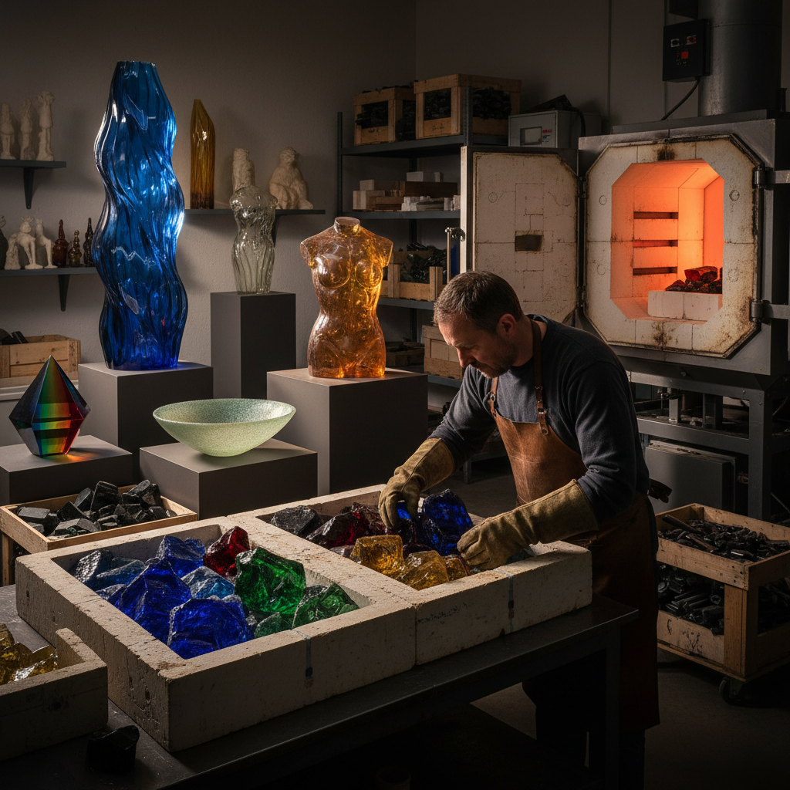

# Cast Glass 铸造玻璃

> "Cast glass is sculpture frozen in light — molten silica poured into molds or melted slowly into form, capturing within its mass the play of transparency, color, and the passage of time itself." — Unknown

## 概述

铸造玻璃（Cast Glass）是将熔融玻璃倒入或熔入模具中成型的玻璃艺术技法。与吹制玻璃（通过吹气成型空心器物）不同，铸造玻璃通常是实心或厚壁的，具有雕塑般的质量感和重量感。铸造玻璃的技法包括：热铸（hot casting，将熔融玻璃直接倒入模具）、窑铸（kiln casting，将玻璃块放入模具中在窑内缓慢熔化流入）、失蜡铸造（lost wax / pâte de verre，用蜡制作原型，制成耐火模具后熔化蜡，再填入玻璃）。

铸造玻璃的魅力在于：光线穿透厚实的玻璃体时产生的深度感——颜色在不同厚度处呈现不同的浓度，气泡和内部纹理创造出如同凝固的液体般的效果。

## 核心特征

| 特征 | 描述 |
|------|------|
| 模具 | 使用模具成型 |
| 实心 | 通常为实心或厚壁 |
| 雕塑 | 雕塑性的质量感 |
| 光 | 光线穿透的深度 |
| 缓慢 | 缓慢的退火过程 |
| 重量 | 有分量的质感 |

## 视觉特征

- **深度**：光线穿透的深度感
- **透明**：不同程度的透明
- **色彩**：色彩随厚度变化
- **质量**：雕塑般的质量感
- **气泡**：内部的气泡和纹理
- **光影**：复杂的光影效果

## 代表作品

| 作品 | 艺术家 | 年代 | 意义 |
|------|--------|------|------|
| *Egyptian cast glass* | 匿名 | 古埃及 | 最早的铸造玻璃 |
| *Pâte de verre* | Henri Cros | 19世纪末 | 失蜡玻璃的复兴 |
| *Cast glass sculptures* | Stanislav Libenský | 20世纪 | 捷克铸造玻璃 |
| *Optical glass sculptures* | Various | 当代 | 光学玻璃雕塑 |
| *Contemporary cast glass* | Karen LaMonte | 当代 | 当代铸造玻璃 |

## 历史时间线

| 时期 | 事件 |
|------|------|
| 公元前1500年 | 古埃及的铸造玻璃 |
| 古罗马 | 罗马铸造玻璃器 |
| 19世纪末 | Pâte de verre的复兴 |
| 1960s | Studio Glass运动 |
| 1970s+ | 捷克铸造玻璃学派 |
| 当代 | 当代铸造玻璃的多元发展 |

## 中国语境

铸造玻璃在中国的发展与当代玻璃艺术运动密切相关。中国传统的"琉璃"制作中包含铸造技法——台湾的琉璃工房（Liuli Gongfang）是华人世界最知名的铸造玻璃品牌之一，使用失蜡铸造法创作。大陆的玻璃艺术教育（中国美术学院、清华美院等）也教授铸造玻璃技法。一些中国当代玻璃艺术家将铸造玻璃与中国传统美学结合，创造出独特的作品。上海玻璃博物馆等机构展示了大量铸造玻璃艺术。

## AI生成概念图

## 与其他风格的关系

- **Blown Glass** → 吹制玻璃
- **Kiln-formed Glass** → 窑制玻璃
- **Pâte de Verre** → 失蜡玻璃
- **Sculpture** → 雕塑
- **Lost Wax Casting** → 失蜡铸造
- **Lampwork** → 灯工玻璃

---

*浮光艺志 | Chronicle of Artistry*
