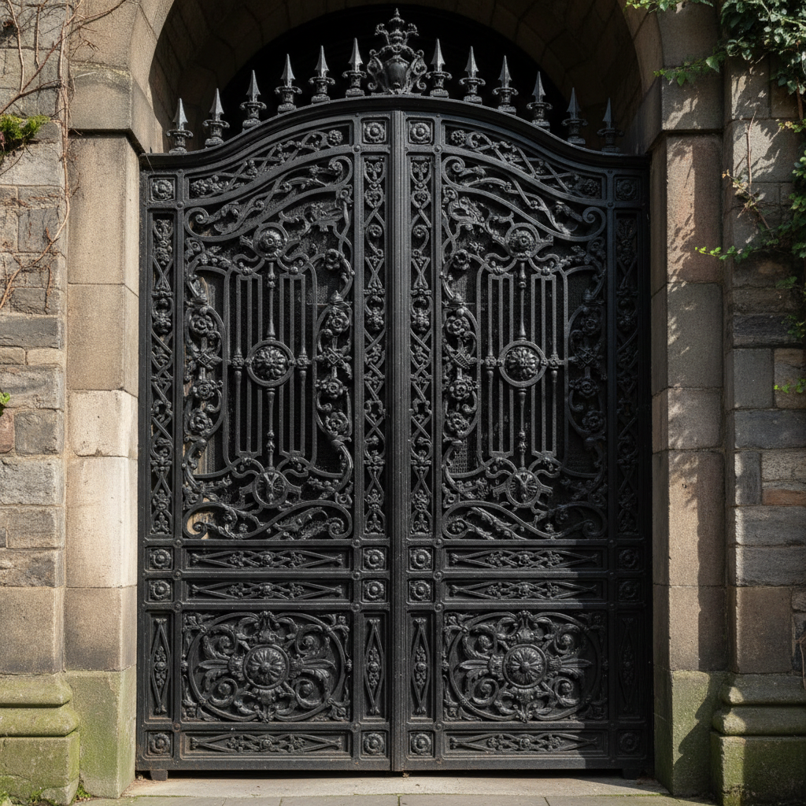

# Cast Iron Art 铸铁艺术

> "Cast iron art is sculpture poured from the earth — iron ore smelted in a furnace becomes a liquid that can fill any mold, from the delicate tracery of a garden gate to the massive columns of a bridge, cooling into forms of extraordinary strength and detail that weather to a noble rust or gleam under black paint, bringing industrial material into the realm of ornament and architecture." — Unknown

## 概述

铸铁艺术（Cast Iron Art）是一种将熔化的铁水浇注入模具中成型的金属工艺——铸铁因其流动性好、能够复制精细的模具细节而被广泛用于建筑装饰、园林家具、雕塑和日用品。铸铁艺术在工业革命时期达到高峰，维多利亚时代的铸铁装饰至今仍是城市景观的重要组成部分。

铸铁艺术的实践包括：1）模具制作——制作砂模或金属模具；2）熔炼——在高炉中熔炼铁矿石；3）浇注——将铁水浇注入模具；4）冷却——缓慢冷却使铸件成型；5）清理——去除毛刺和浇口；6）表面处理——涂漆或任其自然氧化；7）当代铸铁——将传统铸造与现代艺术创作结合。

## 核心特征

| 特征 | 描述 |
|------|------|
| 铸造 | 熔化浇注成型 |
| 细节 | 能复制精细细节 |
| 强度 | 极高的结构强度 |
| 装饰 | 建筑和园林装饰 |
| 工业 | 工业革命的产物 |
| 耐久 | 极其耐久的材料 |

## 视觉特征

- **黑色**：传统的黑色涂漆
- **铁锈**：自然氧化的铁锈色
- **精细**：精细的铸造细节
- **厚重**：厚重的材料感
- **装饰**：华丽的装饰图案
- **力量**：力量感和永恒感

## 代表作品

| 作品 | 艺术家/文化 | 年代 | 意义 |
|------|-------------|------|------|
| *Coalbrookdale ironwork* | 英国 | 18-19世纪 | 科尔布鲁克代尔铸铁 |
| *Victorian railings and gates* | 英国 | 19世纪 | 维多利亚铸铁栏杆 |
| *New Orleans balconies* | 美国 | 19世纪 | 新奥尔良铸铁阳台 |
| *Berlin iron jewelry* | 德国 | 19世纪 | 柏林铸铁珠宝 |
| *Contemporary cast iron sculpture* | 国际 | 当代 | 当代铸铁雕塑 |

## 历史时间线

| 时期 | 事件 |
|------|------|
| 公元前5世纪 | 中国发明铸铁 |
| 中世纪 | 欧洲铸铁的发展 |
| 18世纪 | 工业革命推动铸铁艺术 |
| 19世纪 | 维多利亚时代铸铁装饰的高峰 |
| 当代 | 铸铁在当代艺术中的应用 |

## 中国语境

铸铁在中国有极其悠久的历史和重要的地位。中国是世界上最早发明铸铁的国家——比欧洲早约1800年。中国的铸铁艺术——从古代的铁器到宋代的铁塔，有丰富的传统。中国的铁狮子（沧州铁狮子）——是世界上最大的古代铸铁雕塑之一。中国的铸铁锅——传统的铸铁炊具有悠久的历史。中国当代的铸铁艺术——在雕塑和公共艺术中有广泛的应用。中国的工业遗产中，铸铁建筑和装饰——是重要的保护对象。中国的铸造技术——在世界铸造史上有重要的地位。

## AI生成概念图

## 与其他风格的关系

- **Wrought Iron** → 锻铁
- **Bronze Casting** → 青铜铸造
- **Architectural Ornament** → 建筑装饰
- **Victorian Design** → 维多利亚设计
- **Industrial Art** → 工业艺术
- **Sculpture** → 雕塑

---

*浮光艺志 | Chronicle of Artistry*
