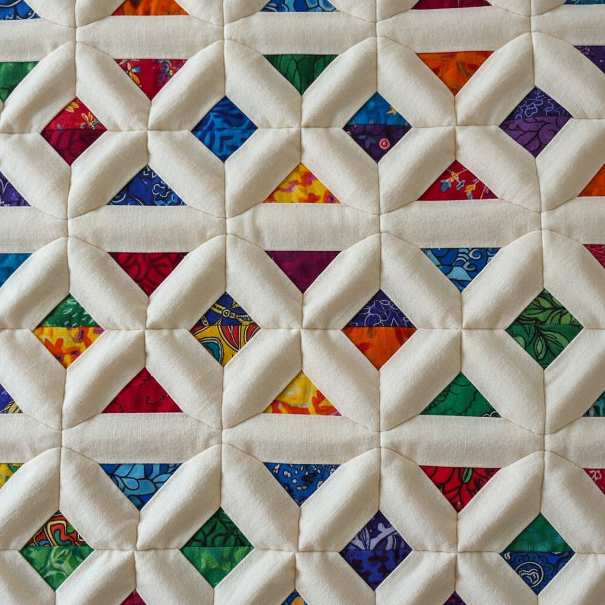

# Cathedral Window Quilting Art 教堂窗户绗缝艺术

> "Cathedral window quilting creates stained glass in fabric — folded muslin squares form the leading, and bright scraps of cotton become the colored glass, all constructed without batting or backing through an ingenious sequence of folds, rolls, and curves that transforms flat squares into a three-dimensional lattice of arched windows." — Unknown

## 概述

教堂窗户绗缝艺术（Cathedral Window Quilting Art）是一种通过折叠和缝合方形布块来创造类似教堂彩色玻璃窗效果的绗缝技法。这种技法不使用填充物或衬布——完全通过布料的折叠和卷曲来创造立体的"窗框"效果，在"窗框"之间放入彩色布片作为"彩色玻璃"。

教堂窗户绗缝艺术的实践包括：1）方形折叠——将方形布料多次折叠成小方块；2）中心缝合——将折叠后的角缝合到中心；3）拼接——将多个折叠方块拼接在一起；4）彩色嵌入——在接缝处放入彩色布片；5）卷曲覆盖——将边缘卷曲覆盖彩色布片的边缘；6）无填充——不使用填充物的独特结构；7）当代变化——将传统技法与现代设计结合的创作。

## 核心特征

| 特征 | 描述 |
|------|------|
| 折叠 | 精确的布料折叠 |
| 窗户 | 教堂窗户的效果 |
| 无填充 | 不使用填充物 |
| 立体 | 立体的框架结构 |
| 彩色 | 彩色布片的嵌入 |
| 几何 | 几何化的重复 |

## 视觉特征

- **窗户**：教堂窗户的视觉效果
- **框架**：柔软的布料框架
- **色彩**：框架中的彩色布片
- **几何**：规律的几何重复
- **立体**：微妙的立体起伏
- **优雅**：优雅精致的整体感

## 代表作品

| 作品 | 艺术家/文化 | 年代 | 意义 |
|------|-------------|------|------|
| *Traditional cathedral windows* | 美国 | 20世纪 | 传统教堂窗户绗缝 |
| *Miniature cathedral windows* | 国际 | 当代 | 微型教堂窗户 |
| *Contemporary variations* | 国际 | 当代 | 当代变化形式 |
| *Secret garden quilts* | 国际 | 当代 | 秘密花园绗缝 |
| *Cathedral window accessories* | 国际 | 当代 | 教堂窗户配饰 |

## 历史时间线

| 时期 | 事件 |
|------|------|
| 20世纪初 | 教堂窗户绗缝的起源 |
| 1960-70年代 | 技法的流行和传播 |
| 1980年代 | 绗缝复兴中的再发现 |
| 2000年代 | 简化版本的开发 |
| 当代 | 教堂窗户绗缝的艺术化 |

## 中国语境

教堂窗户绗缝在中国的手工爱好者群体中有一定的认知。中国的拼布爱好者群体中，教堂窗户作为一种经典的拼布技法——在各种手工教程和工作坊中教授。中国传统的布艺中，折叠技法（如折纸花、布花）——与教堂窗户的折叠理念有相似之处。中国的手工市场中，教堂窗户绗缝被用于制作靠垫、包袋和装饰品——作为一种精致的手工技法受到欢迎。中国的拼布教育中，教堂窗户作为进阶技法——在拼布课程中教授。中国的手工书籍和网络教程中，教堂窗户绗缝——是热门的教学内容之一。

## AI生成概念图

## 与其他风格的关系

- **Quilting** → 绗缝
- **Origami** → 折纸
- **Patchwork** → 拼布
- **Stained Glass** → 彩色玻璃
- **Textile Art** → 纺织艺术
- **Geometric Art** → 几何艺术

---

*浮光艺志 | Chronicle of Artistry*
