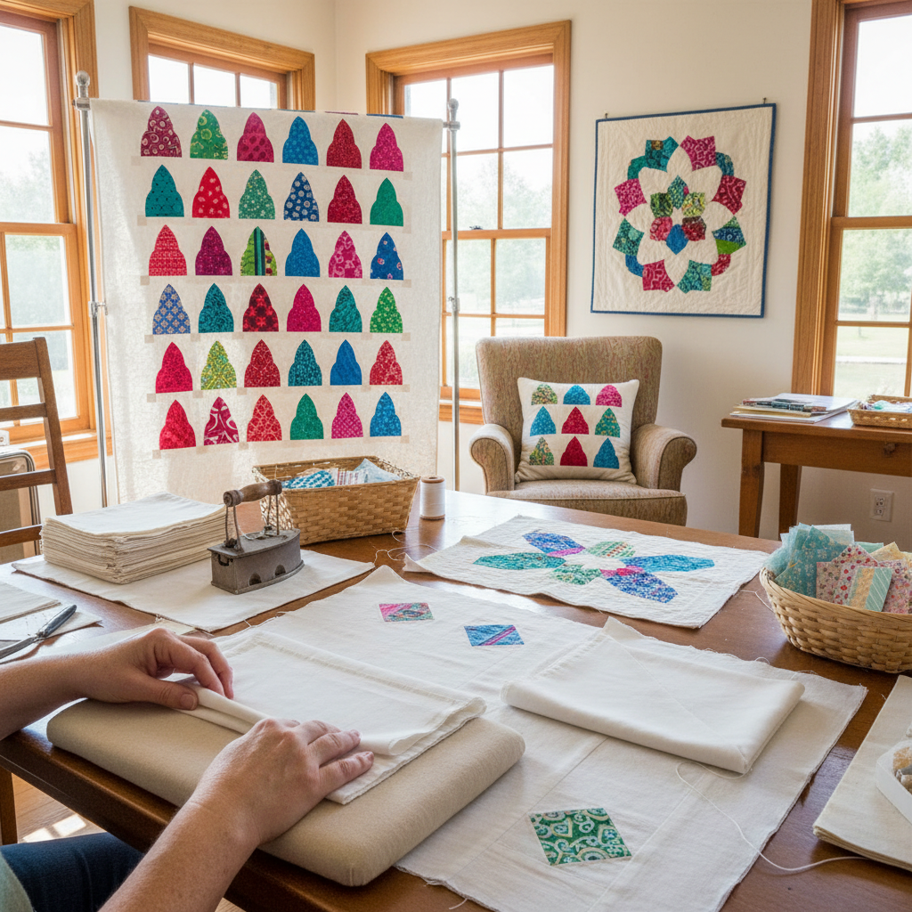

# Cathedral Window Quilting 教堂窗绗缝

> "Cathedral Window quilting is origami in fabric — squares folded and refolded upon themselves to create frames that reveal colorful inserts like stained glass windows, no batting needed, no quilting required, just the geometry of folded cloth creating its own structure and its own light." — Unknown

## 概述

教堂窗绗缝（Cathedral Window Quilting）是一种独特的拼布技法——通过将方形织物反复折叠形成"窗框"，然后在窗框中嵌入彩色织物"玻璃"，模拟教堂彩色玻璃窗的效果。这种技法的独特之处在于：它不需要填充物（batting）、不需要背衬（backing）、不需要绗缝线（quilting stitches）——折叠本身就创造了结构和厚度。

教堂窗绗缝的起源不确定，但在20世纪中期的美国拼布社区中流行起来。这种技法需要大量的织物（成品面积约为原始织物的四分之一）和精确的折叠。传统的教堂窗使用素色（通常是白色或米色）的"窗框"织物和彩色的"玻璃"织物。当代变体包括：Secret Garden（秘密花园）、Folded Star（折叠星）等。

## 核心特征

| 特征 | 描述 |
|------|------|
| 折叠 | 精确的织物折叠 |
| 窗框 | 折叠形成窗框 |
| 嵌入 | 彩色织物嵌入 |
| 无填充 | 不需要填充物 |
| 几何 | 精确的几何结构 |
| 自支撑 | 折叠创造结构 |

## 视觉特征

- **窗格**：教堂窗的窗格效果
- **彩色**：彩色"玻璃"的嵌入
- **几何**：精确的几何图案
- **立体**：折叠的立体感
- **光影**：曲线窗框的光影
- **典雅**：教堂般的典雅

## 代表作品

| 作品 | 艺术家 | 年代 | 意义 |
|------|--------|------|------|
| *Traditional Cathedral Windows* | 美国拼布者 | 20世纪中期 | 传统教堂窗 |
| *Secret Garden variation* | Various | 当代 | 秘密花园变体 |
| *Contemporary Cathedral Windows* | Various | 当代 | 当代教堂窗 |
| *Miniature Cathedral Windows* | Various | 当代 | 微型教堂窗 |
| *Cathedral Window cushions* | Various | 当代 | 教堂窗靠垫 |

## 历史时间线

| 时期 | 事件 |
|------|------|
| 20世纪中期 | 教堂窗绗缝在美国的出现 |
| 1970-80年代 | 教堂窗绗缝的流行 |
| 1990年代 | 各种变体的发展 |
| 当代 | 教堂窗绗缝的持续创新 |

## 中国语境

教堂窗绗缝在中国的拼布（patchwork）社区中有一定的知名度。中国的拼布爱好者通过日本拼布书籍和网络教程了解这种技法。中国的一些手工工作室和拼布教室教授教堂窗绗缝。这种技法在中国常被用于制作靠垫、桌垫和小型装饰品。中国的拼布展览中偶尔可以看到教堂窗绗缝作品。中国传统的折纸和布艺中也有类似的折叠美学。

## AI生成概念图

## 与其他风格的关系

- **Quilting** → 绗缝
- **Patchwork** → 拼布
- **Origami** → 折纸
- **Stained Glass** → 彩色玻璃
- **Textile Art** → 纺织艺术
- **Geometric Art** → 几何艺术

---

*浮光艺志 | Chronicle of Artistry*
