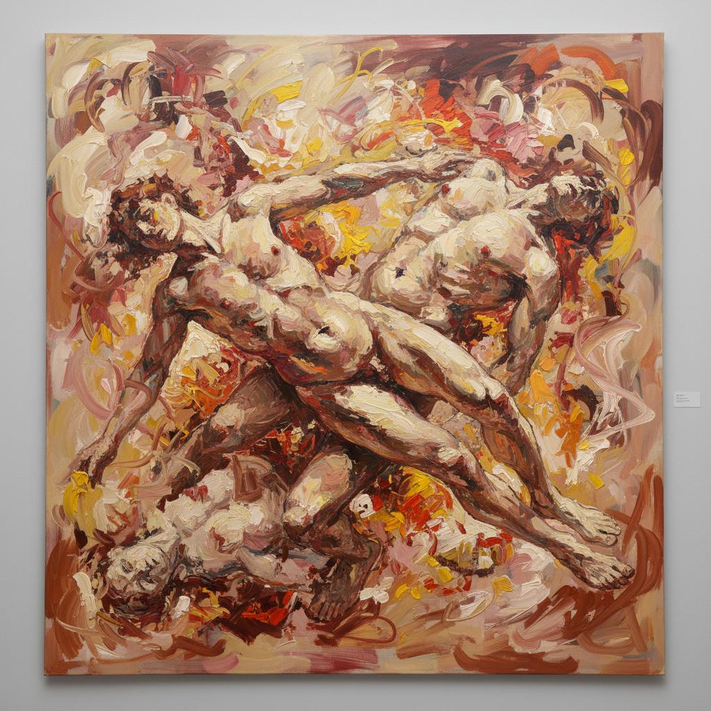

# Cecily Brown 塞西莉·布朗

> **流派**: 当代绘画 · 抽象具象  
> **时期**: 1969–至今 英国/美国  
> **关键词**: 肉体与抽象、德库宁遗产、情色能量、笔触狂欢

## 概述

塞西莉·布朗的绘画在抽象与具象之间快速切换——远看是狂暴的抽象笔触，近看则隐约浮现纠缠的肉体、风景碎片或古典绘画的引用。她继承了德库宁的"女人"系列的能量，但注入了更多的幽默、情色和艺术史意识。她的画面充满了颜料的物质快感和身体的感官能量。

## 视觉特征

- **抽象具象切换**: 形象在笔触中若隐若现
- **肉色调**: 大量粉红、肉色和暖色调
- **狂暴笔触**: 快速、厚重、充满能量的笔法
- **大尺幅**: 作品通常超过2×3米
- **古典引用**: 隐藏的鲁本斯、普桑等大师构图

## 代表作品

- 《高时代》(High Times, 2004)
- 《少女与死神》(Girl on her Stomach, 1999)
- 《兔子洞》系列
- 大都会博物馆个展 (2023)

## 历史影响

布朗证明了抽象表现主义的能量在21世纪仍然可以焕发新生。她将情色、幽默和艺术史知识注入狂暴的笔触中，为"绘画的快感"找到了当代的表达方式。

## 相关风格

- [Abstract Expressionism 抽象表现主义](abstract-expressionism.md)
- [Willem de Kooning 威廉·德库宁](willem-de-kooning.md)
- [Contemporary Painting 当代绘画](contemporary-painting.md)
