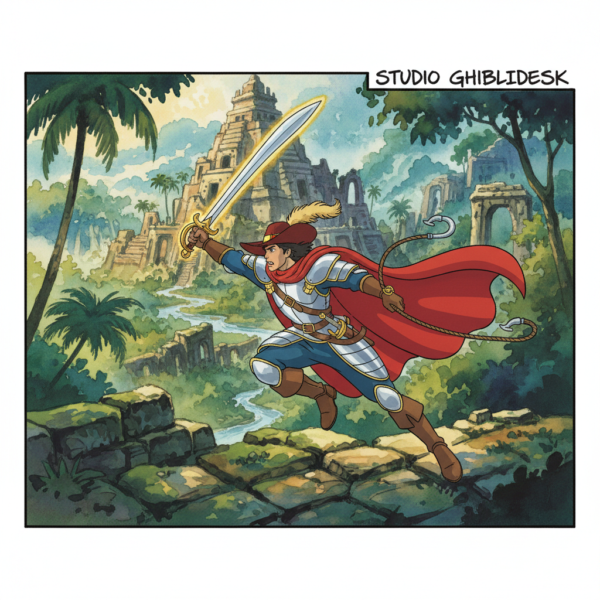

# Cel Animation 赛璐珞动画

> **时期：** 1914年–2000年代  
> **关键词：** 透明胶片、手绘帧、分层合成、黄金时代、工业流水线

## 概述

Cel Animation（赛璐珞动画）是传统手绘动画的工业化形式，通过在透明赛璐珞胶片上绘制角色，叠放在固定背景上逐帧拍摄。从迪士尼的《白雪公主》到吉卜力的《千与千寻》，赛璐珞动画定义了20世纪动画的视觉语言——平涂色彩、清晰轮廓线、精致背景与简化角色的对比。

## 风格特征

- **平涂色彩**：有限色阶的清晰填色
- **清晰轮廓**：黑色或深色的角色轮廓线
- **分层结构**：角色层与背景层的分离
- **背景精致**：水彩或水粉绘制的详细背景
- **运动流畅**：全动画24帧/秒的丝滑运动

## 代表人物与作品

- 华特·迪士尼《白雪公主》《幻想曲》
- 查克·琼斯《兔八哥》系列
- 宫崎骏《千与千寻》（最后的赛璐珞大作之一）
- 唐·布鲁斯《美国鼠谭》

## 概念图

