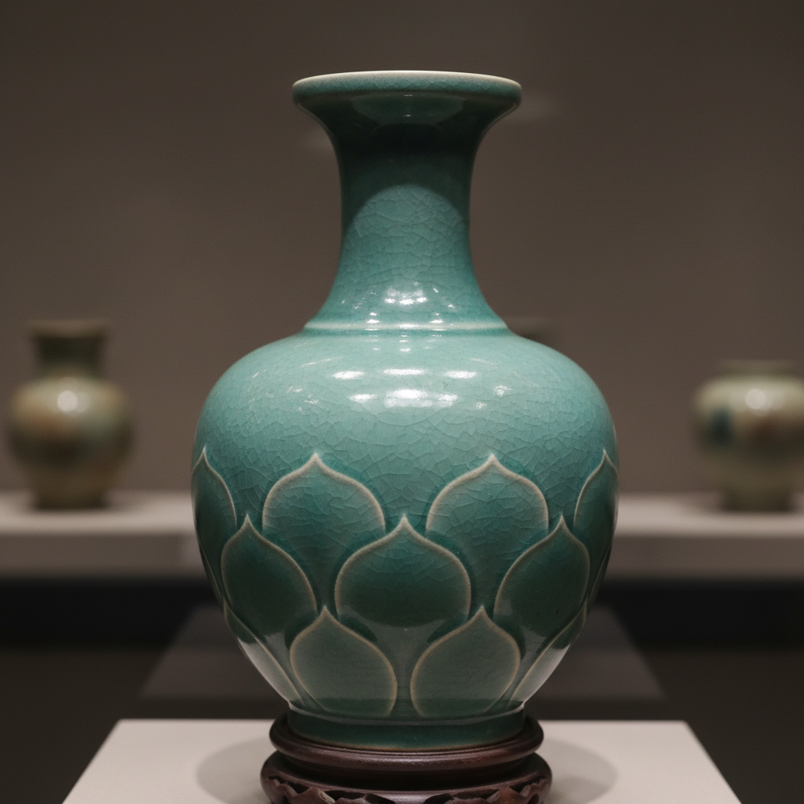

# Celadon Art 青瓷艺术

> "Celadon is the color of jade made liquid — a glaze born from iron and ash, fired in reduction until it captures the soft blue-green of a mountain lake at dawn, the translucent depth of ancient nephrite, and the quiet perfection that Chinese potters pursued for a thousand years, believing that the ideal vessel should look as though carved from a single piece of sky-colored stone." — Unknown

## 概述

青瓷艺术（Celadon Art）是一种以铁为着色剂、在还原气氛中烧制而成的青绿色釉陶瓷艺术。青瓷是中国陶瓷史上最重要的品类之一，其釉色模仿玉石的温润质感，被视为陶瓷艺术的最高境界之一。青瓷从商代原始青瓷发展至宋代达到巅峰，影响遍及东亚乃至全世界。

青瓷艺术的核心要素包括：1）釉料——以植物灰和铁为基础的釉料配方；2）还原烧成——在缺氧气氛中烧制使铁呈现青绿色；3）器形——追求简洁优雅的造型；4）刻花——在坯体上刻划纹饰增加层次；5）釉色——从天青到粉青到梅子青的丰富色谱；6）开片——釉面裂纹作为装饰效果；7）厚釉——多次施釉形成玉质感。

## 核心特征

| 特征 | 描述 |
|------|------|
| 青绿釉色 | 铁在还原气氛中呈现的青绿色 |
| 玉质感 | 模仿玉石温润质感的釉面 |
| 刻花装饰 | 釉下刻划花纹增加层次 |
| 简洁器形 | 追求优雅简约的造型 |
| 厚釉技法 | 多层施釉形成深邃质感 |
| 开片美学 | 釉面裂纹的装饰效果 |

## 视觉特征

- **天青**：如雨过天晴的淡蓝色
- **粉青**：柔和的粉绿色调
- **梅子青**：深沉的翠绿色
- **豆青**：淡雅的豆绿色
- **玉质光泽**：温润如玉的光泽
- **刻花层次**：釉下纹饰的深浅变化

## 代表作品

| 作品 | 艺术家/窑口 | 年代 | 意义 |
|------|-------------|------|------|
| *汝窑天青釉洗* | 汝窑 | 北宋 | 青瓷最高境界 |
| *龙泉窑梅子青凤耳瓶* | 龙泉窑 | 南宋 | 梅子青的典范 |
| *高丽青瓷象嵌云鹤纹梅瓶* | 高丽 | 12世纪 | 韩国青瓷代表 |
| *越窑秘色瓷* | 越窑 | 唐-五代 | 秘色瓷的神秘 |
| *官窑开片青瓷* | 官窑 | 南宋 | 开片美学典范 |

## 历史时间线

| 时期 | 事件 |
|------|------|
| 商代 | 原始青瓷出现 |
| 东汉 | 成熟青瓷烧制成功 |
| 唐代 | 越窑秘色瓷达到高峰 |
| 北宋 | 汝窑、耀州窑青瓷巅峰 |
| 南宋 | 龙泉窑梅子青、粉青 |
| 高丽 | 韩国青瓷独立发展 |
| 当代 | 青瓷技艺的传承与创新 |

## 中国语境

青瓷是中国陶瓷的根基和灵魂。从商代原始青瓷到宋代五大名窑中的汝窑、官窑、哥窑，青瓷贯穿了中国陶瓷史的主线。中国人对青瓷的审美与对玉的崇拜一脉相承——"类玉"是对青瓷的最高赞美。宋代是青瓷的黄金时代：汝窑的天青、龙泉的梅子青和粉青、官窑的开片，代表了中国陶瓷美学的最高成就。青瓷不仅是器物，更是中国文人审美——含蓄、内敛、温润——的物质载体。今天，龙泉青瓷已被列入联合国非物质文化遗产名录，青瓷技艺在中国各地得到传承和创新。

## AI生成概念图

## 与其他风格的关系

- **Ash Glaze** → 灰釉（青瓷的基础）
- **Jade Carving** → 玉雕（审美渊源）
- **Song Dynasty Aesthetics** → 宋代美学
- **Korean Celadon** → 高丽青瓷
- **Porcelain** → 瓷器
- **Reduction Firing** → 还原烧成

---

*浮光艺志 | Chronicle of Artistry*
