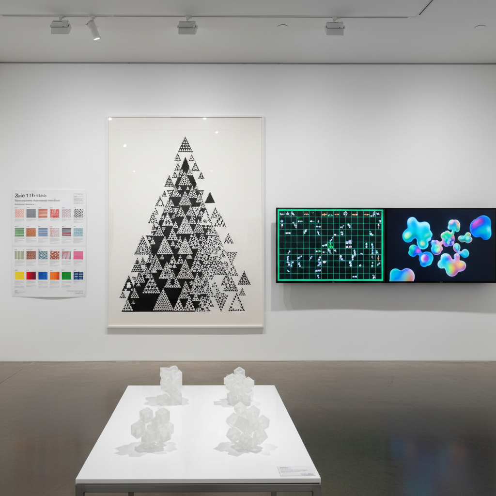

# Cellular Automata Art 元胞自动机艺术

> "Cellular automata art demonstrates the deepest truth about complexity — that the universe does not need a designer, that infinite variety can emerge from finite rules, that a grid of cells following the simplest possible logic can produce patterns of breathtaking beauty and endless surprise, from the stable to the chaotic, from the periodic to the unpredictable, proving that the line between mathematics and art, between computation and creation, between logic and beauty, was always an illusion." — Stephen Wolfram

## 概述

元胞自动机艺术（Cellular Automata Art）是利用元胞自动机（cellular automata, CA）——由简单规则驱动的离散计算系统——创作视觉艺术的实践。元胞自动机由一个网格组成，每个格子（元胞）有有限的状态，根据邻居的状态和简单的规则在每个时间步更新。

元胞自动机艺术的实践包括：1）经典CA的可视化——将Conway生命游戏、Wolfram规则等经典元胞自动机的演化过程转化为视觉艺术；2）自定义规则的探索——设计新的CA规则来产生独特的视觉模式；3）连续CA——使用连续值而非离散状态的元胞自动机（如Lenia）；4）多状态CA——使用多种状态和颜色的元胞自动机；5）3D CA——在三维空间中运行的元胞自动机。

## 核心特征

| 特征 | 描述 |
|------|------|
| 网格 | 网格结构 |
| 规则 | 简单规则 |
| 演化 | 时间演化 |
| 模式 | 复杂模式 |
| 离散 | 离散系统 |
| 确定 | 确定性 |

## 视觉特征

- **网格**：可见的网格结构
- **黑白**：经典的黑白模式
- **三角**：一维CA的三角形图案
- **生命**：生命游戏的滑翔机和振荡器
- **分形**：自相似的分形模式
- **色彩**：多状态CA的色彩

## 代表作品

| 作品 | 艺术家 | 年代 | 意义 |
|------|--------|------|------|
| *Game of Life* | John Conway | 1970 | 最著名的CA |
| *Rule 110* | Stephen Wolfram | 1983 | 图灵完备的CA |
| *Lenia* | Bert Chan | 2018 | 连续生命 |
| *Neural CA* | Google Research | 2020 | 神经元胞自动机 |
| *Multi-state CA art* | Various | 当代 | 多状态CA艺术 |

## 历史时间线

| 时期 | 事件 |
|------|------|
| 1940年代 | Von Neumann的自复制自动机 |
| 1970 | Conway的生命游戏 |
| 1983 | Wolfram的一维CA分类 |
| 2002 | Wolfram《A New Kind of Science》 |
| 2018 | Lenia连续生命系统 |

## 中国语境

元胞自动机艺术在中国有独特的文化共鸣。中国传统的围棋——黑白棋子在网格上的放置和"生死"判定——与元胞自动机有深刻的结构相似性。中国传统的织锦和刺绣图案——在网格上按规则排列的色彩——也可以被理解为一种手工的"元胞自动机"。中国当代的一些程序员和艺术家在探索元胞自动机艺术：创造基于中国传统图案规则的CA系统、用CA生成书法和水墨效果、以及将围棋的美学与CA的计算美学结合。

## AI生成概念图

## 与其他风格的关系

- **Generative Art** → 生成艺术
- **Emergent Art** → 涌现艺术
- **Pixel Art** → 像素艺术
- **Mathematical Art** → 数学艺术
- **Computational Art** → 计算艺术
- **Procedural Art** → 程序化艺术

---

*浮光艺志 | Chronicle of Artistry*
