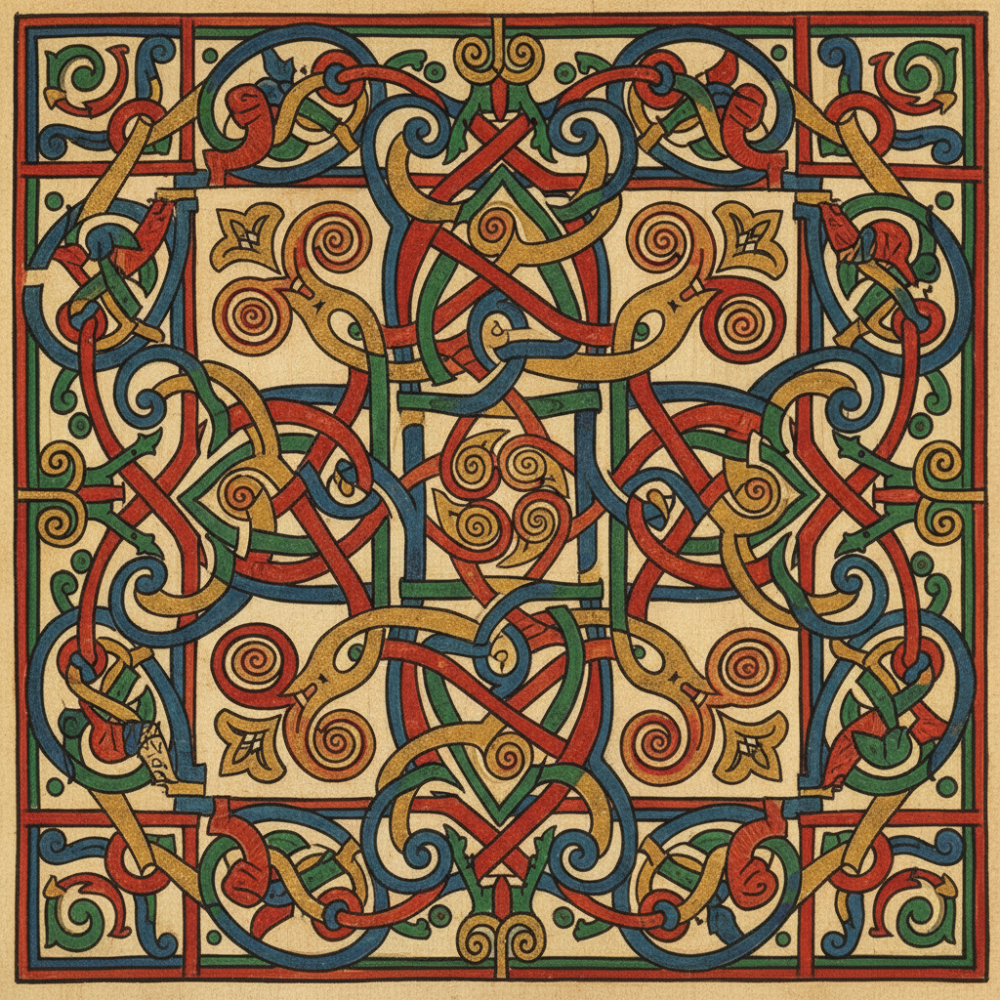

# Celtic Art 凯尔特艺术

> **"永无终点的线条——在缠绕与交织中触摸永恒。"**

## 概述

凯尔特艺术（Celtic Art）是欧洲最古老、最具辨识度的装饰艺术传统之一，起源于铁器时代（约公元前800年）的中欧拉坦诺文化（La Tène），后在爱尔兰、苏格兰、威尔士等"凯尔特边缘"地区延续至中世纪并达到巅峰。其标志性的无尽结（Endless Knot）、螺旋纹（Spiral）和动物交织纹（Zoomorphic Interlace）体现了凯尔特人对永恒循环、自然力量和精神世界的独特理解。

## 时间线

| 时期 | 特征 |
|------|------|
| 拉坦诺时期 (500 BCE–1 CE) | 抽象曲线、S形涡旋、金属工艺 |
| 罗马-凯尔特时期 (1–400 CE) | 罗马影响下的混合风格 |
| 早期基督教/岛屿艺术 (400–900 CE) | 《凯尔经》、高十字架、金属圣物箱 |
| 维京影响期 (800–1100 CE) | 北欧动物纹与凯尔特交织纹融合 |
| 凯尔特复兴 (19世纪) | 民族主义运动中的凯尔特元素复兴 |
| 当代 | 纹身、珠宝、平面设计中的凯尔特纹样 |

## 核心纹样

### 无尽结 (Endless Knot / Knotwork)
- 没有起点和终点的交织线条
- 象征永恒、生命循环、万物相连
- 从简单的三叶结到极复杂的面板填充

### 螺旋纹 (Spiral)
- 单螺旋、双螺旋、三螺旋（Triskelion）
- 新石器时代即已出现（纽格兰奇墓）
- 象征太阳、生长、宇宙能量

### 动物交织纹 (Zoomorphic Interlace)
- 蛇、鸟、犬等动物身体延伸为交织线条
- 动物的头尾咬合形成无尽循环
- 维京影响后更加复杂

### 关键图案 (Key Patterns)
- 直角转折的迷宫式图案
- 类似希腊回纹但更复杂
- 常用于边框装饰

## 代表作品

| 作品 | 时期 | 特征 |
|------|------|------|
| 《凯尔经》Book of Kells | 约800 CE | 岛屿艺术巅峰，极致精细的彩饰手抄本 |
| 《林迪斯法恩福音书》 | 约700 CE | 盎格鲁-凯尔特风格的杰作 |
| 塔拉胸针 Tara Brooch | 约700 CE | 金属工艺的极致 |
| 阿德博格圣杯 Ardagh Chalice | 约700 CE | 银、金、珐琅的精美组合 |
| 高十字架 High Crosses | 8–12世纪 | 石雕中的凯尔特纹样 |

## 视觉特征

- 无尽连续的线条——没有断点
- 对称与不对称的微妙平衡
- 极致精细的手工（《凯尔经》中有肉眼难辨的细节）
- 红、绿、金、蓝的鲜艳色彩（手抄本）
- 填满整个空间的恐惧真空（horror vacui）
- 有机曲线与几何秩序的结合

## 与其他风格的关系

| 风格 | 关系 |
|------|------|
| 维京艺术 | 互相影响，动物纹融合 |
| 伊斯兰几何 | 共享无限延展的图案逻辑 |
| Art Nouveau | 受凯尔特曲线启发 |
| 当代纹身 | 凯尔特结是最流行的纹身主题之一 |
| Tolkien 插画 | 中土世界的视觉语言受凯尔特影响 |

## 概念图

---

*浮光艺志 | Chronicle of Artistry*
